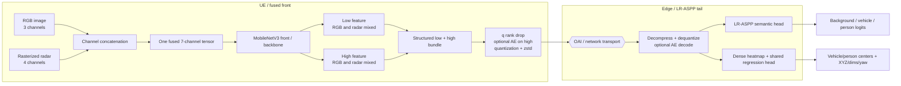
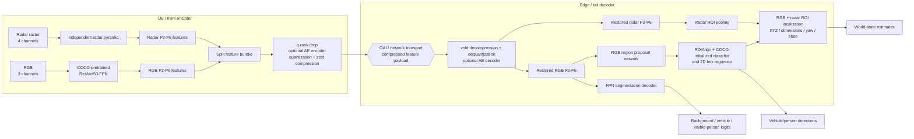
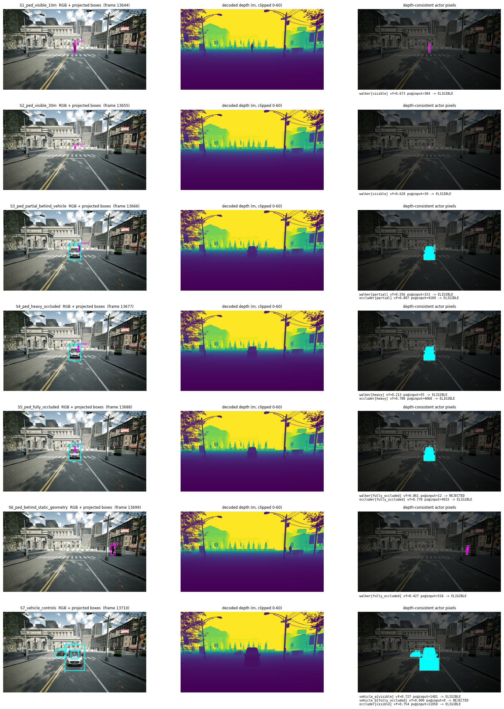
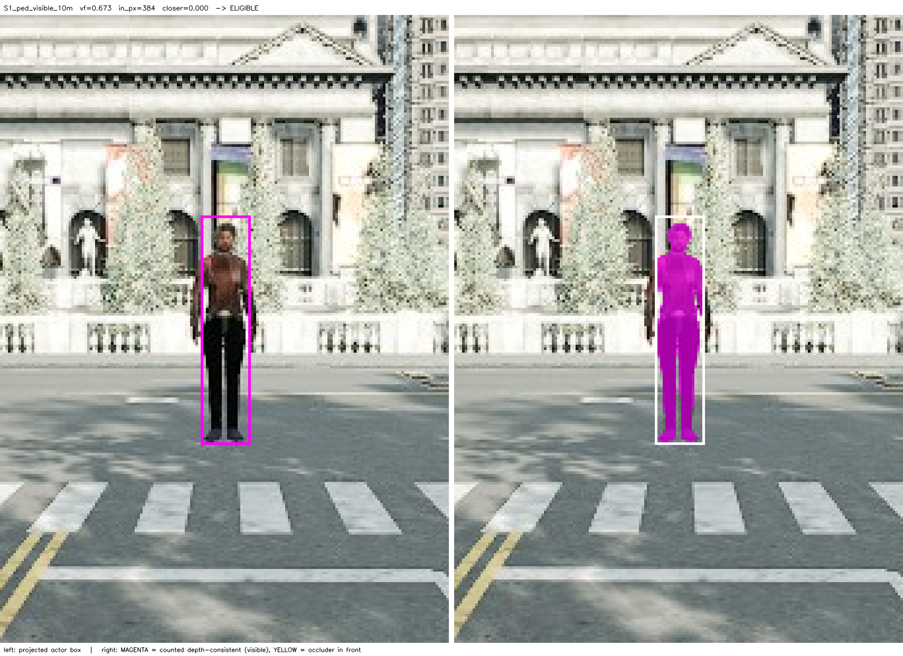
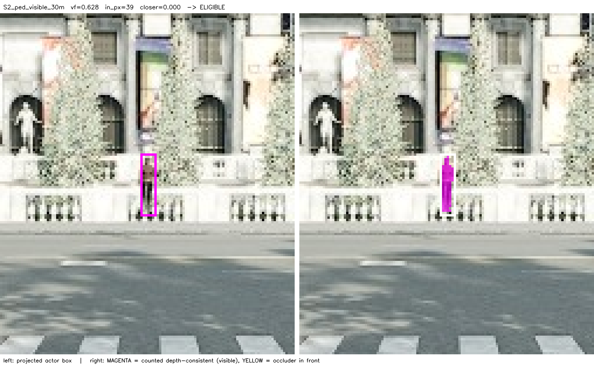
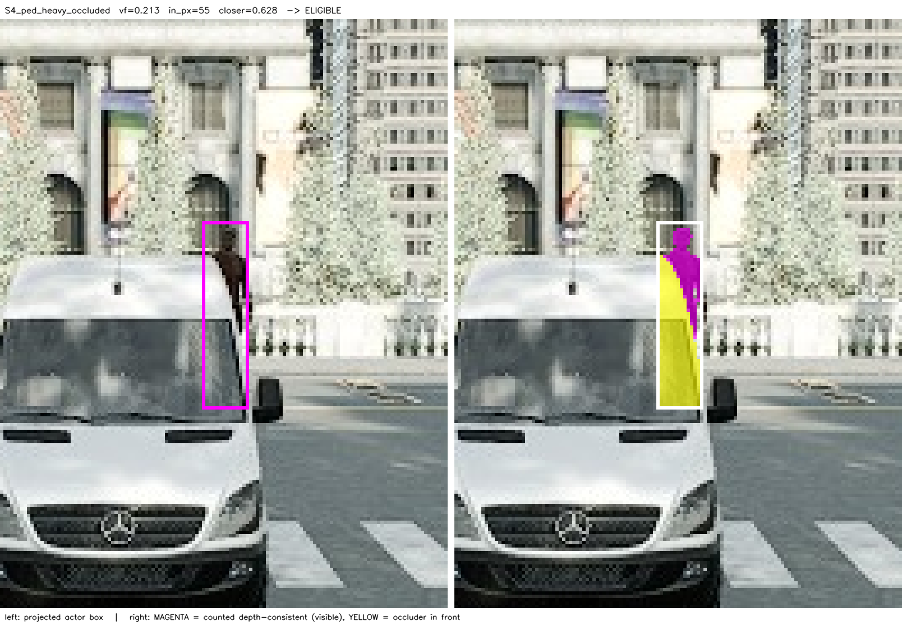

# Route B Full-Map Perception Redesign

## Interim supervisor report: evaluation audit, architecture transition, visibility-qualified data, and measurement roadmap

**Status date:** 27 August 2026<br>
**Status:** Route B v3 canonical data collection and frozen-model comparison complete; static parked-vehicle GT audit and LR-ASPP v3 retraining pending before architecture selection.

> This is an interim, evidence-backed report. The frozen-model v3 comparison values are final for the cited validation run, but they do not settle the architecture choice: the historical LR-ASPP has not yet been retrained on v3, and static map-level parked vehicles may be absent from detection GT. No model is yet being presented as deployment-ready or approved for the 288-cell agent campaign.

---

## 1. Executive summary

The historical M-prime perception model used a multimodal LR-ASPP network with RGB and radar and appeared to achieve vehicle and pedestrian recall near 0.9 on its retained test evaluation. When the same model family was evaluated over the larger, full-map Route B scenario, performance fell sharply. The investigation found that this was not explained by one isolated model defect.

The major findings were:

1. The historical evaluation used a **5 m world-position matching radius**, whereas Route B uses **3 m**. This accounts for about 17% of the historical-to-Route-B recall gap; accepting 3–5 m errors as matches improves the reported score but does not improve localization.
2. The historical moving-ego corpus was collected over repeated route loops and split by hashing each individual `sample_id`. Complete route episodes were not held together, so temporally adjacent and visually similar frames could cross train, validation, and test. This is a leakage risk; it is not being claimed that every split contained byte-identical files.
3. A training-time AMP/autocast interaction caused the LR-ASPP object head to receive zero gradient on drop-aware batches. This was fixed, but fixing it did not close the full-map recall gap.
4. The old dense heatmap decoder spent much of its top-k budget on bilinearly interpolated duplicates. Correcting local-maximum selection improved recall, but still did not reach the required full-map quality.
5. CARLA 0.10 does not render usable walker semantic pixels in this setup. An older pole-model label map also included RoadLine, Ground, and Wall in the “person” class, invalidating its historical person-segmentation claim. Vehicle segmentation from that experiment remains valid.
6. Route B v2 retained any geometrically projected pedestrian as ground truth, even if another vehicle made the pedestrian almost or completely invisible. It also used filled projected boxes for person segmentation, including pixels belonging to the occluder. This mixed model misses with targets that the RGB sensor could not actually observe.
7. Route B v3 detection rows are currently actor-origin only. Static Town10HD parked cars/trucks/buses are map environment objects rather than `vehicle.*` actors, so a correct detection of one may currently be charged as a false positive. This is under audit and must be resolved before the final architecture comparison.

A split multimodal Faster R-CNN–FPN candidate was therefore developed. On the v2 Route B validation set it approximately doubled the vehicle and person detection F1 scores relative to the frozen historical LR-ASPP model, and substantially improved localization and vehicle segmentation. However, it could not provide high precision and high recall at the same operating point under the v2 ground-truth contract.

The data contract has now been corrected. Route B v3 adds synchronized lossless depth and per-actor visibility evidence. A controlled smoke and manual review established that the depth-derived regions distinguish visible, partially occluded, and fully occluded actors. Eight episode-separated v3 runs—four train, two validation, and two locked test—subsequently passed all collection gates.

The frozen comparison is now complete. On the primary v0.10 contract, Faster R-CNN increased vehicle F1 from 0.3281 to 0.6856 and person F1 from 0.2299 to 0.3761, while reducing vehicle/person XY MAE from 1.318/1.638 m to 0.674/1.058 m. This establishes Faster R-CNN as the strongest **frozen challenger**, but not as the selected replacement: LR-ASPP has not had the corresponding visibility-qualified v3 retraining, and the parked-vehicle GT gap may bias vehicle precision for both models.

The remaining decision path is deliberately narrow:

- audit map-level static parked-vehicle truth and, if confirmed, create a v3.1 GT view without changing raw sensor payloads;
- re-score the frozen models under that corrected validation contract;
- retrain the existing seven-channel LR-ASPP on visibility-qualified v3.1 train data and compare it on validation;
- retrain Faster R-CNN on v3.1 only if LR-ASPP remains inadequate, then choose the common base;
- open the locked test only after the architecture, recipe, decoder, and checkpoint are fixed;
- then extend the selected base to hybrid-q training, AE32/AE64/AE128 split models, a 16-cell integration pilot, and finally the 288-cell campaign.

---

## 2. Research objective and evaluation contract

The objective is a multimodal ego-vehicle perception model that supports:

- vehicle and pedestrian detection;
- world-position, dimension, and yaw estimation;
- vehicle and visible-person segmentation;
- split inference between the UE/front end and edge/tail;
- rank-drop control `q`, feature quantization, and optional feature autoencoders;
- downstream spatial-map installation and the physical-AI agent measurements.

The current primary evaluation contract is:

| Field | Contract |
|---|---:|
| Route | Town10HD full-map Route B |
| Detection range | ≤40 m |
| World-position match | 3.0 m |
| Minimum geometric support | 12 px |
| Primary pedestrian observability | `eligible_visible_v010` |
| Clear-only sensitivity | `eligible_clear_v025` |
| Person mask | Depth-consistent visible region; no filled-box fallback |
| Vehicle mask | CARLA semantic vehicle pixels |
| Primary segmentation summary | Mean of vehicle IoU and visible-person IoU |
| Background IoU / 3-class mIoU | Diagnostic |
| Test policy | Episode-separated and locked until final model selection |

Depth is used only to establish training and evaluation truth. It is **not** added as a model input or transmitted in split inference.

---

## 3. Historical model and why the old result did not transfer

### 3.1 Historical M-prime architecture

The historical model used early RGB/radar fusion. Three RGB channels and four radar-raster channels were concatenated into one seven-channel tensor and passed through a widened MobileNetV3 LR-ASPP backbone. The LR-ASPP low/high features fed a semantic classifier and a dense center/regression object head.



The LR-ASPP split payload is therefore not literally one tensor: it contains `low` and `high` feature maps at different resolutions. However, both tensors come from the same seven-channel fused backbone and already contain mixed RGB/radar representations. The existing feature AE compresses the `high` map while the transport codec handles both maps. This is materially simpler than transporting two independent modality pyramids and preserves the already qualified split-inference implementation. Its full-map limitations remain the dense grid detector, limited multiscale proposal handling, and shared feature path for segmentation, detection, and world regression; v3 retraining will determine whether those limitations are binding in practice.

### 3.2 Historical versus Route B recall

The historical noAE result and the Route B result should not be quoted as a like-for-like generalization comparison without the evaluation caveats below.

| Evaluation | Vehicle recall | Person recall | Match radius | Interpretation |
|---|---:|---:|---:|---|
| Historical M-prime retained test | 0.8926 | 0.8532 | 5 m | Original reported regime |
| Frozen M-prime on Route B v2 | 0.3288 | 0.1523 | 3 m | Full-map result under stricter localization |
| Same Route B predictions rescored | 0.4242 | 0.2275 | 5 m | Still far below historical result |

Moving from 3 m to 5 m explains approximately 17% of the historical-to-Route-B gap. Approximately 83% remains associated with model/input/domain difficulty, particularly small, distant, and dense objects. Because the historical per-object GT table is no longer retained, the residual cannot be attributed solely to corpus composition.

### 3.3 Split-independence limitation

The old collector assigned each frame independently:

```text
split = sha1(split_seed : sample_id) -> train / val / test
```

The data consisted of repeated route loops and consecutive frames. Therefore, frames from one physical trajectory or repeated scene could be distributed across splits. This can make a held-out score optimistic because a test frame may be temporally or visually close to training data. The v3 correction is episode-level separation: complete episodes, densities, and seeds belong to only one split.

### 3.4 Additional historical defects and their status

| Finding | Effect | Resolution/status |
|---|---|---|
| Historical 5 m versus Route B 3 m matching | Inflated historical localization recall | All current work uses 3 m; 5 m is reported only as sensitivity |
| Frame-level split across repeated loops | Near-duplicate leakage risk | v3 uses complete episode-separated train/val/test splits |
| AMP autocast cache after a no-grad drop-ranking pass | Object-head weights received zero gradient on drop-aware batches | Fixed with autocast cache disabled; verified with nonzero gradients |
| Continuous `q` sampled only below 0.8 | No exact clean `q=0` training and no support at `q=0.90/0.98` | Future base uses hybrid exact-anchor + stratified-continuous sampling |
| Bilinear object-map upsampling before top-k | 81–84% of permissive top-k could be interpolated duplicate cells | Corrected local-max selection; Faster R-CNN proposals avoid this dense-grid decoder |
| Pole “person” tags included RoadLine/Ground/Wall | Invalid pole person IoU and 3-class mIoU | Claim retracted; vehicle metrics retained |
| CARLA walker pixels absent from semantic camera | No trustworthy semantic silhouette target | v3 uses synchronized depth-consistent visible regions |
| v2 projected-box person masks | Occluders/background painted as person | v3 has no filled-box or ellipse fallback |
| Geometric presence treated as visibility | Occluded/invisible actors counted as ordinary misses | v3 records visibility fraction, pixel support, and explicit tiers |

---

## 4. Challenger architecture: split multimodal Faster R-CNN–FPN

The challenger is more accurately described as a **split multimodal Faster R-CNN ResNet50-FPN v2 with radar-conditioned ROI localization and an FPN segmentation decoder**. It is not an LR-ASPP model and it is not a single seven-channel network.

RGB and radar remain the same seven raw channels in total—three plus four—but they are encoded separately and fused later.



### 4.1 Split-inference compatibility

`encode_front(rgb, radar)` runs on the UE and emits five RGB-FPN tensors and five radar-pyramid tensors. The dictionary called a “bundle” is a transport container, not a fused tensor: RGB and radar remain separate until radar ROI features are concatenated with visual ROI features for world localization. The RPN, 2D classification/box regression, and segmentation decoder use RGB-FPN features. Before transmission, the UE applies the selected rank-drop action, optional AE encoding, quantization, and zstd compression. The edge reverses those transforms and calls `decode_tail(bundle, image_size)` without any raw RGB/radar side channel. Monolithic and split outputs were measured as bit-identical in the v1 qualification.

The raw FP32 bundle is approximately 62.85 MB per sample, so direct transport is not the target deployment. Compressing ten heterogeneous, modality-specific pyramid tensors is more complex than the existing LR-ASPP low/high transport. If Faster R-CNN is ultimately selected, it will require newly designed and jointly trained feature codecs; historical LR-ASPP AE weights are not shape-compatible.

### 4.2 Architecture comparison

| Property | Historical LR-ASPP | Faster R-CNN–FPN challenger |
|---|---|---|
| Modality fusion | Early concatenation into 7 channels | Separate RGB and radar encoders; ROI-level fusion |
| Visual initialization | MobileNetV3/LR-ASPP | COCO-pretrained ResNet50-FPN v2 |
| Detection | Dense heatmap/top-k | RPN proposals + ROI classifier/box regressor |
| Multiscale handling | LR-ASPP low/high | FPN P2-P6 |
| World localization | Dense shared regression | Radar-conditioned ROI regression |
| Segmentation | LR-ASPP classifier | Independent FPN decoder |
| Split boundary | LR-ASPP low/high features | RGB and radar feature pyramids |
| q/quant/AE/zstd | Existing | UE compresses before transport; edge reconstructs before the tail; new feature-specific AE weights required |
| Runtime object/map contract | Existing 14-field schema | Preserved downstream object/map semantics |

---

## 5. Model evidence obtained before v3

### 5.1 Frozen LR-ASPP versus Faster R-CNN on Route B v2

The following is the strongest currently available same-corpus reference. It uses the 3,588-frame Route B v2 validation view and 3 m matching. Person segmentation is projected-box-mask IoU, not silhouette IoU.

| Metric | Frozen M-prime LR-ASPP | Faster R-CNN v1 epoch 12 | Change |
|---|---:|---:|---:|
| Vehicle precision | 0.3627 | 0.5907 | +0.2280 |
| Vehicle recall | 0.3288 | 0.8290 | +0.5002 |
| Vehicle F1 | 0.3449 | 0.6898 | +0.3449 |
| Person precision | 0.2592 | 0.2804 | +0.0212 |
| Person recall | 0.1523 | 0.6448 | +0.4925 |
| Person F1 | 0.1918 | 0.3908 | +0.1990 |
| Vehicle XY MAE | 1.419 m | 0.692 m | 51% lower |
| Person XY MAE | 1.562 m | 0.970 m | 38% lower |
| Vehicle IoU | 0.5020 | 0.8883 | +0.3863 |
| Person box-mask IoU | 0.2265 | 0.3272 | +0.1007 |
| Legacy 3-class mIoU | 0.5539 | 0.7347 | +0.1808 |

This supports the architecture transition: detection F1 approximately doubled, localization improved substantially, and vehicle segmentation became strong. It does **not** establish service readiness because Faster R-CNN still lacked a joint high-precision/high-recall point for pedestrians under v2 GT.

### 5.2 What the recovery experiments established

The Faster R-CNN recovery work isolated different subsystems rather than repeatedly replacing the whole model:

| Subsystem/result | Best observed v2 result | Interpretation |
|---|---:|---|
| Vehicle segmentation IoU | 0.8985 | Strong |
| Person box-mask IoU | 0.5204 | Target reached under the old box-mask contract |
| Legacy 3-class mIoU | 0.8035 | Target reached, but background contributes strongly |
| Vehicle/person XY MAE | 0.650 / 0.936 m | Both localization targets passed |
| Person RPN proposal recall | 0.9137 | RPN could cover most v2 person GT |
| Vehicle/person low-score detection ceiling | 0.8856 / 0.8322 | Recall targets became reachable in principle |

The precision–recall frontier still failed. One composition produced vehicle P/R 0.917/0.775 and person P/R 0.865/0.541; another produced 0.901/0.788 and 0.608/0.556. This pattern is consistent with conflicting v2 supervision: positive-heavy training increased hallucinations, while hard-negative training suppressed both false and true positives.

---

## 6. Visibility-qualified Route B v3

### 6.1 Depth visibility rule

For each actor, v3 compares the colocated camera depth inside the projected actor box with the actor’s camera-depth interval. It records depth-consistent pixels, closer/farther fractions, in-frame support, and two eligibility flags:

- **observable primary (`v0.10`)**: at least 12 visible model-input pixels and visible fraction ≥0.10;
- **clear-only sensitivity (`v0.25`)**: the same pixel floor and visible fraction ≥0.25;
- **marginal**: 0.10–0.25;
- **unobservable**: below 0.10 or below the pixel floor.

All actor rows remain in provenance. The training/evaluation view decides which rows become positive GT; the collector does not silently delete them.

### 6.2 Controlled depth smoke

The controlled smoke produced a monotone visibility ladder:

| Case | Visible fraction | Input-visible pixels | Contract outcome |
|---|---:|---:|---|
| Visible pedestrian, 10 m | 0.673 | 384 | Observable |
| Visible pedestrian, 30 m | 0.626 | 39 | Observable |
| Partial occlusion | 0.558 | 155 | Observable |
| Lower-body occlusion | 0.213 | 55 | Observable; marginal under v0.25 |
| Fully occluded | 0.061 | 12 | Rejected by v0.10 |
| Visible vehicle control | 0.727 | 1,481 | Observable |
| Fully occluded vehicle control | 0.000 | 0 | Rejected |

The 12-pixel floor alone would accept the fully occluded pedestrian; the visible-fraction criterion is therefore load-bearing.



**Figure 1.** RGB projection, decoded depth, and depth-consistent actor pixels for the controlled visibility ladder. The static-geometry stage is a documented null case and is not used as proof of static-scene occlusion handling.



**Figure 2.** Clearly visible pedestrian at 10 m. The projected box and depth-consistent region align with the body (`visible_fraction=0.673`).



**Figure 3.** Distant but visible pedestrian at approximately 30 m (`visible_fraction=0.628`, 39 model-input pixels). This demonstrates that the pixel floor does not automatically remove small distant people.



**Figure 4.** The vehicle occludes the pedestrian’s lower body while the upper body remains visible (`visible_fraction=0.213`). The v0.10 primary rule includes the person; the v0.25 clear-only view treats it as marginal.

The user manually reviewed the v3 30/30 smoke's 32-panel selection and judged approximately **95–97%** of the labels/masks correct, with no systematic visibility failure. This is a manual qualification result, not a statistical estimate over the full corpus.

### 6.3 Canonical v3 collection

Eight fresh-process episodes passed all cadence, alignment, population, intervention, visibility-reconciliation, cleanup, and shutdown gates.

| Split | Episodes | Densities | Saved frames | Size | Test use |
|---|---:|---|---:|---:|---|
| Train | 4 | 2×30/30, 2×50/50 | 6,377 | 49.74 GiB | Training only |
| Validation | 2 | 1×30/30, 1×50/50 | 3,353 | 26.12 GiB | Model selection |
| Test | 2 | 1×30/30, 1×50/50 | 3,300 | 25.66 GiB | Locked |
| **Total** | **8** | **4×30/30, 4×50/50** | **13,030** | **101.52 GiB** | — |

Additional collection evidence:

- 216,913 visibility rows reconciled exactly to object rows;
- 1,894 marginal and 4,555 unobservable person cases within 40 m across the eight episodes;
- person retention ranged from 71.35–80.20% under v0.10 and 58.82–72.51% under v0.25;
- RGB, semantic, depth, and radar alignment deltas were exactly zero in every episode;
- 28 permitted stationary-blocker interventions were recorded;
- no retry was used and every CARLA server shut down cleanly.

The canonical collector hashes are:

| Artifact | SHA-256 |
|---|---|
| v3 collector | `b17bcc1afa2226372f05fd8f5fe63f08d5fd324d112a108de5ffb6c63d7e0894` |
| v3 config | `084a433e22bac4771cc9889bcb485b42689db5765321747717e3604f8d5e5f97` |
| visibility helper | `4a7aa974ea6374eceff35c0fbd8261fba299b2c5de68297591f5ce9756cf980c` |

### 6.4 Remaining vehicle-GT question: static parked map objects

The v3 visibility rows and detection GT currently originate from live CARLA actors. Town10HD also contains parked vehicle-like map assets that are exposed as CARLA environment objects rather than `vehicle.*` actors. These objects can have a stable environment-object ID, transform, semantic class, and 3D bounding box while remaining absent from the actor-origin `object_boxes.csv` stream.

If such a parked vehicle is visible and the model detects it, the current detection evaluator has no corresponding GT and charges the detection as a **false positive**—not a true negative. The semantic camera may simultaneously label the same pixels as vehicle, creating inconsistent detection and segmentation supervision. The magnitude of this effect is not yet known.

The next audit will reuse the existing Town10HD static-environment truth helper for `Car`, `Truck`, and `Bus`, project those boxes into retained v3 validation frames, apply the same depth-derived v0.10/v0.25 observability rules, and reclassify persisted vehicle predictions without rerunning inference. It will stop for manual review before any canonical GT is changed. Because v3 retains depth, camera provenance, and raw sensor payloads, a validated correction should be expressible as a create-only v3.1 GT view rather than another eight-episode collection.

---

## 7. Frozen-model comparison on v3 — complete

Both models were evaluated frozen on the same episode-separated v3 validation view using 3 m world matching, a 40 m range gate, and their model-specific frozen decoders. The view retained 3,345 of 3,353 validation frames after excluding eight post-intervention frames. It contains 7,265 eligible vehicles, 3,872 v0.10 persons, and 3,376 v0.25 clear persons. The locked test split was absent and unopened. Exactly two inference passes ran—one per model—and each model's persisted predictions were reused across v0.10 and v0.25; only GT eligibility changed.

### 7.1 Primary observable-person contract (`v0.10`)

| Metric | Frozen M-prime LR-ASPP | Faster R-CNN v1 | FRCNN − LR-ASPP |
|---|---:|---:|---:|
| Vehicle precision | 0.3488 | **0.5880** | +0.2392 |
| Vehicle recall | 0.3097 | **0.8222** | +0.5125 |
| Vehicle F1 | 0.3281 | **0.6856** | +0.3576 |
| Person precision | **0.2764** | 0.2503 | −0.0261 |
| Person recall | 0.1968 | **0.7557** | +0.5589 |
| Person F1 | 0.2299 | **0.3761** | +0.1462 |
| Vehicle XY MAE | 1.318 m | **0.674 m** | −0.643 m |
| Person XY MAE | 1.638 m | **1.058 m** | −0.580 m |
| Vehicle IoU | 0.3840 | **0.9062** | +0.5222 |
| Visible-person IoU | **0.1890** | 0.1502 | −0.0388 |
| Foreground mIoU | 0.2865 | **0.5282** | +0.2417 |

At score 0.02, used only as a recall-ceiling diagnostic, LR-ASPP reached vehicle/person recall of 0.4246/0.2782. Faster R-CNN reached 0.8540/0.8396, but with precision of only 0.2804/0.0445. This shows that Faster R-CNN generates enough candidate detections to approach the recall targets, especially for persons, but its operating frontier still contains excessive false positives.

### 7.2 Clear-only sensitivity (`v0.25`)

| Metric | Frozen M-prime LR-ASPP | Faster R-CNN v1 | Interpretation |
|---|---:|---:|---:|
| Vehicle P/R/F1 | .3488/.3097/.3281 | **.5880/.8222/.6856** | Vehicle eligibility unchanged |
| Person P/R/F1 | .2713/.2216/.2439 | **.2379/.8238/.3692** | Clear-only denominator |
| Vehicle/person XY MAE | 1.318/1.637 m | **0.674/1.040 m** | FRCNN lower for both |
| Vehicle/person IoU | .3840/**.1896** | **.9062**/.1473 | FRCNN person mask remains weaker |
| Foreground mIoU | .2868 | **.5267** | +0.2399 |

Faster R-CNN person recall rises from 0.7557 under v0.10 to 0.8238 under v0.25, while person F1 falls from 0.3761 to 0.3692. This is caused by removing marginally visible GT from the denominator while keeping the same predictions; it is not evidence that the model improved.

### 7.3 Interpretation rule

An increase in either frozen model’s v3 visibility-qualified recall relative to v2 is an **evaluation-contract effect**, not a model improvement. The comparison establishes the current frozen ranking only. It is not a fair final architecture decision because LR-ASPP was trained on the historical corpus while Faster R-CNN received later Route B training, and neither validation score yet includes audited static parked-vehicle GT.

Faster R-CNN is therefore the stronger frozen challenger, not the selected replacement. It materially improves both-class recall/F1, localization, vehicle IoU, and foreground mIoU, but its person precision and visible-person segmentation remain weak. LR-ASPP will first be retrained on the same visibility-qualified v3.1 train view. If it remains inadequate, Faster R-CNN will then receive the same v3.1 retraining before the architectures are compared under one corrected validation contract.

---

## 8. Remaining model and measurement plan

```mermaid
flowchart LR
    V3[V3 canonical raw corpus<br/>COMPLETE] --> STATIC[Audit static parked vehicles]
    STATIC --> V31[V3.1 corrected GT view<br/>no sensor recollection]
    V31 --> RESCORE[Re-score frozen models<br/>persisted predictions]
    RESCORE --> LTRAIN[Retrain fused 7-channel LR-ASPP<br/>clean noAE / q=0]
    LTRAIN --> DECIDE{LR-ASPP adequate<br/>on corrected validation?}
    DECIDE -->|yes| SELECT[Select common perception base]
    DECIDE -->|no| FTRAIN[Retrain Faster R-CNN on v3.1]
    FTRAIN --> SELECT
    SELECT --> TEST[Open locked test once]
    TEST --> Q[Hybrid-q robustness training]
    Q --> AE[Train AE32 / AE64 / AE128<br/>for selected split representation]
    AE --> HASH[Freeze four model paths + SHA-256]
    HASH --> PILOT[16-cell integration pilot]
    PILOT --> CAMPAIGN[288-cell traffic_50_50 campaign]
```



### 8.1 Base retraining

The next training run will retain the historical LR-ASPP architecture: RGB3 and radar4 concatenated into one seven-channel input, one shared MobileNetV3/LR-ASPP backbone, the existing low/high split boundary, and the corrected dense object decoder. It will warm-start the historical multimodal checkpoint and fine-tune the full network on v3.1 using v0.10 as the primary person contract and v0.25 as sensitivity. The clean noAE, `q=0` base is trained first so compression robustness does not confound the architecture comparison.

### 8.2 Architecture selection

Validation will first compare the v3.1-trained LR-ASPP against both frozen corrected-GT baselines. If LR-ASPP delivers adequate clean perception, it is preferred operationally because its fused low/high split representation and q/quantization/zstd/AE runtime already exist. If it remains inadequate, Faster R-CNN will be retrained on the identical v3.1 train view and the two v3.1-trained models will be compared using the same episode-separated validation contract. The locked test remains closed until the architecture, training recipe, decoder, and checkpoint are fixed.

### 8.3 Hybrid-q robustness

After the clean base passes, robustness training should cover both the deployed anchors and intermediate values:

- 60% exact anchors, uniformly over `{0.00, 0.30, 0.50, 0.70, 0.90, 0.98}`;
- 40% stratified continuous draws between adjacent anchors;
- explicit clean `q=0` forward/backward exposure;
- matched-q evaluation against the clean base;
- no assumption that sparse q curves are smooth.

This keeps the supervisor’s proposed continuous control possible without losing exact support for the six registered measurement actions.

### 8.4 AE model families

Once noAE is selected, train three integrated feature autoencoder variants for the selected split representation:

1. noAE;
2. AE32;
3. AE64;
4. AE128.

Each family must receive its own jointly trained encoder/decoder weights. If LR-ASPP is retained, the existing high-feature AE and low/high transport provide the starting implementation. If Faster R-CNN is selected, new multi-level feature codecs are required because the historical AE weights are not compatible with the RGB/radar pyramids. Every family will be checked at clean q, all six anchors, and held-out continuous-q midpoints before its final checkpoint hash is registered.

### 8.5 Split-inference integration and 288 measurements

The campaign structure already exists:

| Factor | Levels |
|---|---:|
| Model family | 4: noAE, AE32, AE64, AE128 |
| Quantizer | 3 |
| Rank-drop action `q` | 6 |
| Network trace | 4 |
| **Total** | **288 cells** |

The campaign uses `traffic_50_50` only, a fresh Epic off-screen CARLA process/world per cell, exact map-install acknowledgements, and resumable create-only attempts. The four final model paths and SHA-256 hashes are still unresolved. A 4-model ×4-trace =16-cell integration pilot must pass before the full sweep is explicitly authorized.

The existing W10275 baseline is approximately 678.75 s per cell, corresponding to 54.3 hours for 288 cells before retries and additional OAI/cleanup overhead. The full campaign should therefore be scheduled as a multi-day resumable measurement, not treated as an overnight single run.

---

## 9. Claims that are and are not currently supported

### Supported

- The historical evaluation contract was not equivalent to Route B.
- The old sample-level split did not enforce episode independence.
- The historical pole person-segmentation metric was invalid because its class contained RoadLine/Ground/Wall and no rendered walker pixels.
- The Faster R-CNN–FPN candidate substantially outperformed frozen LR-ASPP on Route B v2 detection, localization, and vehicle segmentation.
- v2 pedestrian GT included severely occluded/unobservable actors and person masks painted occluders.
- Synchronized depth separates visible and fully occluded actors in the tested foreground-occlusion cases.
- The v3 collector passed eight episode-separated canonical runs and preserved a locked test split.
- The proposed Faster R-CNN split boundary is real: the tail has no raw-modality side channel.
- On v3 v0.10, frozen Faster R-CNN substantially exceeds frozen LR-ASPP in both-class recall/F1, localization, vehicle IoU, and foreground mIoU.
- Faster R-CNN is the strongest frozen v3 challenger, but its person precision and visible-person IoU remain inadequate.
- The Faster R-CNN split “bundle” contains separate RGB and radar pyramids; it is packaging, not a single fused representation.
- The LR-ASPP split contains separate low/high maps, but both are produced by one shared seven-channel fused backbone and are already supported by the existing transport/AE pipeline.

### Not yet supported

- A service-ready v3 model.
- A final LR-ASPP-versus-Faster-R-CNN architecture selection.
- The magnitude of vehicle false-positive bias caused by missing static parked-vehicle GT.
- A claim that the v3 person mask is a perfect anatomical silhouette; it is a depth-consistent visible-region approximation.
- A claim that all historical error was caused by label or split defects.
- Deployment readiness of noAE or any AE family.
- Continuous-q policy promotion from sparse anchors without the planned midpoint evidence.
- Authorization to begin the 288-cell campaign before final model hashes and the 16-cell pilot.

---

## 10. Interim conclusion

Route B did not show that multimodal perception is infeasible. It exposed that the historical score combined a looser localization tolerance, non-episode-grouped splits, an unsuitable pedestrian semantic target, dense-decoder limitations, and an observability-blind full-map denominator.

The current work has separated these issues. On the present v3 validation contract, the Faster R-CNN–FPN challenger provides much stronger detection recall/F1, world localization, vehicle segmentation, and foreground mIoU than the historically trained frozen LR-ASPP model. That result justifies retaining Faster R-CNN as a challenger, but it does not justify abandoning the established LR-ASPP split pipeline before LR-ASPP receives equivalent v3 training.

The immediate task is to audit and, if validated, add visibility-qualified static parked-vehicle truth through a create-only v3.1 view. LR-ASPP will then be retrained on the corrected full-map corpus. Only if it remains inadequate will Faster R-CNN receive equivalent v3.1 retraining. The winning architecture will become the common perception base for noAE, AE32, AE64, and AE128, followed by the 16-cell integration pilot and 288-cell campaign.

---

## 11. Evidence index

- [Route B visibility and match-radius audit](pole_lraspp_multimodal_fusion/object_head_pilot_v1/four_model_v1/VISIBILITY_AND_MATCH_RADIUS_AUDIT.md)
- [Frozen Faster R-CNN v1 report](pole_lraspp_multimodal_fusion/object_head_pilot_v1/fasterrcnn_radar_roi_v1/FRCNN_RADAR_ROI_FINAL_REPORT.md)
- [Depth visibility smoke report](data_collection/route_b_depth_visibility/DEPTH_VISIBILITY_SMOKE_REPORT.md)
- [Route B v3 schema](data_collection/route_b_perception_v3/SCHEMA.md)
- [Reusable static-environment truth helper](data_collection/phase2_static_environment_truth_v1.py)
- [Pedestrian semantic-label bug](cooperative_fusion/FINDINGS_pedestrian_label_bug.md)
- [Focused hybrid-q training plan](pole_lraspp_multimodal_fusion/object_head_pilot_v1/FOCUSED_NOAE_TRAINING_PLAN.md)
- [288-cell campaign runbook](rl_agent/UE_288_CAMPAIGN_RUNBOOK_V1.md)
- Canonical v3 collection report: `data_collection/experiments/route_b_perception_v3/ROUTE_B_V3_CANONICAL_COLLECTION_REPORT.md` (generated on W10275; pending local artifact synchronization)
- [Frozen v3 model comparison](experiments/route_b_v3_frozen_model_comparison_v1/20260827_184455/ROUTE_B_V3_FROZEN_MODEL_COMPARISON.md)
- [Frozen v3 comparison metrics](experiments/route_b_v3_frozen_model_comparison_v1/20260827_184455/comparison_metrics.json), SHA-256 `637da7c190197d2ce069393efb32a29058f77079dc1205e5c4b837c3ec702d65`
