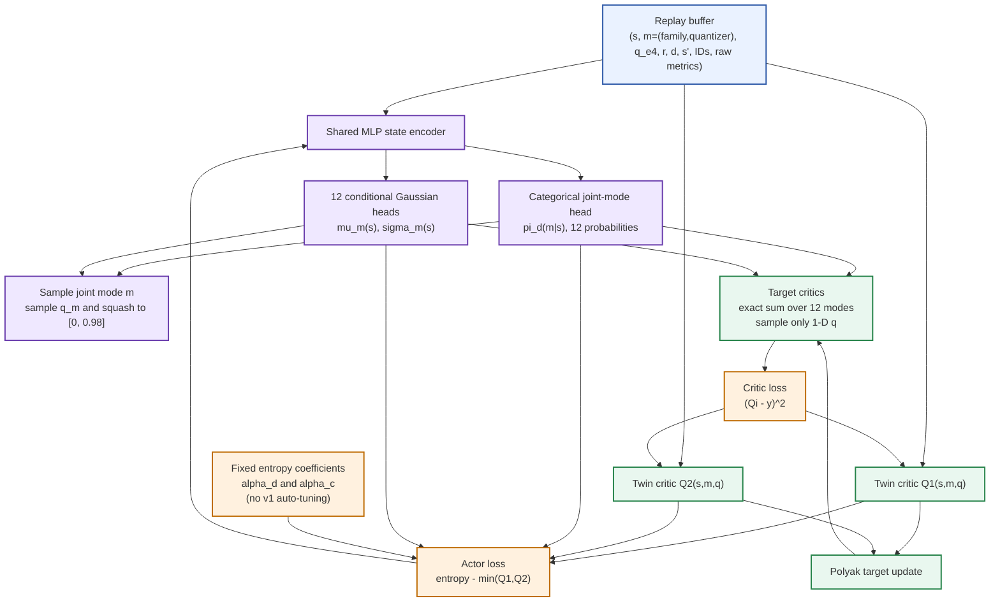

# SplitFusion feed-forward conditional Hybrid SAC architecture v1

Prepared: 2026-09-18  
Status: **runtime/action/state/reward contracts and actor/twin critics
implemented and tested; replay storage and training loop not yet implemented**  
Scope: split inference only; `LOCAL` and `SKIP` remain outside the v1 action space

## 1. Decision summary

Keeping the spatial drop control continuous changes the appropriate controller
from a purely discrete policy to a **parameterized-action** policy. Conditional
Hybrid Soft Actor-Critic (Hybrid SAC) is a good scientific match:

- the policy first chooses one of 12 joint discrete modes: four feature
  families crossed with `UINT4`, `UINT6` and `UINT8`;
- it then chooses a continuous spatial drop fraction conditioned on that joint
  mode;
- all 12 discrete choices can be enumerated exactly in the SAC target rather
  than approximated with a Gumbel-softmax relaxation;
- SAC is off-policy, so expensive CARLA/OAI transitions can be reused from a
  replay buffer; and
- twin critics reduce optimistic value bias while the entropy term encourages
  exploration of the continuous compression surface.

The v1 recommendation is deliberately **feed-forward**, not recurrent. Current
OAI measurements, compact scene descriptors and the previous resolved outcome
are supplied directly to the policy. A GRU/LSTM becomes a registered later
ablation only if a memoryless policy leaves a measurable sequential gap.

The proposed controller is:

$$
\textbf{feed-forward conditional Hybrid SAC}
+\textbf{one outstanding reward ticket}
+\textbf{minimum two-frame action hold}.
$$

## 2. Frozen, provisional and deferred choices

| Item | v1 contract | Status |
|---|---|---|
| Discrete action | $m=(k,b)$: 4 feature families $\times$ 3 quantizers (`UINT4`, `UINT6`, `UINT8`) = 12 joint modes | Implemented contract |
| Continuous action | $q\in[0,0.98]$ | Execution contract and conditional actor implemented; training pending |
| Meaning of $q$ | **spatial drop fraction**, not a detector-confidence or literal ROI threshold | Must not be renamed |
| Wire representation | $q_{e4}=\operatorname{round}(10^4q)$; execute $q_{e4}/10^4$ | Implemented contract |
| Quantizer | selected inside joint mode $m$ from `UINT4`, `UINT6`, `UINT8` | Retained for the primary policy |
| Entropy codec | zstd | Fixed deployment codec |
| Input cadence | prepared data at approximately 10 Hz | Measured system contract |
| Policy cadence | nominally 5 Hz | Consequence of the action hold and reward gate |
| Minimum hold | $k_{\min}=2$ transmitted tensors | Implemented contract |
| Reward deadline | inclusive $B=200$ ms at UE receipt of exact terminal feedback | Implemented contract |
| Memory | no GRU/LSTM in v1 | Deferred ablation |
| Other modes | no `LOCAL`, no `SKIP` | Deferred until independently measured |
| Reward calibration | $w_Q,w_L,\lambda_m,\lambda_q,\tau_c,\beta$, class weights and localization combiner | Explicitly unfrozen |

The 72-action catalog is $4$ feature families $\times$ $3$ quantizers $\times$
$6$ registered $q$ anchors. The primary controller retains all 12 joint
family--quantizer modes, so every historical anchor remains available. The
extra payload of `UINT6` or `UINT8` may be worthwhile for quality in some
states; this is precisely a trade-off the policy should learn rather than a
choice to remove in advance. Fixed-`UINT4` is allowed only as an implementation
smoke test and a registered ablation, not as the primary action contract.

## 3. Runtime control contract

The perception data path remains approximately 10 Hz. The policy is not
allowed to open a new decision while a previous decision's reward ticket is
unresolved.

1. Frame $f_t$ reaches the policy gate while the gate is `READY`.
2. The actor selects $(m_t,q_t)$, where $m_t=(k_t,b_t)$, opens one reward
   ticket, and marks this frame `reward_requested=true`.
3. The selected action is held for at least two frames. A subsequent frame that
   arrives while the ticket is open reuses $(m_t,q_t)$ and carries
   `reward_requested=false`.
4. Exact terminal feedback is matched by `session_uuid`, `decision_seq`,
   `reward_tensor_seq`, `carla_frame_id` and the full executed-action identity.
   It records either `REWARD_FINAL_EXACT` or a proven `ACTION_PATH_FAILURE`.
5. Feedback received before the second transmitted tensor moves the controller
   to `RESOLVED_WAITING_MIN_HOLD`. The gate opens only after both the feedback
   resolution and $k_{\min}=2$ are satisfied. The actor then runs only on a
   **future**, never previously admitted, frame.
6. At the inclusive $B=200$ ms deadline, an unresolved ticket becomes
   `FEEDBACK_TIMEOUT`. If the two-tensor hold is not yet satisfied, the ticket
   remains `TIMED_OUT_WAITING_MIN_HOLD`; once it is satisfied, the gate opens.
   Later matching feedback is `LATE_ORPHAN` and can never be attached to a
   newer decision.

All frame, feedback and deadline events must be serialized through one event
loop. The controller contract is intentionally not thread-safe.

This is a variable-duration semi-Markov decision process if a ticket sometimes
holds the action for more than two frames. Store the realized duration $d_t$
and use $\gamma^{d_t}$ in the critic target. At normal operation $d_t=2$, so
the policy runs at about 5 Hz while split inference continues at about 10 Hz.

```mermaid
flowchart LR
    F0["10 Hz prepared frame f(t)<br/>7-channel tensor; detector radar support = 200 ms<br/>(current + previous 100-ms sweeps)"]
    G{"Policy gate READY?<br/>one ticket maximum"}
    STATE["Compact causal state<br/>camera SI + radar P40 from current 100-ms sweep<br/>SNR, MCS, BSR + ages<br/>previous action and resolved outcome"]
    ACTOR["Feed-forward conditional Hybrid SAC actor<br/>choose joint mode m = (family, quantizer)<br/>then q conditioned on m"]
    HOLD["Action-hold controller<br/>k_min = 2 frames<br/>B = 200 ms"]
    FRONT["UE split front<br/>rank -> spatial mask -> optional AE<br/>selected UINT4/6/8 -> zstd -> UDP"]
    OAI["OAI 5G uplink"]
    TAIL["Edge decode + FCOS tail"]
    MAP["Post-process -> direct edge map service"]
    EVAL["CARLA-only exact evaluator<br/>segmentation + localization<br/>simulator/training branch"]
    REWARD["Exact terminal feedback<br/>full transaction + action identity<br/>quality evidence + terminal status<br/>UE derives latency locally"]
    REUSE["Reuse last (m,q)<br/>reward_requested = false"]
    TIMEOUT["At inclusive 200 ms<br/>resolve as FEEDBACK_TIMEOUT<br/>wait if k_min = 2 is not yet satisfied<br/>late result = LATE_ORPHAN"]

    F0 --> G
    G -->|yes| STATE --> ACTOR --> HOLD -->|reward_requested=true| FRONT
    G -->|no| REUSE --> FRONT
    FRONT --> OAI --> TAIL
    TAIL --> MAP
    TAIL -. "exact frame identity" .-> EVAL --> REWARD
    REWARD -->|resolve; also require k_min = 2| G
    HOLD -. "inclusive deadline" .-> TIMEOUT -->|also require k_min = 2| G

    classDef state fill:#eaf2ff,stroke:#2f5aa8,stroke-width:2px;
    classDef policy fill:#efe8ff,stroke:#6a3dad,stroke-width:2px;
    classDef path fill:#e9f7ef,stroke:#26834a,stroke-width:2px;
    classDef feedback fill:#fff1df,stroke:#be6a00,stroke-width:2px;
    class STATE state;
    class ACTOR,HOLD,G policy;
    class FRONT,OAI,TAIL,MAP,REUSE path;
    class EVAL,REWARD,TIMEOUT feedback;
```



The CARLA evaluator is a training/evaluation instrument. It is shown as a
dashed branch because deployment has no CARLA ground truth. The direct map path
must not wait for the evaluator.

## 4. Minimal causal state

The policy receives compact descriptors, not the raw 7-channel tensor:

$$
s_t=\big[
\operatorname{scale}(SI_t),P40_t,
\operatorname{scale}(\mathrm{SNR}_t),
\operatorname{scale}(\log(1+\mathrm{BSR}_t)),
\operatorname{scale}(\mathrm{MCS}_t),
a_t^{scene},a_t^{SNR},a_t^{BSR},a_t^{MCS},
\operatorname{onehot}(m_{t-1}),
\operatorname{onehot}(z_{t-1}),
q_{t-1}/0.98,Q_{t-1},L_{t-1}/B,
p_t,v_t^Q,v_t^L
\big].
$$

This is the exact 31-feature v1 ordering. Here:

- $SI_t$ is a normalized Sobel spatial-information score for the current RGB
  frame;
- $P40_t$ is nearby radar support from the current, non-overlapping 100-ms
  sweep:

  $$
  P40_t=\frac{1}{N_t}\sum_{i=1}^{N_t}
  \operatorname{clip}\!\left(1-\frac{r_i}{40\ \mathrm m},0,1\right).
  $$

  Every valid return remains in the denominator. Returns at or beyond 40 m
  contribute zero; this is not an object count or a pedestrian detector;
- SNR, MCS and BSR are current UE-side OAI measurements;
- the four $a$ terms are measurement ages, so stale scene/radio observations
  are not mistaken for current ones;
- $m_{t-1}$ is the previous 12-way joint mode and $z_{t-1}$ is its compact
  terminal class;
- the previous executed $q$, exact quality and UE-local normalized feedback
  latency describe the most recently resolved decision; and
- $p_t,v_t^Q,v_t^L$ are the previous-outcome presence, quality-validity and
  latency-validity masks.

The detector and the policy deliberately use different radar time support.
The detector keeps the validated two-sweep 200-ms tensor for sparse-radar
support; $P40_t$ uses only the current 100-ms sweep so the policy descriptor is
not made stale by the previous sweep. Missing or malformed radar invokes a
registered fallback outside the neural policy. It must not be encoded as
numeric $P40=0$, and there is no radar-validity bit in the 31 policy features.

The currently admitted radio carrier is privileged simulator/testbed evidence.
The UE-visible runtime SNR/MCS/BSR carrier must still be qualified and is
fail-closed. A state containing previous exact CARLA quality is likewise a
simulator/training state, not a claim about ground-truth availability in a
deployed vehicle.

Forbidden v1 inputs include the authored network-profile name, future channel
measurements, current-frame ground truth, the eventual current-frame reward,
raw identifiers, and the raw RGB/radar tensor itself. Radar return load,
occupancy entropy and dynamic fraction are diagnostics, not v1 policy inputs.

## 5. Conditional hybrid actor

The actor has one shared feed-forward encoder and two kinds of output heads.
Define the 12-mode set

$$
\mathcal M=
\{\mathrm{noAE},\mathrm{AE128},\mathrm{AE64},\mathrm{AE32}\}
\times\{\mathrm{UINT4},\mathrm{UINT6},\mathrm{UINT8}\}.
$$

Then:

$$
z_t=f_\theta(s_t),
\qquad
\pi_d(m\mid s_t)=\operatorname{softmax}(W_mz_t+b_m),
\qquad m\in\mathcal M.
$$

There is one conditional Gaussian head for each joint family--quantizer mode:

$$
(\mu_m(s_t),\log\sigma_m(s_t))=g_{\theta,m}(z_t),
$$

$$
u_t=\mu_{m_t}(s_t)+\sigma_{m_t}(s_t)\epsilon,
\quad \epsilon\sim\mathcal N(0,1),
$$

$$
q_t=0.49\,[\tanh(u_t)+1]\in[0,0.98].
$$

The action distribution factorizes as

$$
\pi(m,q\mid s)=\pi_d(m\mid s)\,\pi_c(q\mid s,m).
$$

After sampling, quantize only at the execution boundary:

$$
q_{e4}=\operatorname{clip}(\operatorname{round}(10^4q),0,9800),
\qquad q_{\mathrm{exec}}=q_{e4}/10^4.
$$

The replay record stores both the sampled $q$ and executed $q_{e4}$. The critic
should be trained on the executed action so its value corresponds to what the
system actually transmitted.

The neural networks use float32 by default. Batched float32 policy samples are
promoted before vectorized half-up quantization; exhaustive tests around every
wire-grid half-step reconcile that path with the registered contract for
representable float32 inputs. The selected runtime action is still passed
through the canonical decimal half-up boundary before transmission and replay
identity is formed from the resulting integer $q_{e4}$.

## 6. Twin critics and exact discrete enumeration

Two critics estimate the soft return for a state, joint discrete mode and
continuous drop fraction:

$$
Q_{\phi_1}(s,m,q),\qquad Q_{\phi_2}(s,m,q).
$$
Because there are only 12 discrete choices, enumerate them exactly. For a
target state $s'$:

$$
V(s')=\sum_{m\in\mathcal M}\pi_d(m\mid s')
\;\mathbb E_{q\sim\pi_c(\cdot\mid s',m)}
\left[
\min_{i\in\{1,2\}}Q_{\bar\phi_i}(s',m,q)
-\alpha_d\log\pi_d(m\mid s')
-\alpha_c\log\pi_c(q\mid s',m)
\right].
$$

For a transition lasting $d_t$ prepared-frame intervals:

$$
y_t=r_t+(1-\mathrm{done}_t)\gamma^{d_t}V(s_{t+1}).
$$

Separate entropy temperatures $\alpha_d$ and $\alpha_c$ make discrete-mode
and continuous-drop exploration independently auditable.



## 7. Localization-prioritized perception quality

Localization error is lower-is-better, so it cannot be added directly to an
IoU or recall score. Convert each class's centroid error to a bounded utility:

$$
U^{xy}_{c,t}=\exp\!\left(-\frac{e^{xy}_{c,t}}{\tau_c}\right),
\qquad c\in\{\mathrm{person},\mathrm{vehicle}\}.
$$

For each class, define recall only over ground-truth objects the UE was
eligible to detect:

$$
\operatorname{Recall}_{c,t}
=\frac{TP_{c,t}}{N^{eligible}_{c,t}}
=\frac{TP_{c,t}}{TP_{c,t}+FN_{c,t}}.
$$

Combine eligible-object recall and centroid accuracy with a geometric mean:

$$
U^{loc}_{c,t}=
\sqrt{\operatorname{Recall}_{c,t}\;U^{xy}_{c,t}}.
$$

The current feedback carries true positives and false negatives but no false
positives, so precision, F1 and average precision cannot be derived honestly.
Recall prevents an action from appearing accurate merely because centroid
error was computed on a small number of easy matched objects. No semantic IoU
is included in $U^{loc}_c$: doing so would count segmentation evidence twice.

Aggregate valid classes with registered class weights and an explicit
localization combiner:

$$
Q^{loc}_t=
\operatorname{Combine}_{c}
\left(U^{loc}_{c,t};w_c,m_{c,t}\right),
\qquad
\operatorname{Combine}\in
\{\text{weighted geometric},\text{weighted arithmetic}\}.
$$

The weighted geometric option makes one completely missed eligible class
collapse $Q^{loc}$, so a missed pedestrian cannot be averaged away by a good
vehicle result. The weighted arithmetic option keeps the miss as zero at its
registered class weight without collapsing the full term. This safety-policy
choice is intentionally required and has no hidden default.

The registered field `val_segmentation_miou` is a backward-compatible alias
for the foreground average

$$
mIoU_{fg}=\frac{IoU_{vehicle}+IoU_{person\_box}}{2};
$$

it is not an independent semantic metric. The person label is a projected
**box mask**, not a person-silhouette mask. Preserve the two class scores and
normalize them against the fixed frozen dense-reference scores rather than a
running or observed maximum:

$$
s_{v,t}=\operatorname{clip}\!\left(
\frac{IoU_{vehicle,t}}{0.899012847},0,1\right),
\qquad
s_{p,t}=\operatorname{clip}\!\left(
\frac{IoU_{person\_box,t}}{0.527894080},0,1\right).
$$

The denominators mean "fraction of the frozen reference retained," not
perfect segmentation. Raw IoUs and fixed absolute gates remain reportable.
Combine the normalized classes with a masked weighted geometric mean. With
$m^{seg}_{c,t}=1$ whenever that class has a nonempty GT or predicted mask:

$$
Q^{seg}_t=
\exp\!\left(
\frac{\sum_c m^{seg}_{c,t}a_c\log(\max(s_{c,t},\varepsilon))}
     {\sum_c m^{seg}_{c,t}a_c+\varepsilon}
\right).
$$

When both classes are valid, this reduces to
$s_{p,t}^{a_p/(a_p+a_v)}s_{v,t}^{a_v/(a_p+a_v)}$.

The neutral calibration baseline is $a_p=a_v$ (equal exponents). Person-prioritized
shares of $a_p/(a_p+a_v)\in\{0.60,0.70\}$ are sensitivity hypotheses, not
frozen choices. The geometric mean prevents a strong vehicle score from
fully hiding a collapsed person score.

To prioritize localization while allowing segmentation to be sacrificed in
some states, use localization as the base and segmentation as a bounded
modifier:

$$
\boxed{
Q^{perc}_t=
Q^{loc}_t\left[(1-\beta)+\beta Q^{seg}_t\right]
}
$$

where $\beta$ controls how strongly segmentation modifies localization.
Excellent segmentation cannot rescue poor localization, while weak
segmentation does not automatically erase otherwise useful localization.
Neither $\beta$, the localization class weights $w_c$, the localization
combiner nor the localization scales $\tau_c$ are frozen before the registered
sensitivity study.

### Validity and missing-object rules

- For localization, if a class has no eligible ground-truth object, set
  $m_c=0$ and renormalize over the classes that are present. Do not treat
  absence as a perfect localization score.
- If a class is present but the model misses it, the class remains valid and
  its recall and $U^{loc}_c$ contribution are zero.
- For segmentation, exclude a class only when both its GT mask and predicted
  mask are empty. If either side is nonempty, include it; a miss or false
  positive therefore gives that class IoU zero rather than disappearing from
  the reward.
- If GT or evaluation infrastructure is unavailable/corrupt, mark the sample
  invalid; do not silently convert it to zero quality.
- Preserve all raw terms, masks, thresholds and GT identities so
  $Q^{perc}$ can be recomputed.

Before freezing the reward, run a preregistered sensitivity audit over:

$$
\beta\in\{0.15,0.30,0.45\},\quad
\frac{a_p}{a_p+a_v}\in\{0.50,0.60,0.70\},\quad
\frac{w_{person}}{w_{person}+w_{vehicle}}\in\{0.50,0.60,0.70\},
$$

plus physically interpretable $\tau_{person}$ and $\tau_{vehicle}$ values.
Report rank correlation, top-action overlap, class-floor violations, action
frequencies and held-out return. Select values from the scientific priority
and held-out calibration, not from whichever run gives the highest training
return. The equal segmentation weighting and all person-prioritized settings
remain hypotheses until this audit is complete.

## 8. Initial reward and terminal accounting

For a valid reward received by the UE no later than $B=200$ ms:

$$
r_t=w_QQ^{perc}_t-w_L\frac{L_t}{B}
-\lambda_m\mathbf 1[m_t\ne m_{t-1}]
-\lambda_q|q_{exec,t}-q_{exec,t-1}|.
$$

Here $L_t$ ends when exact `REWARD_FINAL` is received by the UE. Keep raw
latency and quality terms in replay; the scalar reward must be reproducible
from a versioned reward specification. Specifically,

$$
L_t=t^{UE}_{feedback\ receipt}-t^{UE}_{ticket\ open}
$$

uses one UE-local monotonic clock. Latency is not trusted as a value carried by
the edge, and wall-clock/map-install timestamps are forbidden substitutes.

$\lambda_m$ is the cost of changing the discrete family--quantizer mode. It
discourages needless large operating-mode switches. $\lambda_q$ is the
proportional cost of moving the continuous compression setting, so a small
change in $q$ costs less than a large one. **Neither lambda is the timeout
penalty.** Both are calibration hypotheses, not frozen constants.

Terminal handling must distinguish three cases:

1. A proven feature-delivery, decode or tail failure is an
   `ACTION_PATH_FAILURE` and receives the registered negative service reward
   minus any applicable switching cost.
2. `FEEDBACK_TIMEOUT` records $c_{deadline}=1$ but currently receives **no
   scalar reward or penalty**. It is censored pending a reviewed, identity-bound
   reconciliation carrier. A lost reward-control packet after successful edge
   work is not automatically evidence that the action had bad perception.
3. An evaluator/infrastructure fault is excluded from learning and reported as
   an experimental failure, not converted into a poor action reward.

Every transition must have exactly one documented terminal classification.
Duplicate feedback is idempotently ignored. A result arriving after the
200-ms ticket closure is diagnostic `LATE_ORPHAN`, never a reward for the next
decision. Timeout adjudication is not yet implemented, and arbitrary caller
adjudication is rejected. Do not describe latency excess as a separately
observed learning constraint: accepted feedback has $L/B\leq1$, while an
unreceived timeout has no feedback-receipt timestamp.

## 9. Transaction identity and replay record

Use separate identifiers:

```text
session_uuid    identifies one run/UE session
decision_seq    identifies one policy invocation
tensor_seq      identifies one transmitted tensor
carla_frame_id  validates the simulator frame
```

The action-hold relationship is explicit: several `tensor_seq` values may
carry the same `decision_seq`, but only the registered reward-requested tensor
may generate that decision's reward.

An arbitrary continuous $q$ has no honest ID in the existing 72-anchor
catalog. Do not assign it the nearest anchor's `action_id`. Carry the executed
family, quantizer, $q_{e4}$, realized keep count and policy/action-schema hash
as the authoritative continuous action value; retain an anchor ID only when
the action exactly equals a registered anchor.

The minimum replay record is:

```text
session_uuid, decision_seq, reward_tensor_seq, carla_frame_id,
state, bound_policy_feature_vector, state/spec/freshness hashes,
joint_mode_sampled, q_sampled,
family_executed, quantizer_executed, q_e4_executed, keep_count,
actor_version_sha256,
completed_ticket, hold_manifest, terminal_outcome,
raw_quality_sources, raw_latency_sources,
scalar_reward, reward_spec,
hold_duration_frames, next_state, next_bound_feature_vector,
terminated, truncated, exact_lineage_ids
```

Insert once, only after exact identity and terminal validation. Never join by
nearest timestamp, latest action or packet arrival order. V1 intentionally
stores no caller-reported behavior log-probabilities: SAC recomputes
$\log\pi$ under the current actor for its updates. A future
importance-weighted algorithm would require a separately versioned,
distribution-complete behavior trace.

## 10. What the 288-cell campaign can and cannot provide

The campaign is valuable anchor evidence for payload, quality, delivery and
latency at six registered drop fractions:

$$
q\in\{0,0.30,0.50,0.70,0.90,0.98\}.
$$

It cannot by itself train or validate this continuous sequential policy:

- it contains only six $q$ anchors, not the interior continuous surface;
- its cells are action/profile aggregates rather than causal policy
  transitions;
- it lacks transaction-aligned SNR/MCS/BSR state for every decision; and
- all 12 family--quantizer modes are retained, but each still has only six
  measured $q$ anchors.

Use the 288 anchors to check units, initialize outcome models or warm-start a
critic conservatively. Before claiming continuous-$q$ control, collect new
space-filling points, for example a preregistered Sobol or Latin-hypercube set,
stratified by feature family, scene density and channel state, with extra
samples around observed knees. Hold out entire route segments/seeds for final
evaluation.

## 11. Implementation sequence and gates

Current implementation status: the action adapter, transaction identity,
SI/P40 descriptors, one-ticket/two-tensor gate, causal state, quality/reward
contract, replay-transition schema, deterministic synthetic environment and
conditional Hybrid-SAC actor/twin critics are implemented and covered by 198
focused tests. Replay storage and the trainer are not yet implemented, and no
trained-policy claim is made. Exact-positive reward generation also remains
fail-closed: the current quality producer is not source-authenticated, the v1
ACK is restricted to the 72 anchors, and a protocol-v2 carrier is required to
identify and authenticate arbitrary off-anchor continuous-$q$ outcomes.

1. **Scene-state foundation — complete.** SI and P40 definitions are
   implemented, timed in the live preparation path and fail closed on invalid
   radar. The detector retains 200-ms radar support; P40 uses the current
   100-ms sweep.
2. **Contract calibration.** Confirm the 12 joint modes, $q$ semantics/range,
   class-specific normalized segmentation references, localization terms,
   $\tau_c$, segmentation and localization class weights, $\beta$, reward
   deadline and timeout/censoring rules.
3. **Identity/state/replay foundation — complete.** The exact identity,
   one-ticket action-hold state machine and fail-closed replay-transition
   contract precede all training code.
4. **Deterministic synthetic test.** Make known states prefer known $(m,q)$
   regions; prove all 12 modes are reachable, continuous bounds, exact
   12-mode enumeration, critic target, duplicate feedback and timeout
   behavior. Prove that the frozen reference maps to normalized segmentation
   one (within tolerance), a collapsed class is not hidden, and absent-class
   masks renormalize as registered. Reconcile the 12 modes $\times$ six exact
   anchors to all 72 catalog actions with no duplicate or missing anchor.
5. **Continuous-$q$ coverage and protocol v2.** Implement the authenticated
   off-anchor feedback carrier, then collect preregistered space-filling live or
   qualified simulator evidence. Do not interpolate unsupported quality knees
   and call them measurements.
6. **Hybrid SAC training.** Report learning curves, entropy, joint-mode,
   family and quantizer frequencies, $q$ distributions, deadline outcomes,
   reward components and at least three seeds.
7. **Ablations.** Compare fixed-`UINT4`, fixed-$q$, discrete-anchor SAC,
   no-scene state and, only if justified, recurrent memory. Keep `LOCAL`/`SKIP`
   out until their costs and outcomes are measured.

## 12. Reconciliation with the supervisor source guide

The supervisor guide
[`split_fusion_data_structure.md`](../split_fusion_data_structure.md) contains
several strong ideas retained here: continuous conditional control, exact
enumeration over a small discrete action set, twin critics, exact transaction
identity, raw reward-component retention and the warning that the 288
aggregate is not a sequential RL dataset.

This v1 intentionally updates several assumptions to match the latest agreed
runtime:

| Source-guide assumption | Corrected v1 contract |
|---|---|
| GRU/recurrent agent | Feed-forward first; recurrence is a measured ablation |
| 20 Hz sensing and many in-flight decisions | Approximately 10 Hz prepared data, one outstanding ticket, minimum two-frame hold |
| 500-ms outcome horizon | 200-ms UE-received reward deadline |
| Generic continuous ROI control | Existing $q$ is specifically spatial drop fraction |
| Broad quality example | Class-specific normalized segmentation and centroid localization remain distinct, then combine localization-first |
| Quantizer decision left open | Primary policy retains all 12 family--quantizer modes; fixed-`UINT4` is a smoke test/ablation only |

The source guide's handoff link currently resolves to a missing sibling path.
The existing local snapshot is
[`experiments/supervisor_handoff/splitfusion_models_and_288_results_20260909`](../../supervisor_handoff/splitfusion_models_and_288_results_20260909).
The source guide was not modified; this note prevents a missing link from being
mistaken for missing evidence.

## 13. Claim boundary

This document establishes an implementable design, not evidence that Hybrid
SAC will outperform a lookup table or discrete controller. The scientific
claim requires continuous-$q$ support, causal state, held-out sequential
evaluation, multiple seeds and comparisons against simple measured baselines.
