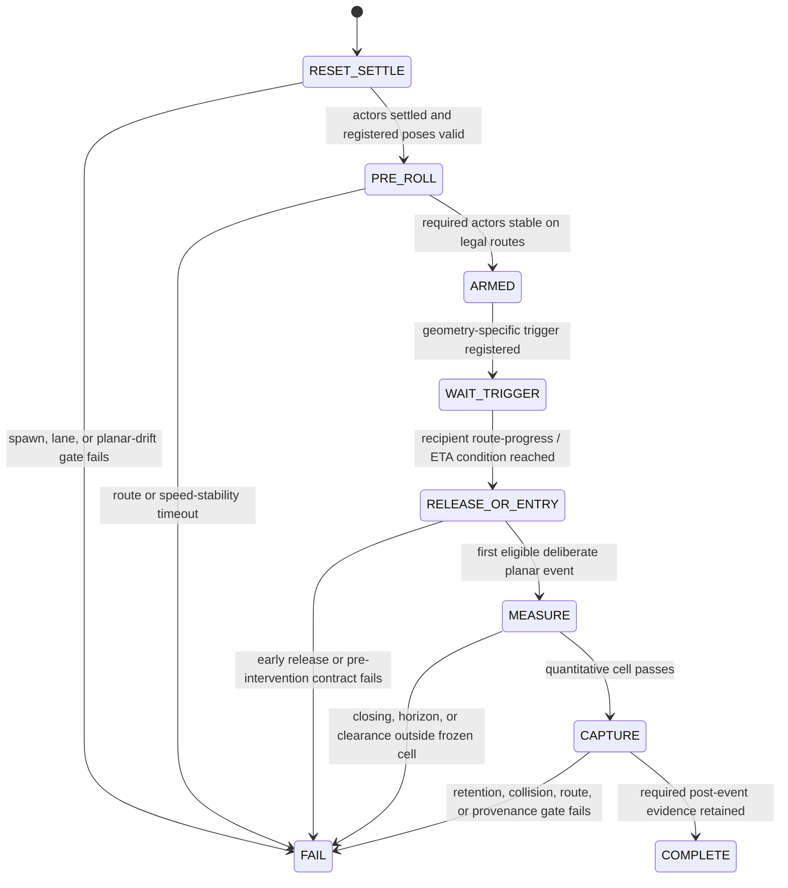

# Factor-realization control architecture v2

Status: **PROPOSED / PENDING JOINT REVIEW. No runtime code change or CARLA,
OAI, exact-16, corpus, controller, or RL run is authorized by this document.**

## 1. Why v2 is necessary

The first eight-corner review root
`/tmp/phase2_factor_corner_final_20260819_050403` is a valid failed-feasibility
fixture. All eight trajectories were visually plausible, collision-free, and
complete, but only one realized its registered quantitative factor cell.
Visual/structural validity and factor realization are separate requirements.

| Geometry and cell | Closing speed (m/s) | Horizon (s) | Clearance (m) | Quantitative verdict |
|---|---:|---:|---:|---|
| pedestrian high / long | 0.663 | 10.278 | 21.074 | FAIL: closing, horizon, clearance |
| pedestrian high / short | 6.663 | 2.954 | 0.595 | PASS |
| pedestrian low / long | 1.939 | 11.287 | 8.718 | FAIL: closing, horizon, clearance |
| pedestrian low / short | 2.714 | 7.495 | 2.959 | FAIL: horizon, clearance |
| vehicle high / long | 0.245 | 222.589 | 0.000 | FAIL: closing, horizon |
| vehicle high / short | not measured | not measured | not measured | FAIL: inadmissible onset; missed registered conflict |
| vehicle low / long | not measured | not measured | not measured | FAIL: inadmissible onset; no safety-yield realization |
| vehicle low / short | not measured | not measured | not measured | FAIL: inadmissible onset; missed registered conflict |

The requested closing bands were low `[2,4]` and high `[6,10]` m/s. The
requested proximity-horizon bands were short `[1.5,3]` and long `[3,5]` s.
Maximum predicted surface clearance was 2.5 m for pedestrians and 3.0 m for
vehicles.

Three root causes are distinct and must not be collapsed into one patch:

1. The control table used episode-time delay as a proxy for geometry. Closing
   speed and proximity horizon are coupled by relative position and velocity,
   so speed plus an unsolved clock delay cannot independently populate their
   Cartesian product.
2. Onset-zero cells sampled actors during acceleration. A requested high
   closing-speed cell cannot be measured while the recipient is moving at
   approximately 0.2--0.5 m/s.
3. Vehicle onset detection used 3D actor speed. CARLA spawn settling produced
   about 0.55 m/s of mainly vertical motion while the target remained
   hand-braked with almost unchanged planar position. That is not deliberate
   hazard onset. Even after correcting this implementation defect, several
   vehicle timing/conflict cells remain physically unrealized.

The v1 evidence must not be relabelled or admitted after observing it. It is
retained to calibrate the new design and as a regression fixture that a correct
validator reports as `1/8`, not PASS.

## 2. Design objective

Produce physically valid, repeatable approach states spanning useful dynamic
regimes without exposing scenario time or factor labels to the policy. The
world orchestrator may use evaluation-only route progress, ETA, and registered
surfaces; the policy receives only causal, deployable relative kinematics,
uncertainty/AoI, and eventually measured network/compute state.

For relative position `r = p_hazard - p_recipient` and relative velocity
`v = v_hazard - v_recipient`, the registered diagnostics remain:

```text
radial_closing_speed = max(0, -(r dot v) / ||r||)
center_proximity_horizon = max(0, -(r dot v) / ||v||^2)
```

The horizon is a constant-velocity closest-approach diagnostic, not collision
TTC, braking TTC, or a safety guarantee. Predicted OBB surface clearance is
evaluated at that same horizon. Collision, stopping distance, warning quality,
and C3 safety remain separate downstream endpoints.

## 3. Required orchestration state machine



### 3.1 RESET_SETTLE

- Spawn actors with the intended legal transforms.
- Hold controlled actors and tick until planar displacement and planar speed
  remain below frozen tolerances for consecutive frames.
- Ignore vertical settling for onset detection, while retaining it as a
  structural spawn diagnostic.
- Fail if an actor cannot settle or retain its registered lane/pose.

### 3.2 PRE_ROLL

- Helper and recipient travel far enough to reach stable requested approach
  speeds before any factor measurement.
- Stability uses planar speed over consecutive frames, not command speed.
- A cross-traffic target starts upstream and accelerates while still outside
  the registered hazard-entry surface and recipient view. It must reach a
  stable route speed before arming.
- A pedestrian remains held at its accepted start pose and therefore needs no
  motion pre-roll.

### 3.3 ARMED and WAIT_TRIGGER

- Arming is explicit and timestamped.
- The trigger is a route-progress, distance-to-conflict, or recipient-ETA
  condition solved for the requested joint factor cell. Absolute episode time
  is not the control variable.
- Trigger fields are orchestration/evaluation truth and are forbidden from
  policy observations.
- A matched benign twin uses the same ego routes, speeds, trigger surface, and
  non-treatment seeds, with the registered hazard absent.

### 3.4 RELEASE_OR_ENTRY and MEASURE

Pedestrian geometry:

- Release the walker only after the recipient is stable and crosses the solved
  trigger surface.
- Measure the first post-release sample with deliberate planar walker motion.

Cross-traffic geometry:

- Do not define hazard onset as first movement from rest.
- Pre-roll the target while occluded. Define the measurement event as the
  first crossing of a registered hazard-entry route surface at stable planar
  speed.

For both geometries:

- The event must occur before recipient safety intervention.
- The release/entry event, planar eligibility, factor sample, and intervention
  state use one CARLA frame clock.
- Requested bands, realized values, and failure reasons are persisted even on
  failure.

### 3.5 CAPTURE

- Use a bounded rolling buffer rather than an authored-time retention window.
- When the realized measurement event passes, flush the registered pre-event
  history and collect the required post-event samples.
- Retention selection is evaluation-only and never becomes policy state.
- Fail closed if the exact pre/post evidence window, role alignment, hashes,
  or provenance are incomplete.

## 4. Feasibility proof required before implementation

No runtime implementation begins until a versioned, reviewable table exists
for every proposed cell. Each row must declare:

- geometry and registered routes;
- recipient, helper, and hazard target planar speeds;
- warm-up distance and speed-stability tolerance/window;
- hazard-entry or pedestrian-release trigger surface;
- predicted closing speed, proximity horizon, and OBB clearance;
- uncertainty envelope from speed/control tolerances;
- recipient-intervention margin;
- expected helper visibility and recipient occlusion interval;
- maximum duration and rolling-retention coverage; and
- whether the whole uncertainty envelope lies inside the frozen cell.

The offline solver must use the frozen route polylines and actor bounding boxes,
not fit an arbitrary delay until a CARLA run passes. Existing v1 traces provide
the acceleration and route-progress envelopes used to validate the solver.

If a requested cell has no interior feasible solution, choose between these
options before code is written:

1. revise start geometry while preserving the scenario meaning;
2. preregister a feasible joint-factor design rather than a full Cartesian
   product; or
3. treat realized closing speed and horizon as continuous covariates.

Removing a cell after collection or widening its gate after seeing a result is
not allowed.

## 5. Verification ladder

1. **Desk proof:** all proposed cells have an interior analytic solution and
   uncertainty margin. No CARLA.
2. **Deterministic unit/trace tests:** state transitions, planar settling,
   explicit release, early-motion rejection, trigger provenance, rolling
   retention, intervention ordering, and boundary values.
3. **One machine-only eight-cell CARLA preflight:** aggregate all results into
   one table; require 8/8 quantitative PASS. Stop immediately if a cell fails.
4. **Minimal human review:** reuse the already accepted base geometry evidence.
   Visually spot-check only the changed pedestrian trigger and changed vehicle
   pre-roll/entry behavior unless the solver changes a route or spawn.
5. **Exact-16:** only after the quantitative preflight, any required human
   checks, and a separate post-acceptance authorization.

The exact-16 runner's pair-level fail-fast and all-or-none admission remain.
No old 15-row audit, larger corpus, OAI, controller ladder, or RL stage chains
from this verification.

## 6. Operational and acceptance contract

The next review tool must not hand the operator eight raw commands with no
ledger. It must:

- run or register each exact trajectory ID once;
- record command exit status, summary SHA, quantitative verdict, and human
  verdict separately;
- index evidence by exact trajectory ID plus row hash before validating it;
- report the complete eight-row matrix even when the first cell fails;
- print a prominent `PASS 8/8` or `FAIL n/8 -- STOP` terminal result;
- perform no archive write when any cell fails; and
- never let a human visual PASS override a quantitative FAIL.

Failure taxonomy:

- missing artifacts, early release, bad hashes, causal leakage, or misleading
  terminal status: implementation/integrity failure;
- out-of-cell kinematics, missed conflict, lane violation, or collision:
  scenario-design validity failure;
- detector miss, right-censored usable track, or a near-zero/negative
  recipient-available margin after valid admission: scientific outcome.

## 7. Review decisions required

Before implementation, Abiodun and Claude should explicitly agree on:

1. route-progress/ETA triggering instead of episode-time triggering;
2. pedestrian release versus vehicle hazard-entry event semantics;
3. whether all eight joint cells are physically necessary and feasible;
4. rolling retention anchored to realized event;
5. the uncertainty margin required for an interior cell solution; and
6. machine-only 8/8 preflight before any further human review.

