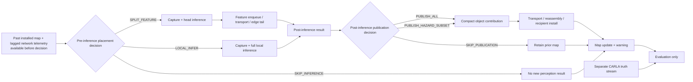

# Phase-2 paired causal control and corpus specification

**Dataset ID:** `phase2_paired_causal_v1`  
**Status:** causal pilot and offline adjudication complete; powered Suite A/B
design candidate added 2026-08-17. **No full CARLA collection, OAI run,
controller evaluation, or RL training is authorized by this document.** The
accepted pilot is structural evidence only; staged collection remains gated by
`WARNING_EVALUATION_DESIGN_FREEZE.md` and `PHASE2_SUITE_AB_DESIGN.md`.

This is the single source of truth for the Phase-2 observation/action timing, map-contribution schema requirements,
paired corpus, and pilot acceptance gate. `policy_corpus_advisor_rich_v5` remains useful for perception QA,
workload distributions, and historical matched-support studies, but it is not renamed or patched into this corpus:
it has no paired recipient, synchronized hazard truth, causal pre-action state, or retained raw sensing needed for
C2.

## 1. Contribution and decision contract

Every stage must name the paper contribution it advances and the decision its result can change.

| Work item | Contribution | Decision changed by the evidence |
|---|---|---|
| Paired helper-recipient local path | C1 system + C2 cooperation gain | Whether helper evidence advances a real recipient warning at all |
| Identical contribution over OAI RFsim | C1 + C2 | Whether the gain survives measured protocol-stack transport |
| State + uncertainty + deadline behavior | C3 | Whether a contribution is usable, stale, or must trigger conservative warning behavior |
| Exact/simple publication and placement baselines | C4 | Whether a measured deterministic rule suffices or a sequential learner has residual headroom |

The binding C2 endpoint is **marginal actionable warning lead** on the same truth trajectory:

```text
lead_gain_s = first_warning_at_s(ego_only) - first_warning_at_s(cooperative)
```

A helper receives cooperation credit only when delivered causal evidence advances the named recipient's warning.
Localization, recall, bytes, latency, and map AoI are explanatory metrics, not substitutes for warning lead.

“Actionable” is hazard-conditioned rather than a universal lead threshold. Before the scientific decision core,
freeze a required response margin from independently justified terms:

```text
required_margin_s(h) = pipeline_p95_s + reaction_s + braking_s(h) + safety_margin_s
actionable(h) iff first_warning_at_s <= predicted_conflict_at_s(h) - required_margin_s(h)
```

`braking_s(h)` depends on the registered closing speed, distance, and conservative deceleration model. The
primary C2 decision endpoint is the paired change in actionable-warning success subject to a registered
false-warning ceiling; continuous `lead_gain_s` is secondary. The numerical smallest effect of interest and sample
counts are frozen after the pilot measures yield/censoring/variance, before any confirmatory collection.

Warning time is a time-to-event endpoint, so missing warnings are not encoded as arbitrary large numbers. If the
cooperative arm warns and ego-only does not warn before the registered hazard/evaluation horizon, report a
right-censored ego-only time and a lower bound on lead. If both miss a positive hazard, report a missed-hazard pair
with no numeric lead. If cooperation warns later, report negative lead. Benign negatives contribute false-warning
outcomes, not a fabricated lead. Report event counts alongside any median/CI.

## 2. Non-goals and claim boundaries

- The pilot is a **capture-contract and computability gate**, not performance evidence.
- The v1 map-sharing synthetic fixture proves plumbing only.
- The Phase-1 ladder, Task B replay costs/lifts, and Task C runtime agreement remain noncausal matched-support
  studies and are not validation targets for this corpus.
- Dynamic intermediate/late fusion selection alone is not claimed as novel; mmCooper already covers that axis.
- No unconditional safety guarantee is claimed. Covariance, process noise, association, detection misses, and
  warning calibration must be measured before the C3 language can exceed “uncertainty-aware model contract.”
- No RL algorithm is selected or trained here. RL is gated on residual sequential headroom after exact and simple
  causal baselines.
- C2 warnings are **recorded but never actuated** during the paired corpus. Braking/steering would make the world
  action-dependent and belongs only to the later navigation-override evaluation.

## 3. Causal decision loop

The policy clock and sensor/inference clock may differ, but time ordering may not. Every field exposed at a
decision carries `source_stage`, `observed_at_s`, `available_at_s`, `consuming_decision_id`, and
`consuming_decision_stage`; the logger and loader must assert against the referenced placement or publication
decision:

```text
available_at_s <= decision_at_s
```



The placement policy must never use same-frame detections, confidence, track identity, map quality, or hazards
produced by the action it is choosing. Shadow execution of unchosen LOCAL/SPLIT paths is allowed only for
evaluation, must be written to an evaluation namespace that the policy loader rejects, and must run offline or in
a separately timed pass so it cannot consume compute/network resources or perturb the primary path.

## 4. Action semantics: placement is not publication

Two decisions occur at different causal stages and must not share an ambiguous `SKIP` label.

### 4.1 Pre-inference placement action

- `SPLIT_FEATURE(profile_id, target_fps)`: capture, run the configured head, and send the intermediate feature to
  the edge tail.
- `LOCAL_INFER(local_profile_id, target_fps)`: capture and run the full local model; no intermediate feature is
  sent.
- `SKIP_INFERENCE`: intentionally acquire no new inference result at this opportunity.

This action may depend only on lagged network state, prior installed-map state/uncertainty, prior causal tracks,
previous action/outcome, scheduler/in-flight summaries, and other explicitly available pre-action signals.

### 4.2 Post-inference publication action

- `PUBLISH_ALL`: serialize all eligible causal detections into the compact Phase-2 object schema.
- `PUBLISH_HAZARD_SUBSET`: publish the causal recipient-conditioned subset using the newest recipient state that
  has actually reached the decision locus.
- `SKIP_PUBLICATION`: do not send a compact object update after local inference.

Record the publication decision locus (`helper`, `edge`, or `recipient`) and the availability/age of the recipient
state used there; “current recipient state” is not magically shared. For `SPLIT_FEATURE`, the edge result is
installed through the split path and its provenance must say which output and transport path produced it. For the
first C2 evaluation, inference placement may be fixed so that send-everything versus hazard-only publication is
isolated. Dynamic placement is evaluated later, after the LOCAL table exists.

## 5. Pre-action state provenance

| State field | Permitted source | Earliest availability | Policy use |
|---|---|---|---|
| Lagged capacity estimate and uncertainty | prior OAI telemetry/estimator | after prior telemetry window | allowed |
| Previous delivery, latency, loss, action | prior completed event | after prior outcome | allowed |
| Scheduler credit / in-flight summaries | local scheduler state | current decision boundary | allowed |
| Installed recipient-map tracks, AoI, covariance | prior accepted contributions | after prior map install | allowed |
| Causal source-local tracks | detections completed before this decision | tracker update completion | allowed |
| Current helper pose and motion | helper-local measurement | measurement timestamp | allowed if timestamped |
| Recipient pose and motion at helper/edge | last causally received recipient-state message | message availability at decision locus | allowed with age/provenance |
| Current-frame detector output/confidence | selected inference path | after current inference | **forbidden pre-action** |
| Current-frame hazard score/map quality | current output/map update | after inference/install | **forbidden pre-action** |
| CARLA actor ID, future trajectory, collision label | truth stream | evaluation only | **forbidden always** |
| Shadow unchosen-path output | evaluation worker | after shadow inference | **forbidden always** |

The implementation must use an allowlist, not merely rely on column naming. Missing or late fields fail closed;
they are not forward-filled across a boundary unless that behavior is part of the declared causal estimator.

## 6. `scenesense.map_contribution.v2` requirements

The checked-in v1 schema is a plumbing scaffold. Before the pilot, a separately versioned v2 schema must be
reviewed and implemented without silently changing v1 artifacts. At minimum it must carry:

### Contribution envelope

- `schema`, `operation`, `contribution_id`, `source_ue_id`, `recipient_ue_id`, and per-source-recipient
  `sequence_number`;
- `captured_at_s`, `placement_decision_at_s`, `inference_completed_at_s`, `publication_decision_at_s`,
  `published_at_s`, decision IDs/loci, and clock-domain metadata;
- `inference_placement`, `publication_action`, `profile_id`, `target_fps`, `model_id`, model/config/code hashes;
- exact `application_payload_bytes`, chunk count, and separately derived UDP/IP on-wire bytes;
- causal provenance for source sensors and calibration identifiers.

### Per-object record

- source-local `track_id` and tracker/version identifier; **never a CARLA/GT actor ID**;
- class, confidence, world-frame `x_m`, `y_m`, `vx_mps`, `vy_mps`, and object measurement/capture time;
- 4x4 covariance for `[x, y, vx, vy]`, or an explicitly equivalent versioned representation;
- `motion_model_id`, process-noise model/parameters, and validity horizon;
- causal occlusion/hazard inputs and their provenance; any recipient-conditioned hazard score must record the
  recipient-state timestamp used to compute it.

The causally delivered recipient-state message also carries covariance, motion/process-noise model identifiers,
and process-noise parameters. Relative-warning uncertainty combines propagated object and recipient covariance;
the initial sum assumes independent errors. A correlated estimator must supply cross-covariance and replace that
assumption. Zero recipient uncertainty must be explicit and calibrated, never an omitted default.

### Recipient behavior

For a constant-velocity baseline with state `z=[x,y,vx,vy]`, propagate:

```text
z(t + dt) = F(dt) z(t)
P(t + dt) = F(dt) P(t) F(dt)^T + Q(dt)
```

Association and warning logic must use the propagated uncertainty, not a hard-coded `speed_sigma` placeholder.
The form and calibration of `Q(dt)`, association gates, and a probabilistic or uncertainty-expanded warning rule
are preregistered after pilot diagnostics. Until then, this is a design equation—not a safety guarantee.

## 7. Sensor, world-clock, and timebase contract

The Phase-2 pilot starts from the validated M-prime training sensor contract rather than inheriting a collector
default:

- CARLA world/sensor tick **10 Hz (`fixed_delta_seconds=0.1`)**;
- RGB **1280x720, FOV 120 degrees**;
- radar **200,000 points/s**, yielding approximately 20,000 returns per 0.1 s frame before filtering;
- radar raster radius **4** and temporal window **2**;
- actor-origin GT in the separate truth stream; no GT-derived runtime labels or keys.

CARLA renderer quality is an explicit nuisance variable. The M-prime training
metadata did not record Low/default/Epic, so the training corpus must not be
retroactively labelled. The paired sparse gate proved renderer sensitivity, and
the matched medium/crowded confirmation had identical world/radar support but no
pedestrian inside its pre-registered <=12 m safety band. Its weighted v5 decision
was therefore formally inconclusive rather than repaired post hoc. The operational
contract is nevertheless frozen: all primary Phase-2 capture uses explicit
`Epic` (`-quality-level=Epic`), selected for realistic rendering and its stronger
dense diagnostic segmentation/vehicle results. Existing Low captures remain a
labelled stress condition; no additional Low corpus stratum is authorized. Every
later launch and run manifest must record `Epic`, the exact server flag, and the
operator-declaration provenance because CARLA exposes no reliable quality RPC.

Any faster controller clock is a later surrogate/runtime concern; it must not silently change the CARLA sensor
contract. The pilot records pre-filter returns/frame and fails on a material density/shape/config drift before
testing perception or C2.

For each process/container, log simulation time, a monotonic host timestamp, wall-clock timestamp, and `clock_id`.
Record clock offset/uncertainty or a synchronization event sufficient to order capture, inference, enqueue,
reassembly, install, and warning. Never subtract timestamps from unaligned clocks.

## 8. Corpus suites and preregistration

Both suites use one helper and one named recipient, synchronized truth, identical route/scenario seeds across
policy arms, and trajectory-grouped train/validation/test splits. Scenario counts and factor distributions are
frozen **after the pilot and before** the scientific decision core/controller development. Power is based on
independent route/seed clusters, not raw frames or a naive count of correlated hazards. Use trajectory-clustered
bootstrap or simulation-based power with pilot-estimated event yield, censoring, variance, and within-trajectory
correlation. Freeze positive-hazard and matched-benign counts per factor cell, total independent clusters, expected
censoring, smallest effect of interest, and false-warning ceiling in a hashed analysis plan.

The deterministic candidate `phase2_suite_ab_v1` now provides that group
inventory, exact 20/20/60 assignment, sensitivity envelope, retention tiers,
and hashes. It remains a candidate—not authorization—until every proposed
geometry/route is manually accepted and calibration simulation confirms at
least 0.80 power for the registered estimators. The fixed names are Suite A =
designed decision opportunities and Suite B = naturalistic operation.

### Suite A — designed decision opportunities

Purpose: provide enough causal states in which cooperation/publication/placement can change a recipient outcome.
Balance controlled positive hazards with matched benign negatives. Span, at minimum:

- helper-only occlusion discovery versus recipient-visible objects;
- pedestrian/cyclist/vehicle class where supported, with class limitations explicit;
- near versus far range, low versus high closing speed, and short versus long time-to-hazard;
- fresh, near-deadline, and stale prior-map states;
- network states where SPLIT and LOCAL are each feasible, plus a genuine neither-good regime;
- clean and degraded transport, including recovery transitions;
- sparse and competing-object scenes to exercise unfiltered false positives and publication selection.

This suite is curated and may flatter the controller. It cannot be the only headline.

### Suite B — naturalistic paired operation

Purpose: preserve an honest denominator under natural event prevalence. Use paired helper-recipient traffic with
the same capture contract, but do not force a decision opportunity every frame. Report the same warning, safety,
latency, and load metrics as Suite A. Never pool the suites into a single headline without also reporting each
suite separately.

The accepted v5 distribution informs traffic realism and perception workload, but its frames are not Phase-2 C2
samples.

### Network-state coverage for agent feasibility

The four measured SNR/channel rungs remain the static calibration anchors, but SNR labels are never policy input
and are not the complete environment. The causal state uses lagged capacity/queue/link telemetry. Before any
dynamic-controller or RL go/no-go, the design-only scientific core must include at least one controlled
degradation-and-recovery trace plus stable good/bad and burst/queue-recovery cases. It must demonstrate that:

- at least two placement/publication actions are genuinely feasible in enough independent clusters;
- LOCAL and SPLIT outcomes are measured on identical inputs without shadow-path perturbation;
- action outcomes and rankings differ beyond measurement noise in at least some registered states; and
- earlier actions change later queue/map-freshness state.

Broader transition coverage is added only if this core exposes residual headroom. Add at least one held-out
intermediate condition near the measured SPLIT feasibility knee to validate interpolation rather than memorizing
four rungs.

## 9. Two-trajectory pilot gate

The minimum pilot is **exactly two short paired trajectories**:

1. one controlled positive occlusion/hazard in which helper evidence can causally precede recipient-only evidence;
2. one matched benign negative with similar traffic/sensing load but no warning-worthy conflict.

The pilot should exercise ego-only, send-everything, and hazard-only counterfactual evaluation from one immutable
capture where valid. Each arm has an independent recipient-map/controller state; no installed track, queue, or
warning state may leak across arms. If an arm changes sensing or world evolution, collect it as a paired replayable
arm rather than claiming an invalid offline counterfactual. Warnings are logged only and **must not actuate** the
recipient during C2 capture.

### Required retained artifacts

- aligned RGB frames and radar tensors/point records for the controlled window, with calibration, transforms,
  frame IDs, sensor timestamps, and exact training sensor contract;
- unfiltered detector candidates before thresholding/NMS/top-k and the final detector outputs, including unmatched
  detections;
- causal tracker inputs/outputs, source-local IDs, association decisions, ID births/deaths/switches, and tracker
  version/config;
- both LOCAL and SPLIT outputs/timing when shadowed, explicitly marked `evaluation_only=true`;
- helper and recipient ego states, route/scenario/traffic seeds, and separate synchronized CARLA truth;
- all state fields with `source_stage`, `observed_at_s`, `available_at_s`, `consuming_decision_id`,
  `consuming_decision_stage`, and the referenced placement/publication decision time;
- inference placement/publication action, scheduler/in-flight state, queue events, and outcome provenance;
- capture, inference-done, enqueue, first-byte, last-byte/reassembly, install, and first-warning timestamps;
- application/on-wire bytes, tunnel identity, channel estimate and raw OAI telemetry where applicable;
- resolved config, package/library versions, model/checkpoint hash, code revision, and artifact manifest hashes.

### Hard raw-retention budget

Continuous heavy retention is forbidden. The retained-input diagnostic implies an initial planning rate of about
46 MB/frame, or about 55 GB/min for two synchronized vehicles at 10 Hz before shadow artifacts. This is a sizing
reference, not a promised corpus size. The pilot runner must:

- retain RGB/radar/tensors/logits only inside explicit controlled windows;
- enforce per-window, per-trajectory, and pilot-total byte quotas before each write;
- reserve configured free space up front and fail closed if the reserve would be crossed;
- record attempted/written bytes, measured bytes/s, window duration, and stop reason; and
- stop raw retention safely while preserving lightweight causal/event logs if a quota is reached.

The pilot measures the true rate used to budget the full suites. Deleting prior evidence is not an automatic
overflow policy; cleanup requires a separate reviewed inventory of uncited, reproducibly disposable artifacts.

### Pilot PASS gates

All are hard gates; there is no majority pass.

1. **Causal availability:** every runtime input satisfies `available_at_s <= decision_at_s` for its referenced
   placement/publication decision; evaluation-only and GT fields are rejected by the policy-state loader.
2. **Representation:** runtime track IDs are source-local and causal; no GT ID enters a runtime message, map,
   association, selection, or warning.
3. **False-positive preservation:** raw/final candidate counts survive end to end. The two trajectories need not
   naturally contain a false positive; inject one synthetic unmatched detection into an offline copy and prove it
   is retained and handled without acquiring a GT identity.
4. **Alignment/recoverability:** a sampled decision can be reconstructed from raw sensing through inference,
   tracking, action, transport, map install, warning, and separate truth scoring.
5. **Action provenance:** LOCAL, SPLIT, `SKIP_INFERENCE`, and `SKIP_PUBLICATION` cannot be conflated; shadow outputs
   cannot influence actions.
6. **C2 computability:** from pilot artifacts alone, compute first registered-target warning, warning lead,
   non-target and unmatched warning burden, missed hazard, bytes, latency decomposition, map AoI, and evidence
   provenance for ego-only, send-everything, and hazard-only. A non-target warning is not called a false alarm
   until evaluation-only future-trajectory truth adjudicates whether that other object is hazardous.
7. **Paired semantics:** the positive and benign trajectories share the intended matched factors, and all arm
   differences are declared. Counterfactual arms have isolated state. No hidden world-state divergence is treated
   as a policy effect.
8. **Integrity:** no dropped required stream, timestamp inversion, cross-recipient update, actor leak, partial
   manifest, mutable overwrite, unintended collision/pile-up/gridlock, or failed actor cleanup. The deliberate
   positive hazard is labelled separately from an unintended impact.
9. **Sensor contract:** configuration hashes match the pinned 10 Hz/1280x720/FOV120/200k/raster4/window2 contract,
   pre-filter radar density is on the expected approximately 20k-return/frame scale before perception scoring,
   and the resolved CARLA renderer quality is present and matches the selected primary or declared stress stratum.

Detector quality or a positive lead magnitude is **not** a pilot gate; the pilot establishes that these outcomes
can be measured honestly. A pipeline can pass with a null/negative cooperation outcome if the result is causal and
recoverable.

### Pilot FAIL/HOLD rule

At the first failed gate: write a failure summary, retain the immutable artifacts, stop, and repair the contract.
Do not launch more trajectories, repair missing causal fields by joining future/GT data, weaken the gate, or infer
that a full run will average the defect away. A PASS summary still requires human review before full collection.

The post-pilot warning labels, clustered evaluation units, bounded calibration grid, non-inferiority margins, and
C2 decision rule are frozen separately in `WARNING_EVALUATION_DESIGN_FREEZE.md`. That document is binding for the
next design stage; the two-trajectory pilot is excluded from calibration and confirmatory claims.

## 10. Staged evaluation plan after a reviewed pilot PASS

1. Apply `WARNING_EVALUATION_DESIGN_FREEZE.md`: freeze the cluster-aware Suite A/B inventory, power-based counts,
   split manifest, actionable-deadline parameters, raw-data quotas, and a small design-only scientific core. Core
   and calibration trajectories never reappear as confirmatory test evidence. The C2 false-warning
   non-inferiority margin is not misrepresented as an absolute C3 deployment guarantee.
2. Run the scientific core and stop unless it passes the causal action-support/dynamic-response gates in §8.
3. Run local paired C2 baselines: ego-only, periodic/send-everything, hazard-only, deadline-aware, and exact
   object/profile enumeration where defined.
4. Send the identical v2 contribution bytes over the two-UE OAI RFsim route and repeat the paired endpoints.
5. Report actionable-warning success, continuous warning lead, missed/false warnings, payload, end-to-end latency,
   map AoI/uncertainty, track continuity,
   and recovery separately by suite and scenario factor.
6. Measure the LOCAL table needed for dynamic placement on the target compute configuration: compact payload
   versus object count/schema; paired segmentation, pedestrian/vehicle recall and localization on identical
   inputs; inference p50/p95; sustainable FPS; CPU/GPU and memory occupancy; and compact-record OAI delivery,
   latency, PRB/airtime, and queueing across the four static anchors. Payload size is indexed by object/schema,
   while SNR/load indexes transport outcomes. Energy is optional unless a calibrated counter exists.
7. Only then run the causal three-placement/publication ladder. Start with exact enumerator, fixed/rule, greedy,
   lambda-RDO where supported, and the AoI-index-inspired heuristic. Genuine Whittle requires a demonstrated
   per-object arm decomposition and indexability.
8. Authorize DQN/discrete-SAC/masked-PPO only if simpler causal baselines leave a pre-registered sequential gap.

Pre-register the interpretation of a null before the core: gain in both suites supports broad C2; gain only in
designed occlusions supports a regime-bounded claim; a late-transport null defines the transport feasibility
boundary; no earlier helper evidence defines a perception/scenario boundary; no meaningful gain anywhere requires
reconsidering C2 as the paper spine rather than a post-hoc C3/C4 pivot.

## 11. Pre-launch self-audit

Before approving any work item, answer all five questions in its review record:

1. **Contribution:** which of C1-C4 does this advance?
2. **Decision:** what result would make us change course?
3. **Causality:** was every controller input available before its action?
4. **Recoverability:** can the conclusion be recomputed from immutable raw and structured artifacts?
5. **Simplicity:** is this the smallest experiment that can answer the question without hiding a needed factor?

If a proposed run cannot name both a contribution and a decision, do not run it. If causality or recoverability is
uncertain, resolve that in the pilot rather than in the full corpus.
