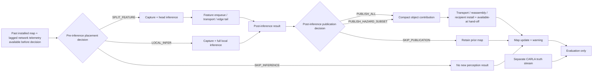

# Phase-2 paired causal control and corpus specification

**Dataset ID:** `phase2_paired_causal_v1`  
**Status:** causal pilots and offline adjudication complete; future C2 endpoint
reconciliation **proposed on 2026-08-19 and pending joint review**. **No full
CARLA collection, OAI run,
controller evaluation, or RL training is authorized by this document.** The
existing `phase2_suite_ab_v1` manifest and power artifacts are immutable
warning-lead-era design candidates, not authorization. The offline
`phase2_suite_ab_v2` factor manifest now exists, but it deliberately carries no
runtime or power authority; its adapters, track-quality guardrails, and bounded
factor smoke remain prerequisites.

This is the single source of truth for the Phase-2 observation/action timing, map-contribution schema requirements,
paired corpus, and pilot acceptance gate. `policy_corpus_advisor_rich_v5` remains useful for perception QA,
workload distributions, and historical matched-support studies, but it is not renamed or patched into this corpus:
it has no paired recipient, synchronized hazard truth, causal pre-action state, or retained raw sensing needed for
C2.

## 1. Contribution and decision contract

Every stage must name the paper contribution it advances and the decision its result can change.

| Work item | Contribution | Decision changed by the evidence |
|---|---|---|
| Paired helper-recipient local path | C1 system + C2 cooperation gain | Whether a usable helper track becomes available at the recipient before recipient-self confirmation |
| Identical contribution over OAI RFsim | C1 + C2 | Whether that recipient-available installed-track gain and its deadline slack survive measured protocol-stack transport |
| State + uncertainty + deadline behavior | C3 | Whether a contribution is usable, stale, or must trigger conservative warning behavior |
| Exact/simple publication and placement baselines | C4 | Whether a measured deterministic rule suffices or a sequential learner has residual headroom |

Under this proposal, the primary future C2 timing endpoint is
**recipient-available installed-track gain** on the same truth trajectory and
at the same recipient consumer/decision boundary:

```text
t_self_available(h) = first available_at for a usable recipient-self confirmed track of h
t_help_available(h) = first available_at for an accepted, usable helper-derived track of h
recipient_available_confirmed_track_margin_s(h) = t_self_available(h) - t_help_available(h)
```

`t_help_available >= installed_at_s` and follows helper sensing, inference,
source-track confirmation, publication, transport, reassembly, recipient
association, accepted map install, and any hand-off to the named recipient
consumer. At availability the contribution must meet preregistered class,
localization, covariance/validity-horizon, and freshness requirements.
Registered-target association is evaluation-only and never enters the runtime
map or policy. Helper-local confirmation or install without causal
`available_at` is not recipient knowledge and earns no C2 credit.
`t_self_available` uses the same frozen detector/tracker/consumer boundary but
only the recipient's own causal sensing.

Information must also arrive with useful deadline margin; a fixed number of
seconds is not a universal safety threshold. For response profile `p`, freeze
independently justified terms before the scientific decision core:

```text
t_info(ego_only,h) = t_self_available(h)
t_info(cooperative,h) = min(t_self_available(h), t_help_available(h))
required_after_info_s(h,p) = map_to_alert_p95_s + reaction_s(p)
                             + braking_s(h,p) + safety_margin_s
actionability_slack_s(a,h,p) = predicted_conflict_at_s(h) - t_info(a,h)
                               - required_after_info_s(h,p)
actionable(a,h,p) iff actionability_slack_s(a,h,p) >= 0
```

`braking_s(h,p)` depends on registered closing speed/distance and a frozen
deceleration/friction model. Reaction profile `p` is an evaluation stratum, not
a policy feature. Actionable-success and continuous slack are mandatory
stratified interpretations of whether earlier information could be timely; they
do not prove that the installed track caused a valid warning, braking response,
or safe stop. C3 warning/safety remains failed and unresolved until a frozen
warning-to-actuation path is evaluated. This prevents an agent from memorizing
the pilot's pedestrian onset or a single comfortable braking budget.

Track availability is a time-to-event endpoint, so missing confirmations,
installs, or consumer availability are never encoded as arbitrary large
numbers. If the helper track becomes usable/available and recipient-self does
not before the registered horizon, report right-censored
`t_self_available` and a lower bound on gain. If no usable helper track becomes
available, report no cooperative gain; if both paths miss, report a
missed-hazard pair. A later helper availability produces negative gain. Report
event counts and trajectory-clustered uncertainty with every aggregate.

Warning lead, missed/false warnings, and nuisance remain important
**secondary downstream outcomes**, not substitutes for valid track
installation. A warning rule must carry its own preregistered specificity gate;
track timing cannot launder a warning design that fails benign
non-inferiority. Likewise, target-track gain must be accompanied by false-track,
duplicate/fragmentation, and benign map-pollution diagnostics so a permissive
tracker cannot manufacture apparent benefit.

### 1.1 Preserved 2026-08-19 pilot result and scope

The immutable decision-opportunity pilot remains a formative result. Under the
fixed M-prime/v3 local replay contract, helper-local target confirmation at
2.2 s preceded recipient-self confirmation at 4.6 s by 2.4 s. That is a
**local-confirmation upper bound**, not `recipient_available_confirmed_track_margin_s`: it contains no
measured OAI delivery and does not establish when an installed helper track was
available to the recipient consumer. It is one designed trajectory and is not a powered or
generalization result.

The same pilot's cooperative warning appeared 3.3 s before ego-only and 2.1 s
before the scenario-owned hidden-target yield, but the cooperative benign
false-warning gates failed (12.86% send-everything and 15.71% hazard-only,
versus 4.29% ego-only). Preserve that lead-versus-nuisance finding as a failed,
rule-dependent secondary result; do not tune or reinterpret it as C2 success.
The current evidence supports only an unresolved unmatched vehicle-track/motion
nuisance diagnosis. Earlier parked-object forensics do not prove that static
objects are the sole cause in this pilot, and hazard-only's larger nuisance
shows that publication selection can amplify the problem.

## 2. Non-goals and claim boundaries

- The pilot is a **capture-contract and computability gate**, not performance evidence.
- The v1 map-sharing synthetic fixture proves plumbing only.
- The Phase-1 ladder, Task B replay costs/lifts, and Task C runtime agreement remain noncausal matched-support
  studies and are not validation targets for this corpus.
- Dynamic intermediate/late fusion selection alone is not claimed as novel; mmCooper already covers that axis.
- No unconditional safety guarantee is claimed. Covariance, process noise, association, detection misses, and
  warning calibration must be measured before the C3 language can exceed “uncertainty-aware model contract.”
- No RL algorithm is selected or trained here. RL is gated on residual sequential headroom after exact and simple
  causal baselines.
- C2 track installation and warnings are **recorded but never actuated** during
  the paired corpus. Braking/steering would make the world action-dependent and
  belongs only to the later common-adapter navigation evaluation.

## 3. Causal decision loop

The policy clock and sensor/inference clock may differ, but time ordering may not. Every field exposed at a
decision carries `source_stage`, `observed_at_s`, `available_at_s`, `consuming_decision_id`, and
`consuming_decision_stage`; the logger and loader must assert against the referenced placement or publication
decision:

```text
available_at_s <= decision_at_s
```



The placement policy must never use same-frame detections, confidence, track identity, map quality, or hazards
produced by the action it is choosing. Shadow execution of unchosen LOCAL/SPLIT paths is allowed only for
evaluation, must be written to an evaluation namespace that the policy loader rejects, and must run offline or in
a separately timed pass so it cannot consume compute/network resources or perturb the primary path.

## 4. Action semantics: placement is not publication

Two decisions occur at different causal stages and must not share an ambiguous `SKIP` label.

### 4.1 Pre-inference placement action

- `SPLIT_FEATURE(profile_id, target_fps)`: capture, run the configured head, and send the intermediate feature to
  the edge tail.
- `LOCAL_INFER(local_profile_id, target_fps)`: capture and run the full local model; no intermediate feature is
  sent.
- `SKIP_INFERENCE`: intentionally acquire no new inference result at this opportunity.

This action may depend only on lagged network state, prior installed-map state/uncertainty, prior causal tracks,
previous action/outcome, scheduler/in-flight summaries, and other explicitly available pre-action signals.

### 4.2 Post-inference publication action

- `PUBLISH_ALL`: serialize all eligible causal detections into the compact Phase-2 object schema.
- `PUBLISH_HAZARD_SUBSET`: publish the causal recipient-conditioned subset using the newest recipient state that
  has actually reached the decision locus.
- `SKIP_PUBLICATION`: do not send a compact object update after local inference.

Record the publication decision locus (`helper`, `edge`, or `recipient`) and the availability/age of the recipient
state used there; “current recipient state” is not magically shared. For `SPLIT_FEATURE`, the edge result is
installed through the split path and its provenance must say which output and transport path produced it. For the
first C2 evaluation, inference placement may be fixed so that send-everything versus hazard-only publication is
isolated. Dynamic placement is evaluated later, after the LOCAL table exists.

## 5. Pre-action state provenance

| State field | Permitted source | Earliest availability | Policy use |
|---|---|---|---|
| Lagged capacity estimate and uncertainty | prior OAI telemetry/estimator | after prior telemetry window | allowed |
| Previous delivery, latency, loss, action | prior completed event | after prior outcome | allowed |
| Scheduler credit / in-flight summaries | local scheduler state | current decision boundary | allowed |
| Installed recipient-map tracks, AoI, covariance | prior accepted contributions | after prior map install | allowed |
| Causal source-local tracks | detections completed before this decision | tracker update completion | allowed |
| Current helper pose and motion | helper-local measurement | measurement timestamp | allowed if timestamped |
| Recipient pose and motion at helper/edge | last causally received recipient-state message | message availability at decision locus | allowed with age/provenance |
| Current-frame detector output/confidence | selected inference path | after current inference | **forbidden pre-action** |
| Current-frame hazard score/map quality | current output/map update | after inference/install | **forbidden pre-action** |
| CARLA actor ID, future trajectory, collision label | truth stream | evaluation only | **forbidden always** |
| Shadow unchosen-path output | evaluation worker | after shadow inference | **forbidden always** |

The implementation must use an allowlist, not merely rely on column naming. Missing or late fields fail closed;
they are not forward-filled across a boundary unless that behavior is part of the declared causal estimator.

### 5.1 Anti-memorization policy-feature contract

The controller must respond to the current causal situation, not learn the
authored scenario schedule. Its versioned feature manifest applies separately
at placement and publication time and is checked by the loader.

**Allowed:** causal ego-centric relative range/bearing and relative velocity;
current ego speed/acceleration; covariance-expanded closing-rate or deadline
proxies computed from already-available tracks; per-object AoI/validity;
lagged capacity, queue, loss, and estimator uncertainty; previous
action/outcome; and scheduler/in-flight state. Protocol scheduler phase is
allowed because it changes transition dynamics, but the phase offset must be
varied independently of hazard onset. Absolute pose may be used inside the map
transform but is not a main-policy feature. A route-ahead radio-map feature is
permitted only as a separately declared deployment-observable ablation with
route-family holdout.

**Denied:** scenario/suite/group/trajectory ID, positive/benign role, factor-cell
label, random seed, registered-target identity, CARLA actor ID, planned hazard
start/end or waypoint, authored target phase, future conflict/trajectory truth,
collision outcome, absolute simulation time, world-frame ordinal, capture-window
offset, manual-versus-scripted driver label, participant identity, and any
shadow-path result. Wall/simulation timestamps remain in provenance but only
causal differences such as AoI, elapsed service time, or estimator age may
enter the policy. Main-policy spatial features are ego-relative; allowing
absolute world/route position requires the registered radio-map ablation and
must never expose a hazard-location lookup.

Scenario onset, sensor/scheduler phase, and route start are independently
balanced or jittered. Train/calibration/validation/test split by complete
trajectory group before feature construction. At least one onset range, one
driver-motion profile, and one geometry/route combination are held out as
explicit extrapolation stresses rather than hidden inside frame-random splits.
The policy never receives the holdout label.

## 6. `scenesense.map_contribution.v2` requirements

The checked-in v1 schema is a plumbing scaffold. Before the pilot, a separately versioned v2 schema must be
reviewed and implemented without silently changing v1 artifacts. At minimum it must carry:

### Contribution envelope

- `schema`, `operation`, `contribution_id`, `source_ue_id`, `recipient_ue_id`, and per-source-recipient
  `sequence_number`;
- `captured_at_s`, `placement_decision_at_s`, `inference_completed_at_s`, `publication_decision_at_s`,
  `published_at_s`, decision IDs/loci, and clock-domain metadata;
- `inference_placement`, `publication_action`, `profile_id`, `target_fps`, `model_id`, model/config/code hashes;
- exact `application_payload_bytes`, chunk count, and separately derived UDP/IP on-wire bytes;
- causal provenance for source sensors and calibration identifiers.

### Per-object record

- source-local `track_id` and tracker/version identifier; **never a CARLA/GT actor ID**;
- class, confidence, world-frame `x_m`, `y_m`, `vx_mps`, `vy_mps`, and object measurement/capture time;
- 4x4 covariance for `[x, y, vx, vy]`, or an explicitly equivalent versioned representation;
- `motion_model_id`, process-noise model/parameters, and validity horizon;
- causal occlusion/hazard inputs and their provenance; any recipient-conditioned hazard score must record the
  recipient-state timestamp used to compute it.

### Recipient receipt/install record

For every contribution/object candidate, retain the contribution/sequence and
source-track IDs; first/last-byte and reassembly times; recipient association
completion and map-install times; accept/reject status and reason; installed
recipient-track ID; covariance, propagated age, validity remaining, and quality
at the install decision; and the named recipient consumer plus its
`available_at_s`. Assert `available_at_s >= installed_at_s`. A source
confirmation or install without a matching consumer-availability record cannot
satisfy `t_help_available`. Evaluation-only registered-target association is
stored outside this runtime record.

The causally delivered recipient-state message also carries covariance, motion/process-noise model identifiers,
and process-noise parameters. Relative-warning uncertainty combines propagated object and recipient covariance;
the initial sum assumes independent errors. A correlated estimator must supply cross-covariance and replace that
assumption. Zero recipient uncertainty must be explicit and calibrated, never an omitted default.

### Recipient behavior

For a constant-velocity baseline with state `z=[x,y,vx,vy]`, propagate:

```text
z(t + dt) = F(dt) z(t)
P(t + dt) = F(dt) P(t) F(dt)^T + Q(dt)
```

Association and warning logic must use the propagated uncertainty, not a hard-coded `speed_sigma` placeholder.
The form and calibration of `Q(dt)`, association gates, and a probabilistic or uncertainty-expanded warning rule
are preregistered after pilot diagnostics. Until then, this is a design equation—not a safety guarantee.

## 7. Sensor, world-clock, and timebase contract

The Phase-2 pilot starts from the validated M-prime training sensor contract rather than inheriting a collector
default:

- CARLA world/sensor tick **10 Hz (`fixed_delta_seconds=0.1`)**;
- RGB **1280x720, FOV 120 degrees**;
- radar **200,000 points/s**, yielding approximately 20,000 returns per 0.1 s frame before filtering;
- radar raster radius **4** and temporal window **2**;
- actor-origin GT in the separate truth stream; no GT-derived runtime labels or keys.

CARLA renderer quality is an explicit nuisance variable. The M-prime training
metadata did not record Low/default/Epic, so the training corpus must not be
retroactively labelled. The paired sparse gate proved renderer sensitivity, and
the matched medium/crowded confirmation had identical world/radar support but no
pedestrian inside its pre-registered <=12 m safety band. Its weighted v5 decision
was therefore formally inconclusive rather than repaired post hoc. The operational
contract is nevertheless frozen: all primary Phase-2 capture uses explicit
`Epic` (`-quality-level=Epic`), selected for realistic rendering and its stronger
dense diagnostic segmentation/vehicle results. Existing Low captures remain a
labelled stress condition; no additional Low corpus stratum is authorized. Every
later launch and run manifest must record `Epic`, the exact server flag, and the
operator-declaration provenance because CARLA exposes no reliable quality RPC.

Any faster controller clock is a later surrogate/runtime concern; it must not silently change the CARLA sensor
contract. The pilot records pre-filter returns/frame and fails on a material density/shape/config drift before
testing perception or C2.

For each process/container, log simulation time, a monotonic host timestamp, wall-clock timestamp, and `clock_id`.
Record clock offset/uncertainty or a synchronization event sufficient to order capture, inference, enqueue,
reassembly, install, and warning. Never subtract timestamps from unaligned clocks.

## 8. Corpus suites and preregistration

Both suites use one helper and one named recipient, synchronized truth,
identical route/scenario seeds across policy arms, and trajectory-grouped
train/calibration/validation/test splits. Power is based on independent
route/seed clusters, not raw frames or a naive count of correlated hazards. Use
trajectory-clustered bootstrap or simulation-based power with
calibration-estimated event yield, censoring, variance, and
within-trajectory correlation. Freeze positive-hazard and matched-benign counts
per realized factor cell, total independent clusters, expected censoring,
smallest effect of interest, and track/map-quality guardrails in a hashed
analysis plan before validation or test.

The deterministic `phase2_suite_ab_v1` inventory, 20/20/60 assignment,
sensitivity table, retention tiers, and hashes are preserved as an immutable
warning-lead-era candidate. Its low/high closing-speed and short/long
time-to-hazard columns are currently **design labels only**: they do not yet
bind per-geometry control parameters or verify the realized urgency. Therefore
the old 15-trajectory audit, 66-trajectory calibration stage, and 330-trajectory
full plan remain unauthorized even though their geometries were visually
reviewed. A versioned successor must regenerate the manifest and power plan for
`recipient_available_confirmed_track_margin_s` plus actionability stratification; v1 artifacts are
never rewritten.

### Suite A — designed decision opportunities

Purpose: provide enough causal states in which cooperation/publication/placement can change a recipient outcome.
Balance controlled positive hazards with matched benign negatives. Span, at minimum:

- helper-only occlusion discovery versus recipient-visible objects;
- pedestrian/cyclist/vehicle class where supported, with class limitations explicit;
- near versus far range, low versus high closing speed, and short versus long time-to-hazard;
- fresh, near-deadline, and stale prior-map states;
- network states where SPLIT and LOCAL are each feasible, plus a genuine neither-good regime;
- clean and degraded transport, including recovery transitions;
- sparse and competing-object scenes to exercise unfiltered false positives and publication selection.

This suite is curated and may flatter the controller. It cannot be the only headline.

Before any factor row is called realized, each geometry family must declare a
typed urgency contract: `hazard_geometry_type`, its conflict event/surface, the
truth fields used only for evaluation, a geometry-appropriate prediction model
and horizon, intended onset/closing-speed band, numeric realized-band bounds,
and tolerance. Pedestrian crossing, cross-traffic, pullout, and queue reveal do
not share one universal TTC definition. Store the realized recipient speed,
range/clearance to the typed conflict surface, predicted conflict time or
censored status, helper-only visibility interval, recipient-self availability,
usable-helper consumer-availability time, and actionability slack. A configured `low/high` or `short/long` label does not
pass its cell unless these realized quantities satisfy the registered typed
gate.

The next proposed live unit is a **16-trajectory factor-realization tranche**,
with every row and split assignment hash-frozen as calibration before launch.
This is not an extra disposable pilot: if capture/integrity and every typed
realization gate pass, those trajectories count toward calibration. Failed or
out-of-cell rows remain immutable failed calibration evidence and are not
relabelled to another cell. Launch still requires a separate human approval of
the versioned manifest; this document does not provide it.

The designed positive/benign contrast uses **scenario-owned actors only**, not
a scripted moving traffic future. The helper, recipient, registered hazard,
and scenario-owned occluder reproduce the manually accepted geometry; no
generic vehicle/walker population process is launched. This removes Traffic
Manager, the sparse native spawn catalog, and random pedestrian placement from
the causal treatment. Suite-A manifest rows use
`traffic_density=not_applicable`, `ambient_population_mode=scenario_owned_only`,
and `ambient_population_process_required=0`. If calibration later
shows that explicit distractor competition is necessary, add preregistered
scenario-owned transforms and repeat visual review rather than reintroducing a
random background population.

Target onset, occlusion-release timing, helper-visible dwell, and recipient
motion are varied independently within the typed contracts. Positive/benign
twins keep all non-treatment timing identical. This makes the live kinematics,
not a scenario clock, determine urgency.

### Suite B — naturalistic paired operation

Purpose: preserve an honest denominator under natural event prevalence. Use paired helper-recipient traffic with
the same capture contract, but do not force a decision opportunity every frame. Report the same installed-track,
actionability-stratum, map-quality, warning, safety, latency, and load metrics as Suite A. Never pool the suites
into a single headline without also reporting each suite separately.

Suite B uses ordinary safe Traffic Manager vehicle motion and walker AI, not
matched replay. Its initial sparse/typical/dense targets are 6/4, 10/8, and
15/12 vehicles/walkers. It retains collision, liveness, and persistent-gridlock
gates but has no positive/benign ambient-trajectory equality requirement. The
three density levels are nuisance strata, while balanced **decision windows**
(object-bearing, hazard/deadline, and no-hazard windows) are the unit used to
assess controller opportunity; raw empty frames are not allowed to dominate by
accident.

The accepted v5 distribution informs traffic realism and perception workload, but its frames are not Phase-2 C2
samples.

Short trajectories must not manufacture route diversity by repeatedly using a
shared prefix. For each loop, pre-register geometry-only start-anchor strata
before collection and balance them across calibration/validation/test. Persist
the anchor ID, recipient/helper start indices, native lane/headings, initial
separation, and byte hashes of both role routes. The current candidate uses six
non-junction strata on each of the signalized-demo and safe-perimeter loops,
with a same-lane helper 10--20 m ahead. This is an unforced platoon-style
vantage difference, not a designed hazard. All inference remains conditional
on the named Town10HD_Opt route families.

Both the signalized-demo and safe-perimeter families have passed automatic and
manual review at all six anchors. Their shared contract is finalized as
`town10hd_opt_same_lane_helper_ahead_v1`. Collection remains subject to the
separate staged calibration, recoverability, realized-factor, track-quality,
and power gates.

### Driver-motion and MWC holdout boundary

The research corpus uses multiple preregistered, reproducible recipient-motion
profiles spanning speed, acceleration/deceleration, and approach timing. These
profiles create human-plausible kinematic variation but do not react to a
counterfactual warning during the paired sensing/publication capture. One
complete scripted motion profile and selected onset/geometry combinations are
held out from controller training. Policy features contain current causal ego
kinematics, never the profile name or an autopilot/manual flag, so the deployed
controller recomputes urgency each step rather than assuming CARLA Autopilot's
braking schedule.

The MWC 2027 manual-driving demonstration is a **post-freeze human-in-the-loop
holdout**, not another training stratum. Audience/driver runs do not enter
training, calibration, model selection, or confirmatory C2 estimates. They use
the frozen controller and warning/display path, record system availability,
driver response, minimum clearance/collision, and stop/comfort outcomes, and
are reported separately with participant/run provenance and an explicit safety
override. Human reaction-time variation is handled through registered response
profiles/sensitivity analysis; participant identity is never a policy input.
This separation lets the system support a human driver without claiming that a
scripted CARLA yield demonstrates human braking performance.

### Network-state coverage for agent feasibility

The four measured SNR/channel rungs remain the static calibration anchors, but SNR labels are never policy input
and are not the complete environment. The causal state uses lagged capacity/queue/link telemetry. Before any
dynamic-controller or RL go/no-go, the design-only scientific core must include at least one controlled
degradation-and-recovery trace plus stable good/bad and burst/queue-recovery cases. It must demonstrate that:

- at least two placement/publication actions are genuinely feasible in enough independent clusters;
- LOCAL and SPLIT outcomes are measured on identical inputs without shadow-path perturbation;
- action outcomes and rankings differ beyond measurement noise in at least some registered states; and
- earlier actions change later queue/map-freshness state.

Broader transition coverage is added only if this core exposes residual headroom. Add at least one held-out
intermediate condition near the measured SPLIT feasibility knee to validate interpolation rather than memorizing
four rungs.

## 9. Historical pilot contracts and completed result

The original data-contract pilot was **exactly two short paired trajectories**:

1. one controlled positive occlusion/hazard in which helper evidence can causally precede recipient-only evidence;
2. one matched benign negative with similar traffic/sensing load but no warning-worthy conflict.

The later decision-opportunity pilot added one naturalistic trajectory to that
positive/benign pair. Both pilots are excluded from future calibration,
validation, test, effect-size estimation, and controller training; §1.1 records
the immutable 2026-08-19 result without promoting it to C2 evidence.

The pilot exercised ego-only, send-everything, and hazard-only counterfactual evaluation from one immutable
capture where valid. Each arm has an independent recipient-map/controller state; no installed track, queue, or
warning state may leak across arms. If an arm changes sensing or world evolution, collect it as a paired replayable
arm rather than claiming an invalid offline counterfactual. Warnings are logged only and **must not actuate** the
recipient during C2 capture.

### Required retained artifacts

- aligned RGB frames and radar tensors/point records for the controlled window, with calibration, transforms,
  frame IDs, sensor timestamps, and exact training sensor contract;
- unfiltered detector candidates before thresholding/NMS/top-k and the final detector outputs, including unmatched
  detections;
- causal tracker inputs/outputs, source-local IDs, association decisions, ID births/deaths/switches, and tracker
  version/config;
- both LOCAL and SPLIT outputs/timing when shadowed, explicitly marked `evaluation_only=true`;
- helper and recipient ego states, route/scenario/traffic seeds, and separate synchronized CARLA truth;
- all state fields with `source_stage`, `observed_at_s`, `available_at_s`, `consuming_decision_id`,
  `consuming_decision_stage`, and the referenced placement/publication decision time;
- inference placement/publication action, scheduler/in-flight state, queue events, and outcome provenance;
- capture, inference-done, enqueue, first-byte, last-byte/reassembly, install, and first-warning timestamps;
- application/on-wire bytes, tunnel identity, channel estimate and raw OAI telemetry where applicable;
- resolved config, package/library versions, model/checkpoint hash, code revision, and artifact manifest hashes.

### Hard raw-retention budget

Continuous heavy retention is forbidden. The retained-input diagnostic implies an initial planning rate of about
46 MB/frame, or about 55 GB/min for two synchronized vehicles at 10 Hz before shadow artifacts. This is a sizing
reference, not a promised corpus size. Any future runner must:

- retain RGB/radar/tensors/logits only inside explicit controlled windows;
- enforce per-window, per-trajectory, and pilot-total byte quotas before each write;
- reserve configured free space up front and fail closed if the reserve would be crossed;
- record attempted/written bytes, measured bytes/s, window duration, and stop reason; and
- stop raw retention safely while preserving lightweight causal/event logs if a quota is reached.

The pilot measures the true rate used to budget the full suites. Deleting prior evidence is not an automatic
overflow policy; cleanup requires a separate reviewed inventory of uncited, reproducibly disposable artifacts.

The historical warning-era **planned** calibration audit instantiated exactly
40 retained input/logit pairs per role in a reviewed 4 s window and 120
lightweight frames per 12 s trajectory. Its nine-group/15-trajectory plan had a
27.24 GB estimate, 3 GB per-trajectory cap, 80 GB stage cap, 500 GB free-space
floor, and 580 GB preflight requirement. Only the accepted three-trajectory /
two-group subset `20260818_230028_audit` completed; do not describe the 15-row
plan as collected. It used native 10 Hz world ticks, Epic rendering, the exact
M-prime sensor contract, and the pre-perception radar-density gate. That subset
established CARLA capture/replay sufficiency only; it could not establish OAI
enqueue, on-wire, reassembly, or install timestamps. Because its speed/urgency
cells were labels rather than typed realization gates, it remains
structural/warning evidence and is not silently counted toward the future
installed-track endpoint.

### Reusable capture gates and successor additions

All are hard gates; there is no majority pass.

1. **Causal availability:** every runtime input satisfies `available_at_s <= decision_at_s` for its referenced
   placement/publication decision; evaluation-only and GT fields are rejected by the policy-state loader.
2. **Representation:** runtime track IDs are source-local and causal; no GT ID enters a runtime message, map,
   association, selection, or warning.
3. **False-positive preservation:** raw/final candidate counts survive end to end. A bounded tranche need not
   naturally contain a false positive; inject one synthetic unmatched detection into an offline copy and prove it
   is retained and handled without acquiring a GT identity.
4. **Alignment/recoverability:** a sampled decision can be reconstructed from raw sensing through inference,
   tracking, action, transport, map install, warning, and separate truth scoring.
5. **Action provenance:** LOCAL, SPLIT, `SKIP_INFERENCE`, and `SKIP_PUBLICATION` cannot be conflated; shadow outputs
   cannot influence actions.
6. **C2 computability:** from future calibration artifacts alone, compute helper-local confirmation,
   recipient-self availability, recipient-side usable-helper-track install and consumer availability,
   recipient-available track gain or censoring,
   typed realized urgency/horizon, actionability slack by response profile, false/duplicate/fragmented track
   burden, missed hazard, bytes, latency decomposition, map AoI, and evidence provenance. Warning timing and
   nuisance are retained as secondary outcomes; a non-target warning is not called false until evaluation-only
   future-trajectory truth adjudicates whether that other object is hazardous.
7. **Paired semantics:** the positive and benign trajectories share the intended matched factors, and all arm
   differences are declared. Counterfactual arms have isolated state. No hidden world-state divergence is treated
   as a policy effect.
8. **Integrity:** no dropped required stream, timestamp inversion, cross-recipient update, actor leak, partial
   manifest, mutable overwrite, unintended collision/pile-up/gridlock, or failed actor cleanup. The deliberate
   positive hazard is labelled separately from an unintended impact.
9. **Sensor contract:** configuration hashes match the pinned 10 Hz/1280x720/FOV120/200k/raster4/window2 contract,
   pre-filter radar density is on the expected approximately 20k-return/frame scale before perception scoring,
   and the resolved CARLA renderer quality is present and matches the selected primary or declared stress stratum.

Detector quality or a positive lead magnitude was **not** a historical
data-contract pilot gate; those pilots established computability. The proposed
16-trajectory calibration tranche has the additional typed factor-realization
gates in §8. It may retain a null/negative cooperation result if that result is
causal and recoverable, but an out-of-cell realization does not count as the
labelled factor.

### FAIL/HOLD rule

At the first failed gate: write a failure summary, retain the immutable artifacts, stop, and repair the contract.
Do not launch more trajectories, repair missing causal fields by joining future/GT data, weaken the gate, or infer
that a full run will average the defect away. A PASS summary still requires human review before full collection.

`WARNING_EVALUATION_DESIGN_FREEZE.md` remains immutable and binding only for
the failed secondary warning-rule result and its no-gate-weakening boundary. It
does not define or power the new primary installed-track endpoint. A versioned,
hash-bound successor analysis plan must be approved before the proposed
calibration tranche. No current pilot is reused as confirmatory evidence.

## 10. Future staged evaluation plan; explicit reauthorization required

1. Review the checked-in v2 factor manifest and implement its missing runtime
   adapter, recipient-availability event, exact policy-feature projection,
   track-quality guardrails, and create-only launcher. The already pinned 16
   calibration trajectories, typed per-geometry realization gates,
   driver/onset balance, response-profile slack analysis, raw-data quotas, and
   cluster estimators must fail closed. This reviewed implementation step, not
   this document, decides whether to authorize launch.
2. If authorized, run only that 16-trajectory factor-realization tranche. Stop
   and review it separately. Every passing row was assigned to calibration in
   advance and therefore counts toward calibration rather than being discarded
   as another pilot; no row may be relabelled after capture.
3. From immutable captures, run local ego-only and cooperative track-availability
   baselines and report `recipient_available_confirmed_track_margin_s`, actionability success/slack,
   misses, false/duplicate/fragmented installed tracks, bytes, and uncertainty.
   Keep the already failed warning-rule lead/nuisance result secondary and do
   not weaken its gates.
4. Only after a separate human gate, send identical contribution bytes through
   two-UE OAI RFsim and repeat recipient-available installed-track endpoints. A helper-local
   confirmation or raw install time is never substituted for consumer availability.
5. Re-estimate yield/censoring/cluster variance and regenerate power/counts for
   the new endpoint. Complete remaining calibration only if factor realization,
   track/map quality, and estimator precision are adequate; validation and test
   each require a new decision.
6. Measure the LOCAL table needed for dynamic placement on the target compute configuration: compact payload
   versus object count/schema; paired segmentation, pedestrian/vehicle recall and localization on identical
   inputs; inference p50/p95; sustainable FPS; CPU/GPU and memory occupancy; and compact-record OAI delivery,
   latency, PRB/airtime, and queueing across the four static anchors. Payload size is indexed by object/schema,
   while SNR/load indexes transport outcomes. Energy is optional unless a calibrated counter exists.
7. Only then run the causal three-placement/publication ladder. Start with exact enumerator, fixed/rule, greedy,
   lambda-RDO where supported, and the AoI-index-inspired heuristic. Genuine Whittle requires a demonstrated
   per-object arm decomposition and indexability.
8. Authorize DQN/discrete-SAC/masked-PPO only if simpler causal baselines leave a pre-registered sequential gap.

Pre-register the interpretation of a null before calibration: positive
recipient-available installed-track gain in both suites supports broad C2;
gain only in designed occlusions supports a regime-bounded claim; a local gain
erased by transport defines the transport feasibility boundary; no earlier
helper evidence defines a perception/scenario boundary; and no meaningful gain
anywhere requires reconsidering C2 as the paper spine rather than a post-hoc
C3/C4 pivot. One pilot's 2.4 s helper-local gap cannot decide any of these.

## 11. Pre-launch self-audit

Before approving any work item, answer all five questions in its review record:

1. **Contribution:** which of C1-C4 does this advance?
2. **Decision:** what result would make us change course?
3. **Causality:** was every controller input available before its action?
4. **Recoverability:** can the conclusion be recomputed from immutable raw and structured artifacts?
5. **Simplicity:** is this the smallest experiment that can answer the question without hiding a needed factor?

If a proposed run cannot name both a contribution and a decision, do not run it. If causality or recoverability is
uncertain, resolve that in the pilot rather than in the full corpus.
