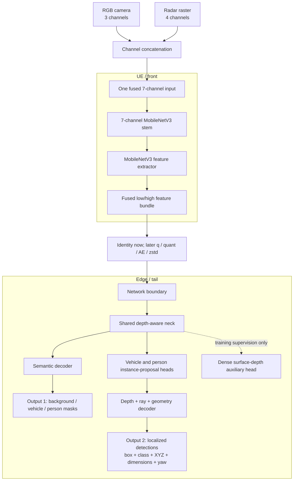
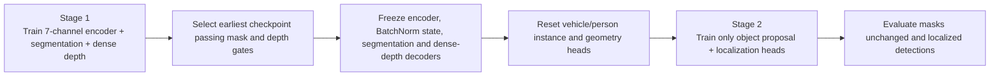
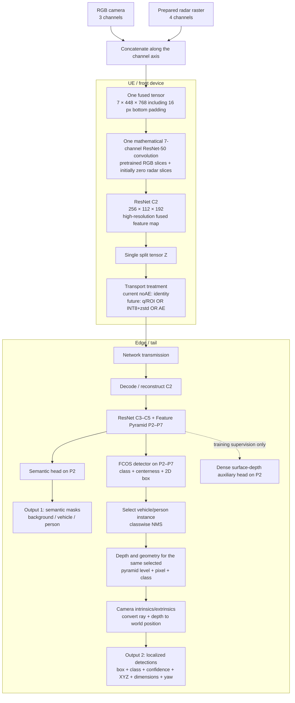

# From LR-ASPP to SplitFusion-FCOS

## A seven-channel RGB-radar split-inference perception study

**Report status:** final noAE perception evidence and forward-model lock; no model training or inference was rerun for this documentation update.

**Primary evaluation contract:** canonical `v0.10`, class-aware one-to-one world matching within 3 m. Historical service results use score `0.20`; the forward wrapper applies a person-only output floor of `0.25` after the unchanged `0.20` consolidation pipeline.

**Measured result:** the supervisor-accepted p020 SplitFusion-FCOS candidate passes 7/9 primary gates. The forward p025 wrapper remains 7/9, with canonical person precision/recall `0.7967/0.5961` and supporting `AVO >= 0.65` precision/recall `0.7042/0.7132`.

**Acceptance decision:** the supervisor accepted the frozen epoch-26 7/9 architecture for progression. The project now locks its p025 wrapper as the noAE baseline for hybrid-q, quantization, zstd, AE and system measurement. This is a service-scope decision, not a claim that the two missed 0.80 gates passed.

**Visibility addendum:** human visibility bands are the interpretable publication reference. Actor-volume observability is retained as a full-validation automatic supporting analysis, while the older depth-box occupancy is internal sensitivity evidence.

---

## 1. Executive conclusion

The project began with LR-ASPP because it is a lightweight semantic-segmentation architecture suitable for split inference. We extended it to accept one fused seven-channel RGB-radar input and added instance-level localization. We then tested two clean training hypotheses:

1. **Joint LR-ASPP:** jointly optimize semantic segmentation, instance proposals, depth and geometry.
2. **Task-separated LR-ASPP:** first learn segmentation and depth; then freeze that representation and train only the instance/localization heads.

The joint model learned useful localization but could not preserve detection and segmentation together. The task-separated model learned strong semantic masks and depth, yet its frozen object head still produced too many false candidates. This showed that optimization interference was not the only problem: knowing which pixels are people did not automatically solve how many people exist, which pixels belong to each individual, or which depth/radar estimate belongs to each individual.

We therefore changed the perception architecture—not the project framework—to **SplitFusion-FCOS-R50-FPN-P2-P7**. It retains:

- RGB `(3)` plus radar `(4)` concatenated into one seven-channel tensor;
- one learned fused intermediate representation crossing the network;
- front-end processing on the UE and tail processing on the edge;
- the same future compression point for q/ROI, quantization, zstd and AE variants;
- semantic masks and per-object world localization as service outputs.

At the historical `v0.50` depth-box-occupancy sensitivity view, the final FCOS candidate achieves vehicle precision/recall `0.9646/0.9778`, person precision/recall `0.7687/0.7644`, and person XY MAE `0.7311 m`. The comparable joint and task-separated LR-ASPP person F1 values are `0.5231` and `0.4301`; FCOS reaches `0.7666`.

A stronger automatic supporting analysis back-projects synchronized depth into each actor's oriented 3D volume, rejects ground support and measures the 2D extent of actor-consistent pixels. At the human-supported binary cutoff `AVO >= 0.65`, the historical p020 FCOS candidate reaches person precision/recall/F1 `0.6292/0.7167/0.6701`, compared with `0.3478/0.6316/0.4485` for joint LR-ASPP and `0.2566/0.6545/0.3686` for task-separated LR-ASPP. This actor-volume measure is more selective than the old same-depth rectangle proxy, but it is still not a true silhouette fraction.

Because projected-box depth occupancy is not the same as visible pedestrian-body fraction, a separate prediction-blind human pilot categorized 100 target pedestrians by their visually observable body fraction. For the 44 non-severely-truncated targets judged at least 65% visible, FCOS attained `0.7045` target recall and `0.6315 m` matched XY MAE, compared with joint LR-ASPP at `0.5227/0.7094 m` and task-separated LR-ASPP at `0.5682/1.2951 m`. On the clearest `90–100%` band, FCOS recalled `23/28 = 0.8214` targets. The sample is target-stratified, so it measures recall and localization—not full-validation precision.

The final person-only p025 output floor was fixed from train-holdout evidence and then confirmed once on frozen validation outputs. It raises canonical person precision from `0.7307` to `0.7967`; person F1 rises from `0.6592` to `0.6819` because false positives fall more than true positives. It also gives `0.7042/0.7132` precision/recall at `AVO >= 0.65`. All vehicle, segmentation, score and geometry fields are unchanged. This p025 wrapper is the forward perception baseline.

This does **not** prove that LR-ASPP can never support localization. It establishes that the two tested LR-ASPP designs failed the registered service objective, while the detection-native FCOS/FPN representation produced a large and repeatable improvement under the same input, data and split-inference principles.

---

## 2. What the system must output

The service requires two visible outputs:

1. **Semantic masks:** label every image pixel as background, vehicle or person.
2. **Localized detections:** identify each individual vehicle/person and attach a physical position to it.

Object detection is therefore not an unrelated extra task. It supplies the individual actor proposals required for localization. A semantic mask can mark all person pixels, but it does not identify how many people are present or separate two overlapping people. The distinction between semantic labels and individual instances is standard in the vision literature; the [Panoptic Segmentation paper](https://openaccess.thecvf.com/content_CVPR_2019/html/Kirillov_Panoptic_Segmentation_CVPR_2019_paper.html) describes these as related but distinct tasks.

For this project, a localized detection contains:

- class and confidence;
- a 2D box;
- physical actor-centre `XYZ`;
- dimensions and yaw.

The registered detection precision/recall is stricter than ordinary image-only box scoring: a prediction is a true positive only when it obtains a same-class, one-to-one match to a ground-truth actor within 3 m in world space. XY MAE is then computed only over matched pairs, so it must always be interpreted together with recall.

---

## 3. Data and evaluation contract

The common dataset contains:

- 16,827 training frames from 10 episodes;
- 3,345 validation frames from 2 disjoint episodes;
- RGB, semantic labels, depth-derived person-mask approximations, four-channel radar rasters and radar points;
- synchronized calibration and depth-derived training/evaluation records;
- no opened test split.

All models use the same 768×432 camera content and the same prepared four-channel radar raster. Synchronized CARLA depth is used for ground-truth supervision and visibility evaluation, but **depth is not an inference input**.

### 3.1 Nine service gates

| Output | Requirement |
|---|---:|
| Vehicle precision | ≥ 0.80 |
| Vehicle recall | ≥ 0.85 |
| Person precision | ≥ 0.80 |
| Person recall | ≥ 0.80 |
| Vehicle XY MAE | ≤ 1.00 m |
| Person XY MAE | ≤ 1.20 m |
| Vehicle semantic IoU | ≥ 0.85 |
| Person box-mask IoU | ≥ 0.50 |
| Foreground mean IoU | ≥ 0.675 |

The historical registered object metrics use score `0.20`; inference retained candidates down to `0.02` for proposal-recall diagnostics. The final forward wrapper runs that pipeline unchanged and then filters only consolidated person outputs below FP32 score `0.25`. Segmentation IoU is the registered mask metric. Segmentation precision and recall shown later are additional per-pixel values derived directly from the stored confusion matrices.

### 3.2 Legacy depth-consistent projected-box occupancy

The original registered `visible_fraction` is a deterministic depth-based projected-box occupancy proxy:

1. Project the eight corners of an actor's 3D bounding box into the camera.
2. Clip the resulting rectangle to the image.
3. Derive the actor's near and far camera-depth limits from those corners.
4. Within the clipped rectangle, count pixels whose synchronized CARLA depth falls inside the actor interval, with fixed ±0.25 m tolerance.
5. Compute

   `visible fraction = depth-consistent pixels / clipped projected-box pixels`.

An eligible actor must also be within 40 m, have at least 12 pixels of projected area, and retain at least 12 accepted pixels at model-input resolution. `v0.10`, `v0.25` and `v0.50` require depth-box occupancy of at least 10%, 25% and 50%. Objects excluded by a stricter sensitivity view are handled through the registered ignore mechanism rather than treated as ordinary missed objects.

This measure is not an identity-perfect percentage of the actor's body that is visible. It uses the whole projected rectangle as its denominator, although a human silhouette does not fill that rectangle, and it accepts any pixel in the rectangle whose depth lies in the actor's near/far interval. Because the available CARLA build did not provide reliable actor-specific pedestrian instance masks, road or another surface at a similar depth can be included. Controlled renderer attempts to construct a stronger automatic z-buffer reference were stopped when the build failed to render dependable walker instances and isolated actor diagnostics. No proxy was silently substituted.

Accordingly, `v0.25` and `v0.50` are retained only as **legacy depth-box-occupancy sensitivity views**, not literal 25%/50% anatomical visibility. The same frozen contract was applied to every model, so the historical relative LR-ASPP/FCOS comparison remains useful, while its absolute eligibility interpretation is explicitly limited.

| View | Eligible vehicle GT | Eligible person GT | Additional vehicle/person GT ignored relative to v0.10 |
|---|---:|---:|---:|
| v0.10 | 9,691 | 3,872 | 0 / 0 |
| v0.25 | 8,385 | 3,376 | 1,306 / 496 |
| v0.50 | 7,333 | 1,974 | 2,358 / 1,898 |

`v0.10` remains the canonical service contract. The other views are sensitivity analyses and do not retroactively change model selection.

### 3.3 Prediction-blind human pedestrian visibility measurement

To measure external pedestrian occlusion directly from what the camera shows, a deterministic pilot selected 100 unique target actor-frames from 100 unique validation frames without consulting any model prediction. The sample contains 50 targets from each validation episode and is balanced across distance: 26 at 0–10 m, 26 at 10–20 m, 24 at 20–30 m and 24 at 30–40 m.

The human annotator used only the complete RGB frame and two RGB crops. Depth, radar, semantic masks, detections, model scores, distance metadata and the old occupancy proxy were hidden. The yellow rectangle identified the actor but was not the visibility denominator. The annotator mentally inferred the target's expected **in-frame body** without external occlusion and estimated the observable fraction of that body:

| Human band | Meaning |
|---|---|
| `bare_90_100` | At least 90% of the expected in-frame body is visible |
| `partial_65_90` | At least 65% but less than 90% is visible |
| `heavy_20_65` | At least 20% but less than 65% is visible |
| `not_observable_0_20` | Less than 20% is reliably visible |
| `ambiguous` | Resolution, alignment or scene content prevents a defensible band |

External vehicles, poles, street furniture, vegetation and other people count as occluders; self-occlusion from body pose does not. Distance alone does not lower visibility. Image-boundary truncation is recorded independently as `none`, `partial` or `severe`; visibility concerns only the expected body portion inside the image.

The planned human views are:

- primary reasonably observable: `bare_90_100 + partial_65_90` (`>=65%`), excluding severe truncation;
- observable challenge: `bare + partial + heavy` (`>=20%`), excluding severe truncation;
- not-observable: diagnostic only, excluded from the primary denominator;
- ambiguous and severely truncated: excluded with their counts disclosed.

Human annotator A labelled 28 bare, 16 partial, 19 heavy, 14 not-observable and 23 ambiguous targets; three targets were severely truncated. A frozen AI annotation was retained only as a diagnostic, not represented as a second human annotator. Exact visibility-band agreement was `63/100`, but among 76 cases where both assignments were non-ambiguous, `73/76 = 96.1%` were exact or only one adjacent band apart and only three differed by more than one band. Linearly weighted Cohen's kappa was `0.633`. For the publication `>=65%` cutoff, diagnostic binary agreement was `82.4%` with kappa `0.622`. This shows that most disagreement concerns a neighboring band boundary rather than opposite visibility judgments.

For model comparison, frozen score-0.20 detections are matched over the complete frame using the registered same-class, nearest-first one-to-one world-XY rule within 3 m. When the legacy occupancy contract had omitted the manually selected target, its authoritative actor row is restored before matching. Only the selected target's matched/missed status, 2D IoU and localization error are summarized. Since only one pedestrian per frame was manually banded, this audit cannot produce an unbiased precision estimate; full-validation precision remains the registered value.

### 3.4 Actor-volume observability supporting measurement

Actor-volume observability (AVO) was developed to remove the most concerning failure mode of the old proxy: counting road or another same-depth surface merely because it lies inside the projected rectangle. For each qualified person actor-frame, the evaluator:

1. projects and clips the actor's 3D bounding volume;
2. decodes depth pixels inside that region and back-projects them to 3D;
3. transforms each point into the actor's oriented local coordinate system;
4. retains points inside the actor volume with a fixed `0.05 m` tolerance and rejects the bottom `0.03 m` ground band;
5. forms the tight visible 2D box of the retained actor-consistent pixels; and
6. computes `AVO = area(visible box) / area(clipped projected actor box)`.

This is an **observability score**, not a literal visible-body percentage. It successfully rejects ground outside the actor volume, but the denominator is a 3D cuboid projection rather than a pedestrian silhouette, and a tight visible box can span across interior occlusion holes. On 77 non-ambiguous human pilot cases, its four-band weighted kappa was `0.4581`, below the registered `0.60` bar. As a binary `>=0.65` indicator it was much more useful: balanced accuracy was `0.8523` with TP/FN/FP/TN `35/9/3/30`. Therefore:

- human bands remain the fine-grained publication visibility reference;
- `AVO >= 0.65` is a defensible full-validation supporting binary view;
- the complete AVO threshold sweep is sensitivity evidence, not model selection or a claim of exact anatomical visibility.

The frozen validation AVO table contains 5,276 qualified person actor-frames and is applied identically to FCOS and both LR-ASPP representatives.

---

## 4. LR-ASPP architecture

LR-ASPP was introduced as a lightweight semantic-segmentation decoder in the [MobileNetV3 paper](https://openaccess.thecvf.com/content_ICCV_2019/papers/Howard_Searching_for_MobileNetV3_ICCV_2019_paper.pdf). Our implementation preserved its MobileNetV3 backbone but added custom object and geometry heads.

The object heads used class-private heatmaps and regressed subcell position, box centre/size, physical ray, depth, dimensions and yaw. The dense-depth branch was an auxiliary representation-learning task; it was not an inference sensor input.

---

## 5. Experiment A: joint depth-aware LR-ASPP

All semantic, proposal, depth and geometry losses were active during joint training. The RGB backbone began from official MobileNetV3 weights, the four radar stem slices began at zero, and the new heads were initialized from their registered priors.

### 5.1 Object-instance detection and localization

| Epoch | Vehicle P/R/F1 | Vehicle R@0.02 | Vehicle XY | Person P/R/F1 | Person R@0.02 | Person XY |
|---:|---:|---:|---:|---:|---:|---:|
| 10 | .6350/.7662/.6944 | .8886 | .7671 m | .4809/.5400/.5088 | .7342 | 1.2004 m |
| 20 | .5580/.7956/.6559 | .8861 | .7060 m | .6546/.4112/.5051 | .5958 | 1.1542 m |
| 30 | .5563/.7723/.6468 | .8727 | .6752 m | .6389/.3915/.4855 | .5323 | 1.0994 m |
| 40 | .6130/.7483/.6739 | .8609 | .6632 m | .6635/.3809/.4840 | .5093 | 1.0933 m |

### 5.2 Semantic segmentation

| Epoch | Vehicle pixel P/R | Vehicle IoU | Person pixel P/R | Person IoU | Foreground mIoU |
|---:|---:|---:|---:|---:|---:|
| 10 | .8807/.9207 | .8186 | .5097/.5946 | .3783 | .5984 |
| 20 | .9070/.9130 | .8349 | .5728/.5814 | .4056 | .6202 |
| 30 | .9012/.9264 | .8411 | .6191/.5638 | .4186 | .6298 |
| 40 | .9043/.9241 | .8417 | .6215/.5643 | .4200 | .6308 |

### 5.3 What was learned

Localization of matched objects improved: by epoch 40, vehicle/person XY MAE reached `0.663/1.093 m`. However, the person recall frontier contracted, vehicle detection never recovered the required precision/recall combination, and segmentation remained below all three mask gates.

The end of the disposable first epoch already showed unequal optimization pressure: heatmap loss carried 61.6% and depth-bin loss 21.8% of the weighted objective, while segmentation carried 1.6% and dense depth plus radar consistency less than 0.4%. The outcome is consistent with shared-representation task interference, a general multi-task risk discussed in work such as [Gradient Surgery for Multi-Task Learning](https://papers.nips.cc/paper_files/paper/2020/hash/3fe78a8acf5fda99de95303940a2420c-Abstract.html). That interpretation motivated a second experiment rather than immediately abandoning LR-ASPP.

No joint checkpoint passed the preservation rule, and none was promoted.

---

## 6. Experiment B: task-separated LR-ASPP

This experiment tested whether object losses were damaging an otherwise useful representation.

### 6.1 Stage-1 representation results

| Epoch | Vehicle IoU | Person IoU | Foreground mIoU | Depth log-MAE overall | 20–30 m | 30–40 m |
|---:|---:|---:|---:|---:|---:|---:|
| 10 | .9084 | .5733 | .7408 | .0901 | .1987 | .2920 |
| 20 | .9114 | .5792 | .7453 | .0829 | .1814 | .2598 |

Both checkpoints passed. The preregistered earliest-passer rule selected epoch 10. Its complete representation was frozen exactly.

### 6.2 Stage-2 object/localization results

| Epoch | Vehicle P/R/F1 | Vehicle R@0.02 | Vehicle XY | Person P/R/F1 | Person R@0.02 | Person XY |
|---:|---:|---:|---:|---:|---:|---:|
| 10 | .2196/.7775/.3425 | .8720 | .9816 m | .3486/.5276/.4199 | .7709 | 1.2941 m |
| 20 | .2895/.7803/.4223 | .8732 | .9734 m | .3457/.5684/.4299 | .8050 | 1.3109 m |
| 30 | .3040/.7822/.4378 | .8750 | .9685 m | .3545/.5633/.4352 | .8022 | 1.3072 m |

The frozen segmentation output was identical at every Stage-2 checkpoint:

| Vehicle pixel P/R/IoU | Person pixel P/R/IoU | Foreground mIoU |
|---:|---:|---:|
| .9450/.9591/.9084 | .7525/.7065/.5733 | .7408 |

### 6.3 Why strong segmentation did not solve localization

This experiment separated two questions:

- **Semantic question:** are these pixels part of a person?
- **Instance question:** which person owns them, how many people exist, and which candidate/geometry should represent each person?

Stage 1 answered the semantic question well. Stage 2 still produced many duplicate/background candidates and did not meet vehicle eligibility. Thus, shared-gradient interference was not the sole limitation. The frozen LR-ASPP representation and centre-based object formulation did not provide sufficiently discriminative instance grouping and ranking.

The result is stronger than saying “LR-ASPP segmentation was poor”: segmentation was good, but instance-level detection/localization was still inadequate. No Stage-2 checkpoint was promoted.

---

## 7. Visibility sensitivity of the LR-ASPP representatives

Representatives were fixed using canonical v0.10 evidence before sensitivity scoring:

- joint LR-ASPP epoch 10: best canonical mean-class detection F1 among epochs 10/20/30/40;
- two-stage LR-ASPP Stage-2 epoch 30: best canonical mean-class detection F1 among epochs 10/20/30.

### 7.1 Object-instance detection and localization

| Model | View | Vehicle P/R/F1 | Vehicle XY | Person P/R/F1 | Person XY | Gates |
|---|---:|---:|---:|---:|---:|---:|
| Joint epoch 10 | v0.10 | .6350/.7662/.6944 | .7671 m | .4809/.5400/.5088 | 1.2004 m | 1/9 |
| Joint epoch 10 | v0.25 | .6379/.8323/.7222 | .7317 m | .4792/.5963/.5313 | 1.1956 m | 2/9 |
| Joint epoch 10 | v0.50 | .6415/.8695/.7383 | .6931 m | .4173/.7006/.5231 | 1.1394 m | 3/9 |
| Two-stage epoch 30 | v0.10 | .3040/.7822/.4378 | .9685 m | .3545/.5633/.4352 | 1.3072 m | 4/9 |
| Two-stage epoch 30 | v0.25 | .2977/.8408/.4397 | .9273 m | .3586/.6203/.4545 | 1.2956 m | 4/9 |
| Two-stage epoch 30 | v0.50 | .2954/.8793/.4422 | .8806 m | .3065/.7209/.4301 | 1.2655 m | 5/9 |

### 7.2 Semantic segmentation sensitivity

| Model | View | Vehicle pixel P/R/IoU | Person pixel P/R/IoU | Foreground mIoU |
|---|---:|---:|---:|---:|
| Joint epoch 10 | v0.10 | .8807/.9207/.8186 | .5097/.5946/.3783 | .5984 |
| Joint epoch 10 | v0.25 | .8801/.9221/.8192 | .5085/.6107/.3840 | .6016 |
| Joint epoch 10 | v0.50 | .8795/.9254/.8212 | .4387/.6432/.3529 | .5870 |
| Two-stage epoch 30 | v0.10 | .9450/.9591/.9084 | .7525/.7065/.5733 | .7408 |
| Two-stage epoch 30 | v0.25 | .9448/.9611/.9101 | .7513/.7273/.5862 | .7481 |
| Two-stage epoch 30 | v0.50 | .9445/.9631/.9115 | .6947/.7642/.5721 | .7418 |

Raising visibility improved object recall, but did not repair LR-ASPP precision. The task-separated model is the clearest example: at v0.50 it retains `0.5721` person IoU while person detection precision is only `0.3065`.

---

## 8. Why FCOS with FPN was selected

The architecture change was chosen to target the identified failure directly:

- [FCOS](https://openaccess.thecvf.com/content_ICCV_2019/html/Tian_FCOS_Fully_Convolutional_One-Stage_Object_Detection_ICCV_2019_paper.html) is an anchor-free, proposal-free one-stage detector designed for instance-level prediction at feature-map locations.
- [Feature Pyramid Networks](https://openaccess.thecvf.com/content_cvpr_2017/html/Lin_Feature_Pyramid_Networks_CVPR_2017_paper.html) create semantically strong features across multiple spatial scales.
- A new high-resolution P2 level gives small pedestrians many more carrier locations, while P3–P7 retain the official pretrained FCOS hierarchy.
- Official COCO-pretrained vehicle/person classification, box-regression and centerness knowledge can be reused instead of initializing a new centre-heatmap detector. The centerness target, loss and inference equation are retained rather than replaced with a radar-specific score.
- The [ResNet](https://openaccess.thecvf.com/content_cvpr_2016/html/He_Deep_Residual_Learning_CVPR_2016_paper.html) backbone provides substantially greater representational capacity than MobileNetV3.

This is an evidence-based architecture change, not a claim that a stronger backbone automatically guarantees success.

---

## 9. SplitFusion-FCOS architecture

### 9.1 End-to-end diagram

The depth/geometry module is shown underneath FCOS because it localizes the object selected by FCOS. It is not presented as a third independent service output.

### 9.2 What C2 and P2–P7 mean

`C` means a stage of the ordinary ResNet convolutional backbone. `C2` is the early, high-resolution feature map after the first residual block. It is one-quarter of the input spatial resolution and is the project split point.

`P` means a level of the Feature Pyramid Network. The pyramid combines spatial detail from early layers with stronger semantics from deeper layers. As the level number increases, the map becomes coarser and covers larger objects/context.

| Feature | Approximate input stride | Implemented shape | Plain-language role |
|---|---:|---:|---|
| C2 | 4 | 256×112×192 | Fused UE representation transmitted as `Z` |
| P2 | 4 | 256×112×192 | Highest resolution; particularly important for small people |
| P3 | 8 | 256×56×96 | Small/medium objects |
| P4 | 16 | 256×28×48 | Medium objects |
| P5 | 32 | 256×14×24 | Larger objects/context |
| P6 | 64 | 256×7×12 | Very large/coarse context |
| P7 | about 128 | 256×4×6 | Coarsest official FCOS level |

The implemented model is P2–P7, not P2–P6. P2 was added; P3–P7 retain the official hierarchy.

### 9.3 Seven-channel initialization and fusion

The first operation is mathematically one convolution over seven channels:

`W7 = concatenate(W_RGB, W_radar)`.

The three RGB weight slices were copied from the official COCO-pretrained FCOS ResNet-50 model. The four radar slices began at exact zero. This made the initial seven-channel convolution reproduce the pretrained RGB behavior while allowing radar contributions to be learned during Route B training. The tail never receives raw RGB or raw radar through a side channel; it receives only `C2` plus calibration metadata needed to convert camera rays to world coordinates.

### 9.4 Detection followed by depth/geometry localization

FCOS predicts candidate class, centerness and box offsets at P2–P7 locations. The geometry head predicts, at those same locations and separately for vehicle/person:

- a 32-bin log-spaced 0–40 m depth distribution plus overflow;
- a bounded within-bin residual;
- a physical actor-centre ray offset;
- log dimensions;
- yaw sine/cosine.

When FCOS retains a candidate, the exact `(image, pyramid level, feature-map point, class)` identity gathers the corresponding geometry. Camera intrinsics turn ray plus depth into local XYZ; extrinsics turn local XYZ into world XYZ. This is why the geometry block belongs underneath the detector in the diagram.

The implemented confidence score retains the official FCOS form:

`score = sqrt(sigmoid(class logit) × sigmoid(centerness logit))`.

Centerness is therefore not mathematically customized for radar. It is nevertheless learned from the unified seven-channel representation, so radar can influence its features after training. Radar-relevant localization is handled explicitly by the separate depth/ray/geometry head operating on the same fused pyramid features.

### 9.5 Split and future compression

The clean noAE experiment transports raw FP32 C2: `[256,112,192]`, approximately 21.0 MiB per frame. Identity split/monolithic parity was exact. The future q/ROI, INT8/zstd and AE128/64/32 variants will operate at this same `Z=C2` boundary.

Preserving a valid split point does not yet prove deployment readiness. The uncompressed C2 payload is larger than LR-ASPP's low/high bundle, so UE/Raspberry-Pi latency, compressed size and accuracy must be measured before deployment claims are made.

---

## 10. FCOS training and clean checkpoint results

The first FCOS trajectory exposed unstable near-zero yaw-vector normalization. A bounded numerical recovery replaced it with the preregistered stable map

`raw / max(stable_L2_norm(raw), 1e-2)`

without changing architecture, targets, loss weights or ordinary rows above the threshold. Original epochs 10–26 from the affected trajectory were excluded. Epochs 3/8 were reused from the healthy original segment, and epochs 16/22/26 came from the recovered continuation. The final run completed 26 epochs and 27,352 optimizer updates with no breaker events.

### 10.1 Object-instance detection and localization before service calibration

| Epoch | Vehicle P/R/F1 | Vehicle R@0.02 | Vehicle XY | Person P/R/F1 | Person R@0.02 | Person XY | Gates |
|---:|---:|---:|---:|---:|---:|---:|---:|
| 3 | .0593/.9524/.1116 | .9539 | .6944 m | .0342/.7503/.0654 | .7588 | 1.0441 m | 3/9 |
| 8 | .1985/.9398/.3278 | .9665 | .6163 m | .0441/.8649/.0839 | .9070 | .9351 m | 5/9 |
| 16 | .1968/.9609/.3267 | .9717 | .6076 m | .0692/.8523/.1280 | .9075 | .9408 m | 4/9 |
| 22 | .2803/.9551/.4334 | .9669 | .4964 m | .0774/.8492/.1419 | .9228 | .8968 m | 7/9 |
| 26 | .3082/.9510/.4655 | .9648 | .5035 m | .0876/.8414/.1587 | .9228 | .8818 m | 7/9 |

The high `R@0.02` values show that the FCOS representation generated candidates for most actors. The main remaining failure was candidate precision/ranking, not absence of all person evidence.

### 10.2 Semantic segmentation before service calibration

| Epoch | Vehicle pixel P/R/IoU | Person pixel P/R/IoU | Foreground mIoU |
|---:|---:|---:|---:|
| 3 | .8530/.9086/.7856 | .7394/.2152/.2000 | .4928 |
| 8 | .9239/.9419/.8741 | .6724/.5877/.4569 | .6655 |
| 16 | .7812/.9728/.7645 | .6818/.5877/.4612 | .6129 |
| 22 | .9390/.9569/.9009 | .7469/.6361/.5233 | .7121 |
| 26 | .9398/.9539/.8990 | .7413/.6471/.5279 | .7135 |

By epoch 22, FCOS passed every vehicle, localization and segmentation gate. Only vehicle/person detection precision remained below target in the raw score space.

---

## 11. Bounded candidate-refinement evidence

Four bounded train/holdout studies investigated whether false candidates could be removed without retraining the base model.

| Study | Result | Decision |
|---|---|---|
| Candidate-quality MLP | Vehicle train frontier was feasible. Person max precision at recall ≥.80 was .2849; max recall at precision ≥.80 was .1028. | Do not use for person. |
| Person ROI verifier | Holdout max precision at recall ≥.80 was .2094; max recall at precision ≥.80 was .0197. | Train-infeasible; no validation. |
| Parameter-free semantic instance consolidation | Fit `.8966/.8018` P/R; holdout `.8974/.8042`. | Feasible and locked before validation. |
| Relational selector | Canonical-rematched holdout max precision at recall ≥.80 was .7722; max recall at precision ≥.80 was .7845. | Close but infeasible; no validation. |
| Person p025 output floor | Train-holdout `AVO >= .65` P/R `.8989/.8799`; frozen validation `AVO >= .65` P/R `.7042/.7132`; canonical P/R `.7967/.5961`. | Qualified and locked as the forward wrapper. |

The final forward service candidate therefore uses only:

- frozen recovered FCOS epoch 26;
- one train-derived monotonic vehicle-score calibration;
- the fixed parameter-free person consolidation rule using semantic support `0.10` and group-box IoU `0.20`;
- a final person-only FP32 score floor of `0.25` after consolidation.

It does not load the failed candidate-quality, ROI-verifier or relational-selector checkpoints. It creates no new candidates and does not alter scores, geometry or vehicle outputs.

---

## 12. Final locked FCOS results

Sections 12.1-12.6 preserve the historical p020 evidence used for the architecture and supervisor decision. Section 12.7 records the p025 wrapper that is now locked for all forward compression and system experiments.

### 12.1 Object-instance detection and localization sensitivity

| View | Vehicle TP/FP/FN | Vehicle P/R/F1 | Vehicle XY | Person TP/FP/FN | Person P/R/F1 | Person XY | Gates |
|---|---:|---:|---:|---:|---:|---:|---:|
| v0.10 | 8,416/618/1,275 | .9316/.8684/.8989 | .4787 m | 2,325/857/1,547 | .7307/.6005/.6592 | .8436 m | 7/9 |
| v0.25 | 7,978/401/407 | .9521/.9515/.9518 | .4431 m | 2,257/711/1,119 | .7604/.6685/.7115 | .8338 m | 7/9 |
| v0.50 | 7,170/263/163 | .9646/.9778/.9711 | .4030 m | 1,509/454/465 | .7687/.7644/.7666 | .7311 m | 7/9 |

### 12.2 Semantic segmentation sensitivity

| View | Vehicle pixel P/R/IoU | Person pixel P/R/IoU | Foreground mIoU |
|---|---:|---:|---:|
| v0.10 | .9398/.9539/.8990 | .7413/.6471/.5279 | .7135 |
| v0.25 | .9396/.9558/.9005 | .7399/.6626/.5375 | .7190 |
| v0.50 | .9392/.9573/.9015 | .6847/.7070/.5333 | .7174 |

Post-processing does not change the segmentation masks, so these are the epoch-26 mask outputs under the three ignore contracts.

### 12.3 Gate interpretation

At every depth-box-occupancy threshold, vehicle precision/recall, both localization gates and all three segmentation gates pass. The two original numerical failures are person precision and person recall.

At v0.50:

- person precision `0.7687` is 3.13 percentage points below `0.80`;
- person recall `0.7644` is 3.56 percentage points below `0.80`;
- person localization passes comfortably at `0.7311 m`.

Moving from v0.10 to v0.50 removes 1,082 of the canonical 1,547 aggregate person false negatives—69.9%. This establishes a strong association between the registered depth-box-occupancy filter and the recall gap, but it must not be interpreted as proving that anatomical occlusion alone caused those false negatives. `v0.50` remains a sensitivity result rather than a replacement for the canonical `v0.10` definition.

The frozen automatic evaluator therefore records 7/9 rather than 9/9. Following review of the complete metrics and their operational context, the supervisor explicitly accepted this locked checkpoint as service-ready for progression to compression studies. The acceptance does not modify the stored predictions, thresholds, counts or historical evaluator verdict.

### 12.4 Direct v0.50 architecture comparison

| Model | Vehicle P/R | Person P/R/F1 | Vehicle/person XY | Vehicle/person IoU | Foreground mIoU | Gates |
|---|---:|---:|---:|---:|---:|---:|
| Joint LR-ASPP epoch 10 | .6415/.8695 | .4173/.7006/.5231 | .6931/1.1394 m | .8212/.3529 | .5870 | 3/9 |
| Two-stage LR-ASPP epoch 30 | .2954/.8793 | .3065/.7209/.4301 | .8806/1.2655 m | .9115/.5721 | .7418 | 5/9 |
| SplitFusion-FCOS service candidate | **.9646/.9778** | **.7687/.7644/.7666** | **.4030/.7311 m** | **.9015/.5333** | **.7174** | **7/9** |

The comparison captures the architectural trade-off clearly:

- joint LR-ASPP localized matched actors but did not preserve masks/detection;
- two-stage LR-ASPP preserved strong masks but could not produce precise instances;
- FCOS retained passing masks and localization while greatly improving instance precision.

### 12.5 Prediction-blind human visibility audit

The human audit reuses the frozen final FCOS service-candidate detections and the fixed joint/two-stage LR-ASPP representatives. It performs no inference, retraining, threshold selection or model modification.

#### Primary and observable target views

Recall is the fraction of the selected human-banded target pedestrians receiving a canonical same-class match within 3 m at score 0.20. `IoU50 target recall` additionally requires the matched prediction to overlap that target's projected 2D box by at least 0.50.

| Human view | N | Model | TP/FN | Target recall | Matched XY MAE | IoU50 target recall |
|---|---:|---|---:|---:|---:|---:|
| Primary `>=65%`, non-severe | 44 | SplitFusion-FCOS | 31/13 | **.7045** | **.6315 m** | **.6591** |
|  | 44 | Joint LR-ASPP | 23/21 | .5227 | .7094 m | .4091 |
|  | 44 | Two-stage LR-ASPP | 25/19 | .5682 | 1.2951 m | .3636 |
| Observable `>=20%`, non-severe | 63 | SplitFusion-FCOS | 38/25 | **.6032** | **.7367 m** | **.5397** |
|  | 63 | Joint LR-ASPP | 27/36 | .4286 | .7563 m | .3333 |
|  | 63 | Two-stage LR-ASPP | 29/34 | .4603 | 1.2978 m | .3016 |

#### Exact human bands

| Human band | N | SplitFusion-FCOS recall | Joint LR-ASPP recall | Two-stage LR-ASPP recall |
|---|---:|---:|---:|---:|
| Bare / fully visible (`90–100%`) | 28 | **23/28 = .8214** | 21/28 = .7500 | 20/28 = .7143 |
| Partial (`65–90%`) | 16 | **8/16 = .5000** | 2/16 = .1250 | 5/16 = .3125 |
| Heavy (`20–65%`) | 19 | **7/19 = .3684** | 4/19 = .2105 | 4/19 = .2105 |
| Not observable (`0–20%`) | 12 | 1/12 = .0833 | 0/12 = .0000 | 2/12 = .1667 |

The not-observable row is diagnostic rather than a service denominator. SplitFusion-FCOS is best on every observable human band. Its `82.1%` recall on the clearest band meets the original person-recall target within this small stratum, while the partial/heavy results show that external occlusion remains a material failure source.

#### Distance within the primary `>=65%` view

| Distance | N | SplitFusion-FCOS | Joint LR-ASPP | Two-stage LR-ASPP |
|---|---:|---:|---:|---:|
| 0–10 m | 18 | **16/18 = .8889** | 13/18 = .7222 | 13/18 = .7222 |
| 10–20 m | 15 | **12/15 = .8000** | 5/15 = .3333 | 7/15 = .4667 |
| 20–30 m | 7 | 3/7 = .4286 | 4/7 = .5714 | **5/7 = .7143** |
| 30–40 m | 4 | 0/4 = .0000 | **1/4 = .2500** | 0/4 = .0000 |

The 20–40 m cells are too small for architecture claims; they identify far-person performance as a future measurement priority. The model ranking is stable when the diagnostic AI bands replace the human grouping: FCOS remains best for both `>=65%` and `>=20%` views. Thus, exact heavy/partial boundary disagreement changes the denominators but not the architecture conclusion.

This pilot should be reported alongside—not substituted for—the full-validation service table. The full table supplies precision and population-wide recall under the frozen legacy contract; the human audit supplies a direct, interpretable diagnosis of recall and localization as pedestrian visibility changes.

### 12.6 Actor-volume observability model comparison

The complete frozen validation set was rescored without inference at six AVO thresholds. All rows below use the same detector score `0.20`, 3 m one-to-one matching and actor-volume table. A stricter AVO threshold changes the eligible population; it does not improve or retune a model.

| Model | AVO | Eligible GT | Person P/R/F1 | Person XY |
|---|---:|---:|---:|---:|
| SplitFusion-FCOS | .10 | 4,228 | .6571/.5516/.5997 | .845 m |
| SplitFusion-FCOS | .25 | 3,995 | .6564/.5820/.6170 | .844 m |
| SplitFusion-FCOS | .50 | 3,354 | .6476/.6664/.6569 | .830 m |
| SplitFusion-FCOS | **.65** | **2,877** | **.6292/.7167/.6701** | **.813 m** |
| SplitFusion-FCOS | .70 | 2,606 | .6090/.7268/.6627 | .803 m |
| SplitFusion-FCOS | .85 | 1,080 | .3901/.7194/.5059 | .778 m |
| Joint LR-ASPP | .10 | 4,228 | .3834/.5014/.4346 | 1.203 m |
| Joint LR-ASPP | .25 | 3,995 | .3818/.5269/.4427 | 1.200 m |
| Joint LR-ASPP | .50 | 3,354 | .3695/.5957/.4561 | 1.189 m |
| Joint LR-ASPP | **.65** | **2,877** | **.3478/.6316/.4485** | **1.168 m** |
| Joint LR-ASPP | .70 | 2,606 | .3308/.6462/.4376 | 1.160 m |
| Joint LR-ASPP | .85 | 1,080 | .1775/.6815/.2817 | 1.170 m |
| Two-stage LR-ASPP | .10 | 4,228 | .2895/.5260/.3735 | 1.315 m |
| Two-stage LR-ASPP | .25 | 3,995 | .2873/.5507/.3776 | 1.311 m |
| Two-stage LR-ASPP | .50 | 3,354 | .2737/.6130/.3784 | 1.292 m |
| Two-stage LR-ASPP | **.65** | **2,877** | **.2566/.6545/.3686** | **1.289 m** |
| Two-stage LR-ASPP | .70 | 2,606 | .2411/.6650/.3539 | 1.290 m |
| Two-stage LR-ASPP | .85 | 1,080 | .1200/.6889/.2043 | 1.246 m |

FCOS has the best person precision, F1 and localization at every AVO threshold. Precision falls at very strict thresholds because the denominator removes many ground-truth actors while unmatched predictions remain false positives; high AVO is an eligibility filter, not a confidence calibration.

At the human-supported `AVO >= 0.65` cutoff, FCOS recall/XY by distance is `.9274/.352 m` at 0-10 m, `.9246/.597 m` at 10-20 m, `.7321/1.014 m` at 20-30 m and `.3779/1.194 m` at 30-40 m. The result localizes the remaining weakness primarily to far pedestrians.

### 12.7 Forward p025 service lock

The final wrapper keeps the historical p020 pipeline intact and removes only consolidated person rows with FP32 score below `0.25`. It retains 3,203 of 3,577 p020 person outputs on validation as an exact ordered subset. Vehicle, segmentation, scores and every non-score person field remain unchanged.

| Evaluation view | Person TP/FP/FN | Person P/R/F1 | Person XY |
|---|---:|---:|---:|
| Canonical v0.10, p020 history | 2,325/857/1,547 | .7307/.6005/.6592 | .8436 m |
| Canonical v0.10, **p025 forward** | 2,308/589/1,564 | **.7967/.5961/.6819** | **.8395 m** |
| `AVO >= .65`, p020 history | 2,062/1,215/815 | .6292/.7167/.6701 | .8131 m |
| `AVO >= .65`, **p025 forward** | 2,052/862/825 | **.7042/.7132/.7087** | **.8122 m** |

Train-only holdout at `AVO >= .65` was `.8989/.8799/.8893` P/R/F1, and both holdout episodes passed the registered qualification. The validation confirmation was then run once on frozen predictions. Canonical person precision is now only `0.0033` below the original `0.80` gate, while recall remains the documented limitation. The project therefore locks p025 for the transport phase without claiming 9/9 service gates. Since validation threshold behavior had previously been explored, this validation is confirmation rather than an untouched selection estimate; the reserved test set is still required for independent publication confirmation.

At `AVO >= .65`, p025 recall by distance is `.9274`, `.9216`, `.7281` and `.3738` for 0-10, 10-20, 20-30 and 30-40 m respectively. This confirms that the filter primarily removes false positives; it does not solve the far-person candidate deficit.

### 12.8 Internal-only high depth-box-occupancy sensitivity

For completeness, frozen predictions were also scored at legacy depth-box-occupancy thresholds `v0.70` and `v0.85`. These results are retained as internal diagnostic evidence and are **not intended for the paper, model selection or service claims**.

The higher thresholds collapse the evaluation population:

| Legacy occupancy view | Eligible vehicle GT | Eligible person GT | Vehicle/person GT ignored relative to v0.10 |
|---|---:|---:|---:|
| v0.70 | 4,521 | 107 | 5,170 / 3,765 |
| v0.85 | 408 | 0 | 9,283 / 3,872 |

At `v0.70`, only `107/3,872 = 2.76%` of canonical person GT remain. At `v0.85`, the person denominator is empty, so person recall, precision, F1 and localization are not estimable. The frozen scorer serializes some empty-denominator fields as zero, but those zeros must not be interpreted as measured performance.

#### Internal object and localization results

| Model | View | Vehicle P/R/F1 | Vehicle XY | Person P/R/F1 | Person XY | Gates |
|---|---:|---:|---:|---:|---:|---:|
| SplitFusion-FCOS | v0.70 | .9613/.9887/.9748 | .2872 m | .2507/.7944/.3812 | .6601 m | 5/9 |
| SplitFusion-FCOS | v0.85 | .8886/.9583/.9222 | .2886 m | not estimable (`N=0`) | not estimable | 3/9 |
| Joint LR-ASPP | v0.70 | .5921/.8746/.7061 | .5610 m | .0480/.7477/.0902 | 1.1303 m | 3/9 |
| Joint LR-ASPP | v0.85 | .2864/.7230/.4103 | .6792 m | not estimable (`N=0`) | not estimable | 1/9 |
| Two-stage LR-ASPP | v0.70 | .2633/.9179/.4092 | .7640 m | .0295/.7009/.0566 | 1.0983 m | 4/9 |
| Two-stage LR-ASPP | v0.85 | .1571/.7549/.2600 | 1.0265 m | not estimable (`N=0`) | not estimable | 0/9 |

#### Internal segmentation results

| Model | View | Vehicle IoU | Person box-mask IoU | Foreground mIoU |
|---|---:|---:|---:|---:|
| SplitFusion-FCOS | v0.70 | .8950 | .1141 | .5045 |
| SplitFusion-FCOS | v0.85 | .7425 | .0000 | .3713 |
| Joint LR-ASPP | v0.70 | .8120 | .0426 | .4273 |
| Joint LR-ASPP | v0.85 | .6319 | .0000 | .3160 |
| Two-stage LR-ASPP | v0.70 | .9045 | .1062 | .5054 |
| Two-stage LR-ASPP | v0.85 | .7689 | .0000 | .3844 |

The population collapse and counterintuitive mask behavior reinforce the decision not to interpret high projected-box occupancy as high anatomical visibility. These runs remain useful as an audit trail showing where the automatic proxy ceases to define a meaningful pedestrian evaluation population.

---

## 13. Scientific interpretation

### What the evidence supports

1. Explicit depth/geometry learning works: all final FCOS localization gates pass, and joint LR-ASPP also localized matched actors increasingly well.
2. Semantic segmentation alone is not an instance solution: the two-stage LR-ASPP result isolates this directly.
3. Multiscale detection materially improves the person candidate frontier: raw FCOS epoch-26 person proposal recall is `0.9228` at score 0.02.
4. The prediction-blind human pilot shows that FCOS target recall is highest for `90–100%` visible pedestrians (`.8214`) and degrades through partial and heavy occlusion; the effect is not merely an artifact of the old depth-box proxy.
5. FCOS remains the strongest architecture under both the human reference and the diagnostic alternative banding, despite ordinary neighboring-band disagreement.
6. AVO rejects same-depth ground outside the oriented actor volume and preserves the same architecture ranking on all 5,276 qualified validation actor-frames.
7. Candidate consolidation plus the p025 output floor raises canonical person precision to `.7967` and `AVO >= .65` precision/recall to `.7042/.7132`, but the full-validation person 0.80/0.80 target is not met.

### What the evidence does not support

1. It does not prove LR-ASPP can never be used for localization.
2. It does not establish that the legacy v0.50 depth-box view should replace the v0.10 service contract, nor that legacy `visible_fraction` is an identity-perfect body-visibility percentage.
3. The 100-target human pilot is too small for a new population-wide precision value or strong 20–40 m claims; it is a stratified diagnostic rather than a complete relabelling of all validation GT.
4. The AI agreement analysis is diagnostic and is not evidence of two independent human annotators.
5. AVO is not a true silhouette percentage: its projected cuboid and tight-visible-box conventions under-estimate some clear people and can miss interior occlusion holes.
6. It does not yet establish UE/Raspberry-Pi latency or compressed network performance for FCOS.
7. It does not isolate radar's causal contribution; a locked modality ablation would be required if that claim is needed.
8. It does not establish the accuracy, latency or payload-size effects of hybrid-q/ROI, quantization, zstd or AE compression; those remain the next measured phase.

---

## 14. Supervisor decision and next phase

The supervisor accepted the frozen epoch-26 7/9 SplitFusion-FCOS architecture as service-ready for progression. After the bounded p025 confirmation, the project locks the p025 wrapper as the forward noAE perception baseline. The model weights, centerness equation, geometry head, vehicle calibration, person consolidation, final person threshold and canonical evaluation are frozen. The noAE perception and visibility studies are now closed. The **next action will be hybrid-q/ROI training and evaluation** at the unchanged `Z=C2` split boundary after its plan is separately reviewed.

After hybrid-q, the transport study will complete the clean/zstd and 8-bit quantization characterizations, train/evaluate the three registered AE bottlenecks, and report UE/Raspberry-Pi front latency, encoded payload size, encode/decode cost, edge latency and end-to-end accuracy for each accepted variant.

Compression results must be compared with the locked noAE p025 service candidate. They must not silently change the detector, centerness equation, geometry head, vehicle calibration, candidate consolidation, p025 output floor or evaluation contract.

---

## 15. Reproducibility paths

### Code

- Joint LR-ASPP: `pole_lraspp_multimodal_fusion/object_head_pilot_v1/route_b_v3_1_depth_aware_lraspp_v1/`
- Two-stage LR-ASPP: `pole_lraspp_multimodal_fusion/object_head_pilot_v1/route_b_v3_1_depth_aware_lraspp_two_stage_v1/`
- SplitFusion-FCOS: `pole_lraspp_multimodal_fusion/object_head_pilot_v1/splitfusion_fcos_r50_fpn_p2_p7_v1/`
- Numerical recovery: `pole_lraspp_multimodal_fusion/object_head_pilot_v1/splitfusion_fcos_r50_fpn_p2_p7_v1_numerical_recovery_v1/`
- Historical p020 service candidate: `pole_lraspp_multimodal_fusion/object_head_pilot_v1/splitfusion_fcos_r50_fpn_p2_p7_service_candidate_v1/`
- Forward p025 service wrapper and lock: `pole_lraspp_multimodal_fusion/object_head_pilot_v1/splitfusion_fcos_r50_fpn_p2_p7_person_p025_calibration_v1/`
- Actor-volume observability evaluator: `data_collection/route_b_publication_actor_volume_observability_model_comparison_v1/`

### Dataset

- Root: `experiments/route_b_v3_1_expanded_train_camera_plane_v1/20260828_094151/`
- Manifest: `experiments/route_b_v3_1_expanded_train_camera_plane_v1/20260828_094151/dataset/manifest.csv`
- Visibility implementation: `data_collection/route_b_perception_v3/visibility_v1.py`

### Core evidence

- Joint report: `experiments/route_b_v3_1_depth_aware_lraspp_v1/20260829_060656/FINAL_REPORT.md`
- Two-stage report: `experiments/route_b_v3_1_depth_aware_lraspp_two_stage_v1/20260829_184743/FINAL_REPORT.md`
- LR-ASPP visibility table: `experiments/lraspp_visibility_sensitivity_comparison_v1.md`
- Recovered FCOS evaluation: `experiments/route_b_v3_1_splitfusion_fcos_r50_fpn_p2_p7_v1_numerical_recovery_v1/20260830_recovered_epoch10_gate_v1/evaluation_original_003_008_recovered_016_022_026/`
- Final FCOS v0.10: `experiments/splitfusion_fcos_service_candidate_v1/predictions/evaluation_v010.json`
- Final FCOS v0.25: `experiments/splitfusion_fcos_service_candidate_v1/predictions/evaluation_v025.json`
- Final FCOS v0.50: `experiments/splitfusion_fcos_service_candidate_v1/predictions/evaluation_v050.json`
- Human visibility pilot: `data_collection/experiments/route_b_publication_human_occlusion_pilot_v1/20260901_030234_seed20260831/`
- Human visibility-band rubric: `data_collection/experiments/route_b_publication_human_occlusion_pilot_v1/20260901_030234_seed20260831/VISIBILITY_BAND_RUBRIC.md`
- Completed human bands: `data_collection/experiments/route_b_publication_human_occlusion_pilot_v1/20260901_030234_seed20260831/annotator_A_visibility_bands.csv`
- Human/AI diagnostic agreement: `data_collection/experiments/route_b_publication_human_occlusion_pilot_v1/20260901_030234_seed20260831/human_AI_visibility_band_agreement.json`
- Human-band FCOS/LR-ASPP comparison: `data_collection/experiments/route_b_publication_human_occlusion_pilot_v1/20260901_030234_seed20260831/human_visibility_band_model_comparison_v1.md`
- Machine-readable human-band comparison: `data_collection/experiments/route_b_publication_human_occlusion_pilot_v1/20260901_030234_seed20260831/human_visibility_band_model_comparison_v1.json`
- Actor-volume comparison report: `data_collection/route_b_publication_actor_volume_observability_model_comparison_v1/FINAL_REPORT_20260901_REPAIRED.md`
- Machine-readable actor-volume results: `experiments/actor_volume_observability_model_comparison_v1/20260901_repaired_tolerance_cpu_once/model_threshold_results.json`
- Forward p025 train qualification: `experiments/splitfusion_fcos_person_p025_calibration_v1/train_holdout_qualification.json`
- Forward p025 validation confirmation: `experiments/splitfusion_fcos_person_p025_calibration_v1/validation_confirmation.json`
- Forward p025 lock: `pole_lraspp_multimodal_fusion/object_head_pilot_v1/splitfusion_fcos_r50_fpn_p2_p7_person_p025_calibration_v1/PERCEPTION_FORWARD_LOCK_P025_V1.md`
- Internal FCOS v0.70 occupancy sensitivity: `experiments/splitfusion_fcos_service_candidate_v1/predictions/evaluation_v070.json`
- Internal FCOS v0.85 occupancy sensitivity: `experiments/splitfusion_fcos_service_candidate_v1/predictions/evaluation_v085.json`
- Internal joint LR-ASPP v0.70 occupancy sensitivity: `experiments/route_b_v3_1_depth_aware_lraspp_v1/20260829_060656/evaluation/epoch_010_v070_sensitivity.json`
- Internal joint LR-ASPP v0.85 occupancy sensitivity: `experiments/route_b_v3_1_depth_aware_lraspp_v1/20260829_060656/evaluation/epoch_010_v085_sensitivity.json`
- Internal two-stage LR-ASPP v0.70 occupancy sensitivity: `experiments/route_b_v3_1_depth_aware_lraspp_two_stage_v1/20260829_184743/stage2/evaluation/epoch_030_v070_sensitivity.json`
- Internal two-stage LR-ASPP v0.85 occupancy sensitivity: `experiments/route_b_v3_1_depth_aware_lraspp_two_stage_v1/20260829_184743/stage2/evaluation/epoch_030_v085_sensitivity.json`

All tables in this report are rounded for readability. The linked JSON artifacts retain exact values, counts, hashes and provenance.
