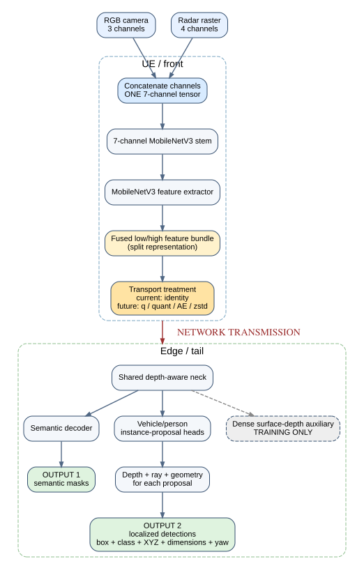
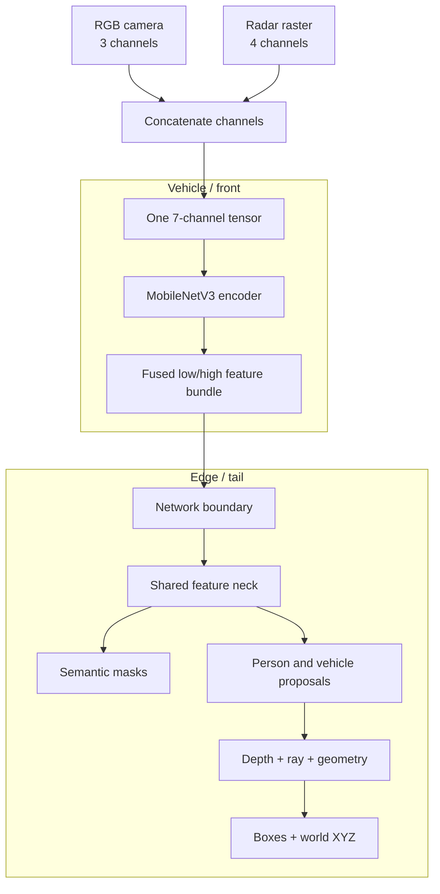
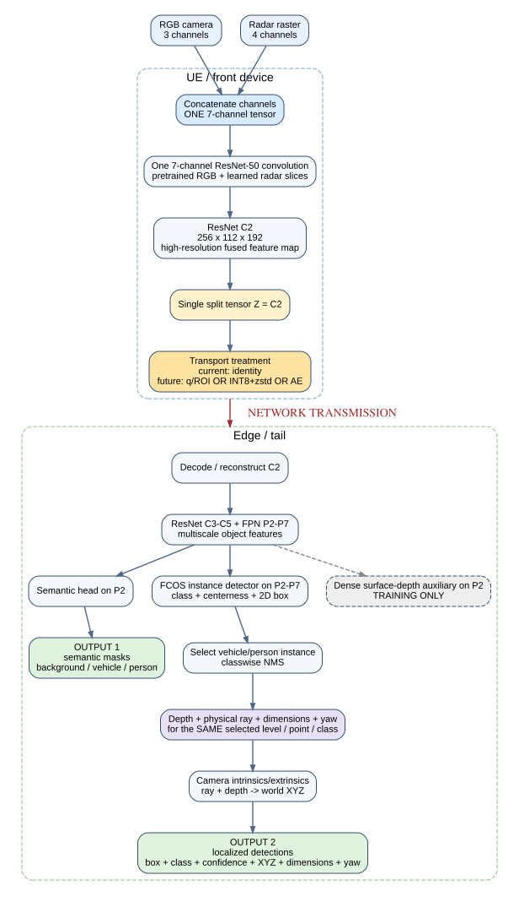
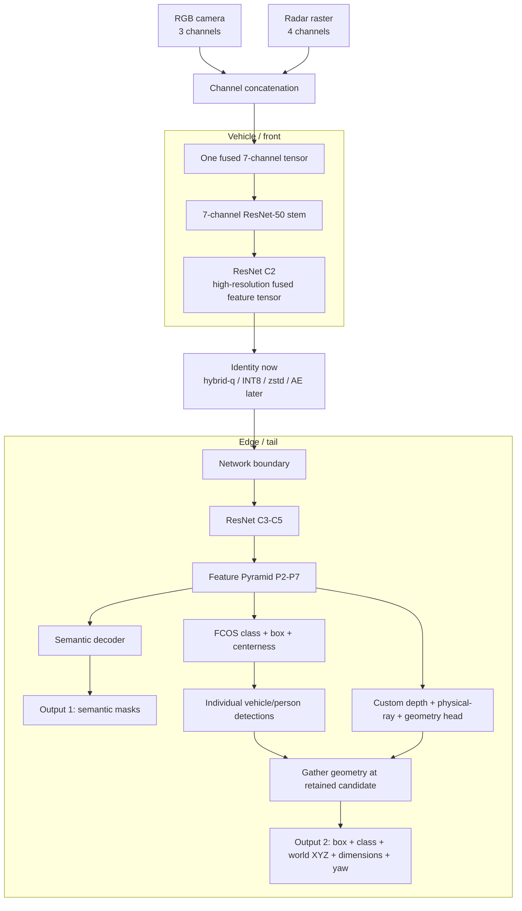

# From LR-ASPP to SplitFusion-FCOS

## Final seven-channel RGB-radar split-inference perception report

**Report scope:** concise final architecture story using actor-volume observability (AVO) for pedestrian detection and localization. Superseded visibility sensitivities and intermediate model-selection history are intentionally omitted.

**Forward model:** `SplitFusion-FCOS-R50-FPN-P2-P7`, epoch 26, with a final person confidence threshold of `0.25`.

**Pedestrian evaluation:** `AVO >= 0.65`, same-class one-to-one world-XY matching within 3 m.

**Decision:** perception development is closed. The frozen model and its `C2` split are the baseline for hybrid-q, quantization, zstd, autoencoder and system-latency experiments.

---

## 1. Project objective

The perception service receives synchronized camera and radar data from a vehicle and must produce:

1. semantic masks for background, vehicles and people;
2. individual vehicle and pedestrian detections; and
3. a physical world position for every retained detection.

These outputs will later be combined across vehicles in the spatial map. The perception model should therefore report visible actors accurately and quickly; multi-vehicle reasoning about actors hidden from one vehicle belongs to the downstream spatial-mapping system.

The split-inference requirements are fixed:

- concatenate RGB `(3 channels)` and the prepared radar raster `(4 channels)` into one seven-channel input;
- process the front of the network on the vehicle;
- transmit one learned fused tensor across the network;
- complete detection, segmentation and localization at the edge; and
- apply hybrid-q, quantization, zstd or an autoencoder only at the fixed split boundary.

The dataset contains 16,827 training frames from 10 episodes and 3,345 validation frames from two disjoint episodes. Synchronized depth supports training and evaluation but is not an inference input.

---

## 2. Final pedestrian observability definition

### 2.1 Actor-volume observability

Actor-volume observability addresses a practical evaluation problem: CARLA supplies projected pedestrian boxes, including partially and fully occluded actors, but this CARLA build does not provide dependable actor-specific pedestrian silhouette masks.

For each person actor-frame, the evaluator:

1. projects the actor's oriented 3D bounding volume into the camera;
2. clips the projected region to the image;
3. decodes synchronized depth inside that region;
4. back-projects each depth pixel into 3D;
5. transforms each point into the actor's local coordinate frame;
6. retains only points inside the actor volume, using a fixed `0.05 m` tolerance;
7. rejects the bottom `0.03 m` ground band;
8. forms the tight 2D box around the retained actor-consistent support; and
9. computes

   `AVO = visible-support-box area / clipped projected-actor-box area`.

This prevents road pixels outside the pedestrian's 3D volume from being counted merely because they have a similar depth.

### 2.2 Selected evaluation view

The final pedestrian view uses `AVO >= 0.65` because it was evaluated independently against the prediction-blind 100-person human annotation pilot:

- binary balanced accuracy: `0.8523`;
- TP/FN/FP/TN: `35/9/3/30`;
- qualified validation person actor-frames at the selected cutoff: `2,877`;
- total person actor-frames in the frozen AVO table: `5,276`;
- validation frames: `3,345`.

AVO is an observability score, not an exact visible-silhouette percentage. Its denominator is the projection of a 3D cuboid, and its tight visible box can bridge holes caused by thin or interior occluders. Fine-grained four-band weighted kappa against the human pilot was only `0.4581`. Consequently, AVO is used as a reproducible binary evaluation view, while human visibility bands remain the interpretability reference.

### 2.3 Detection and localization scoring

A person prediction is a true positive only when it obtains a same-class, one-to-one match to an eligible actor within 3 m in world XY. Remaining unmatched predictions are false positives unless they match a registered ignored actor. Unmatched eligible actors are false negatives.

Precision answers: “Of the people reported by the model, how many were correct?” Recall answers: “Of the eligible visible people, how many did the model report?” XY MAE measures localization error only for matched pairs and must therefore be interpreted alongside recall.

Two different thresholds are used and must not be confused:

| Threshold | Applies to | Plain meaning |
|---|---|---|
| `AVO >= 0.65` | Ground-truth pedestrian | Include this actor in the observable-person evaluation. It is an actor-volume observability cutoff, not a model confidence. |
| Person confidence `>=0.25` | Model prediction | Report this consolidated person detection. The shorthand `p025` means only this final confidence threshold. |

Therefore, `p025` does **not** mean 25% visibility, an AVO threshold, a new backbone or a separately trained model. It is simply the final output confidence rule applied to the frozen FCOS model.

---

## 3. First architecture: depth-aware LR-ASPP

LR-ASPP was selected initially because it is a lightweight semantic-segmentation architecture based on MobileNetV3 and is naturally attractive for split inference. The model was extended to accept the seven-channel RGB-radar tensor and to produce object proposals, depth and physical geometry. LR-ASPP is described with MobileNetV3 in the [MobileNetV3 paper](https://openaccess.thecvf.com/content_ICCV_2019/html/Howard_Searching_for_MobileNetV3_ICCV_2019_paper.html).

Two clean training strategies were tested.

### 3.1 Joint multi-task training

Segmentation, person/vehicle proposals, dense depth and physical localization were trained together from the beginning. The model learned useful geometry, but the proposal and depth losses dominated the shared representation. Detection, segmentation and localization did not become strong simultaneously.

At the selected joint representative:

- person AVO precision/recall/F1: `0.3478/0.6316/0.4485`;
- person XY MAE: `1.168 m`;
- vehicle/person semantic IoU: `0.8186/0.3783`;
- foreground mean IoU: `0.5984`.

The experiment showed that depth supervision could improve localization, but joint optimization did not preserve all required tasks.

### 3.2 Task-separated training

The second experiment first trained the encoder using segmentation and dense-depth supervision. It then froze the encoder, BatchNorm state, segmentation decoder and dense-depth decoder before training only the object and localization heads.

Stage 1 produced strong semantic features:

- vehicle IoU: `0.9084`;
- person IoU: `0.5733`;
- foreground mean IoU: `0.7408`.

However, the final object/localization stage achieved:

- person AVO precision/recall/F1: `0.2566/0.6545/0.3686`;
- person XY MAE: `1.289 m`.

Freezing the representation preserved segmentation but did not solve instance formation. A semantic mask can indicate that pixels belong to the person class, but it does not by itself determine how many people exist, separate nearby people, suppress duplicate candidates or attach the correct range to each individual.

### 3.3 LR-ASPP conclusion

The two experiments isolated two different failure modes:

- joint training suffered from competing tasks in a limited shared representation;
- task separation preserved excellent masks but still produced weak instance precision and localization.

The evidence does not prove that LR-ASPP can never support object localization. It establishes that the two scientifically distinct LR-ASPP designs tested here did not satisfy the complete perception objective. A detection-native multiscale representation was therefore required.

---

## 4. Final architecture: SplitFusion-FCOS

The replacement architecture is **SplitFusion-FCOS-R50-FPN-P2-P7**. It changes the perception backbone and detector while preserving the seven-channel input, fused representation and single split-inference boundary.

FCOS is an anchor-free one-stage detector described in the [FCOS paper](https://openaccess.thecvf.com/content_ICCV_2019/html/Tian_FCOS_Fully_Convolutional_One-Stage_Object_Detection_ICCV_2019_paper.html). Its multiscale representation follows the [Feature Pyramid Network](https://openaccess.thecvf.com/content_cvpr_2017/html/Lin_Feature_Pyramid_Networks_CVPR_2017_paper.html) design.

### 4.1 What C2 and P2-P7 mean

`C2` is an early ResNet feature map. It retains relatively high spatial resolution and already mixes the camera and radar channels. It is the single tensor transmitted from the vehicle to the edge.

`P2-P7` are Feature Pyramid Network levels reconstructed on the edge. P2 is the highest-resolution level and is important for small pedestrians. Each higher level is progressively coarser and covers larger objects and wider context. This gives FCOS genuine multiscale detection instead of relying on one native proposal grid.

### 4.2 Seven-channel initialization

The RGB slices of the first convolution were initialized from official COCO-pretrained FCOS ResNet-50 weights. The four radar slices began at zero. Initial behavior therefore matched the pretrained RGB detector, while training could learn radar contributions through the same unified convolution and backbone.

The edge never receives a separate RGB or radar branch. All downstream predictions use the single fused `C2` representation.

### 4.3 Detection and physical centroid localization

FCOS predicts class, 2D box offsets and centerness at locations across P2-P7. The standard FCOS confidence equation is retained:

`score = sqrt(sigmoid(class logit) * sigmoid(centerness logit))`.

Centerness measures the quality of a 2D detection location; it is not the object's physical centroid. Once a candidate is retained, its exact pyramid level, feature location and class retrieve the corresponding custom geometry prediction:

- a 0-40 m depth distribution plus overflow;
- a bounded within-bin depth residual;
- a ray offset toward the physical actor centre;
- dimensions; and
- yaw sine/cosine.

Camera calibration turns the predicted ray and range into camera-space XYZ, and the camera pose converts that point into world coordinates. Radar contributes through the fused feature representation; centerness does not directly modify the radar measurements or numerically correct the centroid.

### 4.4 Fixed split boundary

The frozen split tensor is raw fused `C2` with shape `[256,112,192]`, or `22,020,096` bytes per frame in clean FP32 form. Identity split execution matches monolithic execution exactly.

All following transport variants must encode and decode this same tensor. The detector, geometry head, segmentation head and service post-processing remain fixed.

---

## 5. Final locked service pipeline

The forward model is recovered epoch 26 with checkpoint SHA-256:

`da14d21edbd374c1c3abce02ca4674b9f4097becfba9759aba945cea160a297f`.

Its fixed output processing is:

- vehicle: train-derived monotonic score calibration, with no new NMS pass;
- person: candidates enter parameter-free semantic instance consolidation at score `0.20`, using semantic support `0.10` and group-box IoU `0.20`;
- final person output: retain consolidated detections with FP32 confidence `>=0.25`—this is what `p025` means;
- no score rewriting, geometry rewriting, candidate creation or reordering.

The threshold wrapper retains an exact ordered subset of the model's person detections and leaves every vehicle, segmentation and retained geometry field unchanged.

---

## 6. Final results

### 6.1 Complete architecture comparison

This is the conclusion table. Person detection/localization uses the selected `AVO >= 0.65` view. Vehicle detection and semantic masks use their fixed validation measurements because AVO is specifically a pedestrian actor-level measure. Each architecture uses its frozen final service output; this is not a raw-score calibration ablation.

#### Detection and localization

| Architecture | Vehicle P/R/F1 | Vehicle XY | Person TP/FP/FN | Person P/R/F1 at AVO>=.65 | Person XY |
|---|---:|---:|---:|---:|---:|
| Joint depth-aware LR-ASPP | .6350/.7662/.6944 | .7671 m | 1,817/3,408/1,060 | .3478/.6316/.4485 | 1.168 m |
| Task-separated LR-ASPP | .3040/.7822/.4378 | .9685 m | 1,883/5,456/994 | .2566/.6545/.3686 | 1.289 m |
| **SplitFusion-FCOS, final confidence >=.25** | **.9316/.8684/.8989** | **.4787 m** | **2,052/862/825** | **.7042/.7132/.7087** | **.8122 m** |

#### Semantic segmentation

| Architecture | Vehicle pixel P/R/IoU | Person pixel P/R/box-IoU | Foreground mIoU |
|---|---:|---:|---:|
| Joint depth-aware LR-ASPP | .8807/.9207/.8186 | .5097/.5946/.3783 | .5984 |
| Task-separated LR-ASPP | .9450/.9591/.9084 | .7525/.7065/.5733 | **.7408** |
| **SplitFusion-FCOS** | **.9398/.9539/.8990** | **.7413/.6471/.5279** | .7135 |

The task-separated LR-ASPP retains the highest foreground mask score, but its person and vehicle instance precision is extremely poor. SplitFusion-FCOS is the only architecture that combines strong vehicle detection, passing-quality masks, substantially better person precision/recall, and the lowest localization errors. This complete output balance—not one isolated metric—is why it is the chosen architecture.

### 6.2 Final FCOS result at different AVO cutoffs

The table below changes only the **ground-truth observability cutoff**. The model, final person confidence threshold `0.25`, predictions and matching rule are fixed. These are AVO sensitivity results, not different trained models.

| AVO cutoff | Eligible person GT | TP/FP/FN | Precision | Recall | F1 | XY MAE |
|---|---:|---:|---:|---:|---:|---:|
| >=.10 | 4,228 | 2,313/864/1,915 | .7280 | .5471 | .6247 | .8404 m |
| >=.25 | 3,995 | 2,306/864/1,689 | .7274 | .5772 | .6437 | .8390 m |
| >=.50 | 3,354 | 2,221/863/1,133 | .7202 | .6622 | .6900 | .8280 m |
| **>=.65, selected** | **2,877** | **2,052/862/825** | **.7042** | **.7132** | **.7087** | **.8122 m** |
| >=.70 | 2,606 | 1,885/863/721 | .6860 | .7233 | .7041 | .8021 m |
| >=.85 | 1,080 | 774/862/306 | .4731 | .7167 | .5700 | .7781 m |

`AVO >= 0.65` is selected because it is the only cutoff supported by the human binary-observability pilot. Higher cutoffs do not mean the model became worse: they remove many ground-truth actors from the denominator while most background false positives remain. This is why precision can fall as the AVO cutoff becomes stricter.

### 6.3 Final FCOS person performance by distance

| Distance | Eligible GT | TP/FN | Recall | XY MAE |
|---|---:|---:|---:|---:|
| 0-10 m | 124 | 115/9 | .9274 | .3522 m |
| 10-20 m | 1,008 | 929/79 | .9216 | .5968 m |
| 20-30 m | 1,004 | 731/273 | .7281 | 1.0111 m |
| 30-40 m | 741 | 277/464 | .3738 | 1.2006 m |

The model is strong within 20 m. Most remaining person-recall weakness is concentrated at 30-40 m, where pedestrians occupy fewer image pixels. The causal contribution of each modality has not yet been isolated.

---

## 7. Why the architecture change worked

The LR-ASPP experiments showed that semantic features and depth supervision were not enough. The missing capability was reliable instance-level proposal generation and ranking.

SplitFusion-FCOS adds three properties that directly address that failure:

1. **Detection-native pretraining:** the FCOS backbone and detector begin with learned vehicle/person detection knowledge.
2. **Multiscale representation:** P2 preserves fine detail for small pedestrians, while coarser levels provide context and support larger actors.
3. **Explicit candidate-to-geometry correspondence:** the retained FCOS location directly indexes the matching depth and physical-ray prediction.

The architecture change does not abandon the original project design. It retains the seven-channel input, single fused representation, vehicle/edge split, semantic masks, physical localization and compression insertion point.

---

## 8. Limitations and publication interpretation

The following statements are supported:

- SplitFusion-FCOS substantially outperforms both tested LR-ASPP designs for observable-person precision, recall, F1 and localization.
- The two-stage LR-ASPP experiment demonstrates that strong semantic segmentation does not automatically produce strong person instances.
- The final model detects and localizes observable people well at short and medium range.
- The seven-channel fused split-inference framework remains intact.

The following claims are not supported yet:

- AVO is not an exact anatomical visibility percentage or actor-instance silhouette.
- The 100-person human pilot does not provide population-wide precision.
- Radar's causal contribution has not been isolated by a locked modality ablation.
- Raspberry-Pi latency, compressed payload size and compression-induced accuracy changes have not yet been measured for this architecture.
- Validation threshold behavior was explored during development; the untouched test set remains necessary for independent publication confirmation.

The defensible publication wording is that AVO provides a reproducible actor-volume-based binary observability view, supported by human annotation at the selected cutoff, with explicitly documented geometric limitations.

---

## 9. Forward lock and next phase

Perception is frozen at:

- model: `SplitFusion-FCOS-R50-FPN-P2-P7`, epoch 26;
- input: RGB `(3)` + radar `(4)` concatenated into one tensor;
- split: raw fused `C2`, `[256,112,192]`;
- detector: FCOS with its standard centerness score;
- localization: custom depth, physical-ray, dimensions and yaw heads;
- person processing: fixed semantic consolidation followed by score `>=0.25`;
- vehicle calibration, output schema and evaluation matching: unchanged.

Hybrid-q, fixed quantization, zstd and AE128/64/32 may change only the encoding and decoding of `C2`. Each variant must report payload size, vehicle-side processing time, network time, edge-side processing time and the same frozen perception metrics.

---

## 10. Reproducibility paths

### Models and reports

- Joint LR-ASPP code: `pole_lraspp_multimodal_fusion/object_head_pilot_v1/route_b_v3_1_depth_aware_lraspp_v1/`
- Task-separated LR-ASPP code: `pole_lraspp_multimodal_fusion/object_head_pilot_v1/route_b_v3_1_depth_aware_lraspp_two_stage_v1/`
- SplitFusion-FCOS code: `pole_lraspp_multimodal_fusion/object_head_pilot_v1/splitfusion_fcos_r50_fpn_p2_p7_v1/`
- Forward p025 package and lock: `pole_lraspp_multimodal_fusion/object_head_pilot_v1/splitfusion_fcos_r50_fpn_p2_p7_person_p025_calibration_v1/`

### Data and evidence

- Dataset: `experiments/route_b_v3_1_expanded_train_camera_plane_v1/20260828_094151/`
- AVO implementation: `data_collection/route_b_publication_actor_volume_visibility_v1/`
- Frozen AVO table and architecture comparison: `experiments/actor_volume_observability_model_comparison_v1/20260901_repaired_tolerance_cpu_once/`
- Final p025 validation confirmation: `experiments/splitfusion_fcos_person_p025_calibration_v1/validation_confirmation.json`
- Human visibility pilot: `data_collection/experiments/route_b_publication_human_occlusion_pilot_v1/20260901_030234_seed20260831/`
- Forward lock: `pole_lraspp_multimodal_fusion/object_head_pilot_v1/splitfusion_fcos_r50_fpn_p2_p7_person_p025_calibration_v1/PERCEPTION_FORWARD_LOCK_P025_V1.md`

All values are rounded for readability. The linked JSON artifacts contain exact counts, values, hashes and provenance.
