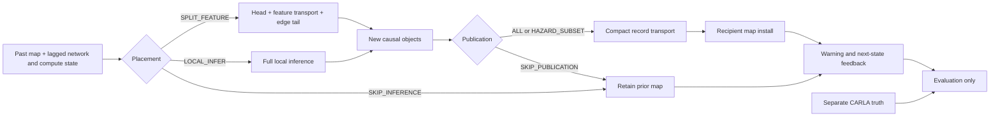
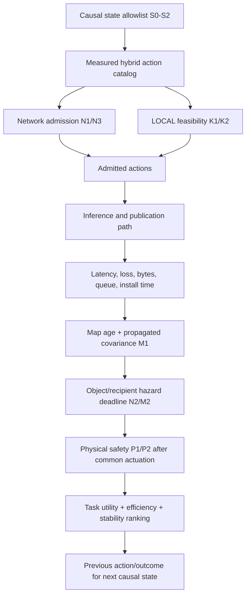

# SceneSense agent: advisor progress brief

**Meeting date:** 2026-08-19  
**Scope:** current controller/system design, evidence already banked, and the
next scientific gates. Historical noncausal controller comparisons are
deliberately excluded from this brief.

## 1. The message to lead with

We have moved from “train an RL agent to choose compression knobs” to a more
defensible systems problem:

> Build a causal, network- and safety-aware cooperative-perception controller
> that chooses where inference runs and what evidence is published, then use
> measured end-to-end evidence to decide whether a learned sequential policy is
> necessary.

The core research object is now the complete helper-to-recipient loop over the
OAI 5G stack (RFsim): sensing, inference placement, compact map publication,
transport, recipient installation, warning, and—later—an identical
warning-to-braking adapter. Learning is a possible controller implementation,
not a preselected contribution.

## 2. What is tangible now

| Deliverable | What is complete | Why it matters |
|---|---|---|
| Measured system surfaces | RGB+radar split-inference profiles, payload/quality table, channel/queue behavior, freshness model, and exact M-prime sensor contract | The controller is grounded in measured actions rather than invented continuous settings |
| Reward v5 task utility | `0.35 segmentation + 0.40 pedestrian recall + 0.25 vehicle recall`; explicit ROI cost removed; localization kept safety-side | Makes pedestrian protection the largest perception term without double-counting ROI damage |
| Causal control contract | Pre-inference placement is separated from post-inference publication; every state field has availability provenance | Prevents a policy from choosing an action using detections produced by that same action |
| Recipient-specific map contract | Versioned contribution record with source/recipient identity, timestamps, compact objects, covariance, motion model, process noise, validity horizon, and byte accounting | Gives Phase 2 a real map-sharing interface rather than an offline GT join |
| Accepted two-trajectory pilot | The retained helper and recipient inputs/logits, causal tracks, publication, map installation, warning, and separate truth stream are recoverable; all structural gates pass | Proves the end-to-end causal data path and the warning-lead endpoint are computable |
| Future-hazard adjudicator | Evaluation-only, one-to-one truth matching with a matched benign/no-yield counterfactual and censoring rules | Avoids relabelling a correct warning as false merely because the vehicle yielded |
| Frozen evaluation design | Designed-opportunity Suite A plus naturalistic Suite B, grouped 20/20/60 split, bounded calibration grid, nuisance and miss-rate gates, and a 0.5 s minimum meaningful lead | Prevents tuning on test trajectories or claiming a curated scenario as naturalistic performance |
| Scenario library | Six designed hazard/benign families and two naturalistic route families have been visually reviewed in Epic rendering | Gives the final corpus class/range/speed/occlusion diversity instead of mostly empty frames |
| Constraint catalog | Causal, physical, deadline, network, compute, map, runtime, utility, and comfort requirements are ranked and versioned | Converts “a reward with many weights” into a constrained control problem |
| Reproducible orchestration | Single 10 Hz CARLA tick owner, exact training sensor contract, bounded raw retention, structured manifests, cleanup gates, frozen context for designed twins, and ordinary Traffic Manager motion for the naturalistic denominator | Protects the scientific comparison without forcing one traffic controller to serve incompatible causal and realism goals |

The accepted pilot is a structural result, not a performance claim. The next
corpus stage is designed to estimate the cooperation benefit and to expose—or
rule out—sequential control headroom.

## 3. Paper-level contributions: keep these distinct from constraints

The label `C1–C4` is reserved for paper contributions, not individual runtime
constraints:

1. **C1 — system:** an instrumented multi-modal cooperative-perception path
   whose helper evidence reaches a recipient map through the OAI 5G protocol
   stack over RFsim.
2. **C2 — transport-conditioned cooperation gain:** the marginal actionable
   warning lead provided by causal helper evidence, compared on the same truth
   trajectory with ego-only and send-everything controls.
3. **C3 — safety and service contract:** uncertainty propagation,
   recipient-specific deadlines, fail-closed action admission, and explicit
   graceful degradation. This is not called an unconditional safety guarantee.
4. **C4 — deployable design rules:** a measured feasibility envelope and the
   simplest controller that satisfies it; learning is retained only if simple
   controllers leave a preregistered gap.

The measurement results support these contributions. They are not presented as
standalone algorithmic novelty.

## 4. Final control boundary

The controller acts on perception and map sharing. It does not directly steer
or brake the car.

### 4.1 Causal pre-action state

The placement observation at time `t` may contain only information available
before the action:

- lagged achievable-uplink estimate and uncertainty;
- queue/BSR, in-flight work, scheduler credit, and previous delivery outcome;
- prior action and switching state;
- installed recipient-map tracks, age, covariance, and validity horizon;
- causal source-local tracks completed before the decision;
- helper pose/motion and the newest causally received recipient pose/motion;
- measured local-compute headroom and prior inference latency; and
- clock/provenance metadata for every field.

It may not contain current-action detections, confidence, track identity, map
quality, shadow-path outputs, CARLA actor IDs, future trajectories, or truth
labels. The invariant is

```text
available_at_s <= consuming_decision_at_s
```

and it is enforced by an allowlist and audit record, not by convention.

### 4.2 Two decisions, not one overloaded `SKIP`

Pre-inference placement:

```text
a_place(t) in {
  SPLIT_FEATURE(profile_id, target_fps),
  LOCAL_INFER(local_profile_id, target_fps),
  SKIP_INFERENCE
}
```

Post-inference publication:

```text
a_publish(t) in {
  PUBLISH_ALL,
  PUBLISH_HAZARD_SUBSET,
  SKIP_PUBLICATION
}
```

`LOCAL_INFER` is late/object fusion: the helper performs full local inference
and may publish a compact object record. `SPLIT_FEATURE` is intermediate
fusion: the helper sends a feature tensor for edge-tail inference. Deciding
publication after local inference must not be confused with deciding placement
before paying the local compute cost.



## 5. Granular constraint hierarchy

These are operational domains, labelled `S/N/K/M/P/O` to avoid confusing them
with contribution C1–C4.

| Rank | ID | Requirement | Treatment | If it cannot be satisfied |
|---:|---|---|---|---|
| 0 | S0 | No future truth, GT identity, same-action output, or shadow result in policy state | Hard reject | Experiment/action is invalid |
| 0 | S1 | Action belongs to the measured profile/FPS/LOCAL catalog | Hard mask | Unsupported action is unavailable |
| 0 | S2 | Correct recipient/source isolation and monotone contribution order | Hard reject | Reject contribution; never repair silently |
| 1 | P1/P2 | Collision avoidance and minimum surface clearance, once common warning actuation exists | Hard/terminal physical constraints | Enter declared safe fallback; record violation |
| 2 | N2/M2 | Observed hazard evidence must arrive before its recipient deadline with calibrated uncertainty | Service constraint | Choose least harmful feasible fallback and record deadline debt |
| 3 | N1 | Offered work must fit a conservative lagged capacity estimate | Hard mask for known infeasibility | Prefer LOCAL or SKIP_INFERENCE; never knowingly build an unstable queue |
| 3 | N3 | Network backlog must remain stable; expired work must not block fresh work | Queue guard | Replace/drop expired work and report recovery |
| 3 | K1 | LOCAL p95 latency and sustainable FPS must fit local compute/headroom | Hard mask after LOCAL calibration | Use SPLIT if feasible, otherwise SKIP_INFERENCE |
| 3 | K2 | Energy/thermal envelope | Deferred until measured | No numerical claim yet |
| 3 | M1 | Contribution covariance, motion model, process noise, TTL, and timestamps are valid | Schema/TTL reject | Retain and propagate the prior map with increasing uncertainty |
| 4 | M3 | Preserve segmentation, pedestrian recall, and vehicle recall | Soft utility inside admitted set | Trade quality only through measured profiles |
| 5 | O1 | Correct clock/sensor contract, bounded retention, no actor leaks, no unreported frame loss | Hard experiment gate | Stop the run; no scientific result |
| 5 | P3–P5 | Comfortable stop placement, deceleration/jerk, mobility, and unnecessary intervention | Soft outcomes after common actuation exists | Rank safe actions; never override collision/clearance constraints |
| 5 | — | Minimize PRB-time, bytes, compute, energy, and switching | Soft efficiency | Break ties among safe/serviceable actions |

This ordering is lexicographic. A scalar reward can choose among admitted
actions; it cannot buy permission to violate causality, use an unmeasured
profile, or knowingly violate a hard physical constraint.

### 5.1 How the constraints interact



The short interpretation is: **the network and local computer determine which
fusion levels are feasible; the observed hazard determines the deadline; the
safety/service contract filters actions; reward ranks what remains.**

Protection is currently claimable only for pedestrians/cyclists/vehicles that
the causal pipeline has observed. Discovery misses remain a perception limit,
not something a sharing shield can retroactively protect.

## 6. Reward formulation

### 6.1 Fixed task-utility direction

For a delivered/installed perception result,

```text
U_task = 0.35 * normalized_segmentation
       + 0.40 * normalized_pedestrian_recall
       + 0.25 * normalized_vehicle_recall
```

- Pedestrian recall is ranked highest because vulnerable-road-user misses are
  the most consequential supported class.
- Segmentation remains substantial because aggressive ROI removal can preserve
  some objects while destroying scene understanding.
- Vehicle recall remains explicit rather than hidden inside a lumped object
  term.
- There is no explicit `C_ROI`: ROI damage is already visible in measured task
  utility and an additional penalty would double count it.
- Localization/uncertainty stays on the safety side, plus a small mandatory
  expected-error margin; it is not folded into `U_task`.

### 6.2 Constrained Phase-2 reward candidate

First construct the admitted set:

```text
A_admitted(s_t) = A_measured
                intersect A_causal
                intersect A_network(s_t)
                intersect A_compute(s_t)
                intersect A_service/safety(s_t)
```

Then rank its actions with a candidate inner objective:

```text
R_t =  w_task   * U_task(t)
     - lambda_r * realized_PRB_time(t)
     - lambda_c * realized_local_compute(t)
     - lambda_q * hazard_deadline_debt(t)
     - lambda_s * action_switch(t)
     - w_E      * expected_uncertainty_margin(t)
```

The weights are intentionally **not frozen yet**: paired causal data, LOCAL
latency/FPS, and OAI compact-record measurements must first put every term in a
calibrated range. Tail uncertainty/deadline feasibility belongs in the shield;
the smaller expected-error term only prefers margin inside the safe set.

There is no global penalty for selecting SKIP. A global penalty would punish
correct abstention in empty scenes and could force congestion. Instead, SKIP is
charged through its actual causal consequence: missed hazard evidence,
deadline debt, increasing map age/covariance, or a missed warning. Skip rates
are reported by reason: no demand, map safely fresh, network blocked, compute
blocked, or controller preference.

### 6.3 Stopping distance and collision

The advisor's stopping-distance proposal fits the design, with one attribution
boundary. The sharing controller cannot earn stopping reward until every arm
uses the same fixed warning-to-braking/replanning adapter.

After that adapter exists:

- collision and an advisor-frozen minimum surface clearance are hard safety
  constraints;
- stopping inside `[d_min, d_comfort_max]` is preferred;
- stopping too close and stopping unnecessarily early are both penalized;
- peak/p95 deceleration, jerk, route progress, delay, and unnecessary
  intervention are reported; and
- the recipient's actual bounding box is logged rather than inferred from a
  same-blueprint proxy.

A candidate soft stop-placement cost is

```text
C_stop = ((d_min - d_stop)_+ / d_min)^2
       + lambda_early * ((d_stop - d_comfort_max)_+ / d_scale)^2
```

This term is subordinate to the hard collision/clearance gate. Maximizing
clearance alone is wrong because it rewards stopping far too early.

## 7. Discrete versus continuous action design

The correct initial action space is **masked hybrid**, not unconstrained
continuous SAC:

| Quantity | Treatment | Reason |
|---|---|---|
| Inference placement | Discrete | SPLIT, LOCAL, and SKIP have different execution semantics |
| AE/quantization/ROI profile | Discrete measured catalog | Intermediate profiles have no measured payload or accuracy and must not be invented |
| Publication action | Discrete | All, hazard subset, and skip are semantic operations |
| Target FPS/update interval | Bounded discrete initially; continuous only after held-out interpolation validation | A continuous value is legitimate only if its payload, latency, and quality response is calibrated |
| Capacity, latency, AoI, covariance, clearance, energy | Continuous state/outcomes | Continuous outcomes do not imply continuous actions |

Controller ladder:

1. exact masked enumerator over measured actions;
2. hand-written threshold/rule controller;
3. lambda-RDO supported-hull lookup and AoI-index-inspired publication
   heuristic;
4. finite-horizon MPC with the calibrated queue/map dynamics;
5. only if a held-out sequential gap remains: DQN, discrete SAC, or masked PPO;
6. parameterized/hybrid RL only if continuous-FPS interpolation is validated
   and materially useful.

This is the “simplest that works” rule. RL is justified by delayed effects—an
action changes queue state, future capacity use, map age/covariance, and later
deadline feasibility—not merely because the state variables are continuous.

## 8. Evaluation that can answer the question cleanly

Three paired publication arms isolate the cooperation mechanism:

1. ego-only;
2. helper send-everything;
3. helper hazard-subset publication.

The primary endpoint is recipient-specific actionable warning success and
warning-lead gain on the same truth trajectory. Secondary endpoints are missed
hazards, false-warning-active exposure, warning fragmentation, application and
on-wire bytes, latency, map age/covariance, deadline slack, and class/range
performance.

- **Suite A, designed opportunities:** ensures enough occlusion, deadline, and
  network/compute decision states to test the mechanism.
- **Suite B, naturalistic operation:** remains the honest denominator and is
  reported with the same metrics so the curated suite cannot flatter the
  controller invisibly.
- The pilot is excluded from calibration and test.
- Trajectory groups, not frames, are the uncertainty unit.
- Calibration, validation/freeze, and untouched test are separated 20/20/60.
- The first C2 run fixes inference placement to isolate publication. Dynamic
  SPLIT/LOCAL/SKIP control comes after the LOCAL and OAI tables exist.

The RL gate is therefore meaningful: authorize learning only if the causal
corpus contains enough feasible dynamic states and exact/rule/MPC baselines
leave a preregistered reward, service, or warning-lead gap on held-out groups.

## 9. Current engineering gate and next steps

The repeated preflight failures exposed a design mismatch rather than a need
for more traffic-controller patches: positive/benign twins required the same
ambient future, while naturalistic operation required traffic that could react
normally. One deterministic moving-NPC controller could not provide both. The
corpus now has two explicit ambient evidence layers:

- designed twins use only the already reviewed scenario-owned actors; no
  generic traffic process is launched, gridlock is non-applicable, and owned-
  actor initial-state equality, collision monitoring, and cleanup remain hard;
  their manifest says `traffic_density=not_applicable` rather than pretending
  that sparse/typical/dense traffic was realized; and
- naturalistic trajectories use safe Traffic Manager vehicles and walker AI
  at 6/4, 10/8, and 15/12 vehicle/walker targets. They are unpaired and retain
  collision and persistent-gridlock gates.

The layer, counts, and motion modes are persisted in every plan/result. Config
validation, compilation, and the focused calibration plus shared-corpus unit
suites pass offline. No new CARLA evidence is claimed yet.

Proceed in bounded gates:

1. visually validate one short designed static-context trajectory and one
   short naturalistic-TM trajectory; stop if a static actor intrudes on the ego
   path or natural traffic looks abnormal;
2. run one positive/benign designed preflight pair and one naturalistic cell;
   inspect the explicit layer provenance, static full-trajectory equality, TM
   liveness/collision/gridlock summary, and cleanup before expanding;
3. only then run the 15-cell sensor-free traffic preflight once;
4. run the bounded calibration capture, then prove all 96 offline parameter
   combinations are replayable without recollection;
5. freeze the operating point and powered trajectory counts;
6. collect validation, stop for review, then untouched test;
7. evaluate local cooperation, then transmit identical records through two-UE
   OAI RFsim;
8. measure LOCAL compact payload versus object count, local inference p50/p95
   and sustainable FPS, and OAI delivery/latency;
9. evaluate exact/rule/lambda-RDO/AoI/MPC controllers under the causal contract;
10. decide whether a discrete learned controller is warranted;
11. only later attach a fixed warning-to-braking adapter and evaluate stopping,
    comfort, and collision outcomes.

No long run should start before the preceding summary/sentinel is reviewed.

## 10. Ninety-second meeting summary

> We found that the original knob-selection framing was too narrow and that a
> deployable controller must be causal. We therefore rebuilt the problem around
> two decisions: pre-inference placement—split, local, or skip—and post-inference
> publication—all objects, hazard subset, or skip. The state now contains only
> timestamped information available before each decision, and CARLA truth is
> isolated for evaluation. We have a versioned compact map schema, covariance
> and deadline semantics, a ranked constraint catalog, reward v5, and a complete
> designed-plus-naturalistic evaluation protocol. An end-to-end paired pilot has
> already recovered helper evidence through inference, publication, recipient
> map installation, warning, and separate truth adjudication. The next bounded
> stage calibrates warnings and false-positive exposure on diverse traffic,
> followed by identical-message evaluation over two-UE OAI RFsim. We will start
> with exact, rule, RDO/AoI, and MPC controllers, and use discrete RL only if the
> causal held-out data exposes a real sequential gap. The latest preflight stop
> was a 0.024-degree pose-quantization check conflicting with the registered
> 0.10-degree tolerance; it is an orchestration guardrail defect, not a negative
> scientific result, and is now regression-covered.

## 11. Claims to avoid in the meeting

- Do not call RFsim over the OAI stack over-the-air 5G.
- Do not call the pilot a cooperation-gain result.
- Do not call uncertainty propagation an unconditional safety guarantee.
- Do not claim dynamic fusion-level selection alone as novel.
- Do not claim protection for hazards the causal detector has not observed.
- Do not promise RL; promise a preregistered decision about whether RL is
  necessary.
- Do not report frame-random confidence intervals; trajectories are the unit.
