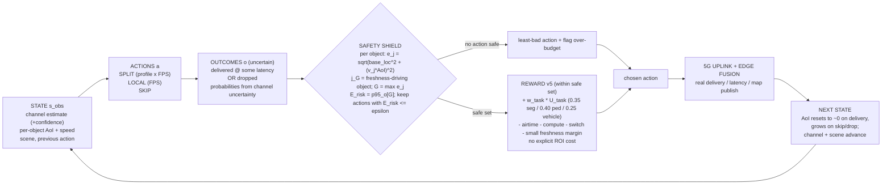

# The decision loop — state -> actions -> outcomes -> costs -> reward -> next state

Advisor-requested "simple block diagram" for 1-2 slides, plus a worked 2-3 object frame that explains G and how
we get E_expected / E_risk. Companion to `REWARD_EXPLAINER.md` (term-by-term) and `state_diagram.md` (full MDP).
Render Mermaid at mermaid.live / VS Code / GitHub.

## Block diagram (the loop)



Read it as: from the current state we enumerate a few actions; each action has *uncertain outcomes* (the channel
might deliver or drop); the shield uses the bad-case localization error to keep only safe actions; the reward
picks the best of those by map-benefit minus cost; the chosen action hits the real uplink; the map + channel
advance to the next state; repeat.

## Worked frame — why one object drives the decision (rename "worst" -> "freshness-driving")

One frame, three objects in view (epsilon = 2.0 m, base_loc = 1.11 m):

| object | speed v | map age AoI | error e_j = sqrt(1.11^2 + (v*AoI)^2) | status |
|---|---|---|---|---|
| parked car | 0 m/s | 0.5 s | 1.11 m | fine |
| pedestrian | 1.5 m/s | 0.8 s | 1.63 m | fine |
| crossing car | 8 m/s | 0.3 s | **2.64 m** | **over budget** |

`G = max over objects = 2.64 m`, set by the **crossing car** (`j_G`). Say it as: *"the crossing car is the
**freshness-driving object** — it is the one whose position goes stale fastest, so it sets when the map must be
refreshed."* The parked car and pedestrian are already fresh enough; skipping does not hurt them. It is the
fast object that forces a send. (Not "worst" in a pejorative sense — it is the **budget-binding** object.)

## Same frame — where E_expected and E_risk actually come from

An action does NOT have one outcome — it has a *distribution* of outcomes, because we do not know the exact
current channel. We build that distribution from **past OAI measurements**, then reduce it to two numbers.
E_expected and E_risk are two summaries of the whole distribution, not any single row.

**Step 1 - sample plausible current channels, from measured data.** The channel sweep (`combined_surface.csv`)
measured, for each payload x channel-rung: does it deliver, and the capture->map latency (p50 and p95). We do not
know the true current capacity, only a noisy estimate, so we sample a spread of plausible capacities across the
**measured +/-30% band** around that estimate (in the surrogate: 7 levels, 0.70x ... 1.30x the estimate).

**Step 2 - each sampled channel produces one G.** For each sampled capacity:
- deliver if `payload x fps <= that capacity`, else drop (the measured sharp threshold);
- if delivered, the object's age at publish = the measured latency, so `e_j = sqrt(base_loc^2 + (v*latency)^2)`;
  if dropped, it keeps aging;
- take `G = max_j e_j` across the frame; its argmax `j_G` is the freshness-driving object.

So you get a *set* of G values, one per sampled channel — e.g. for the crossing car:

| sampled channel (x estimate) | deliver? | G |
|---|---|---|
| 1.3 / 1.2 / 1.1 / 1.0 / 0.9 | yes (fits) | ~1.24-1.63 m |
| 0.8 / 0.7 | no (drops -> keeps aging) | ~3.0 m |

**Step 3 - reduce the set to two numbers (the direct answer to "which value is mean / p95"):**
```
E_expected = MEAN of G over all sampled channels             (typical case)
E_risk     = 95th PERCENTILE of G over all sampled channels  (bad case)
```
You do NOT pick one row as "the mean." Every sampled channel contributes one G; E_expected is their average,
E_risk is their tail. In the example: 5 of 7 deliver (~1.4 m) + 2 drop (~3.0 m) -> E_expected ~= 1.8 m,
E_risk ~= 3.0 m (the tail catches the drop). If the estimate is comfortably high so all 7 deliver ->
E_expected ~= E_risk ~= 1.4 m.

The shield admits the action only if `E_risk <= epsilon`: good channel -> drops rare -> E_risk low -> SPLIT
admitted; deep fade / very fast object -> drops likely -> E_risk high -> SPLIT unsafe -> LOCAL (drop-proof) or
flagged degradation.

**How the outcomes are inferred from past measurements:** the deliver/drop threshold and the latency values are
*looked up from the measured channel sweep*, not invented. The only inference is mapping the current noisy
estimate onto the measured +/-30% capacity band. Live, the outcomes come from the real channel instead of the
table.

**Honest caveat (say it to the advisor):** today the hard C1 mask already removes actions that cannot fit the
estimated capacity, so admitted actions almost always deliver across the whole sampled band -> E_expected ~=
E_risk (little spread). The extra tail margin is therefore currently inert in the surrogate; a richer, calibrated
outcome-uncertainty model (real prediction residuals) is a live-validation item. The mechanism above is the
design; its spread only bites once real channel variability is in the loop.
