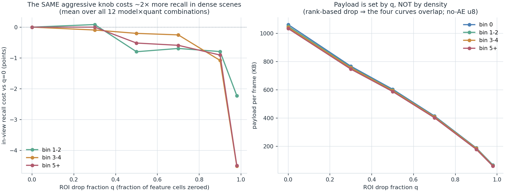

# Density-adaptive knob selection — RESULTS

**Date:** 2026-07-31 · **Plan:** [`../DENSITY_ADAPTIVE_KNOB_PLAN.md`](../DENSITY_ADAPTIVE_KNOB_PLAN.md) ·
**Run log:** [`RUN_LOG.md`](RUN_LOG.md) · **Gates:** 8/8 PASS ([`raw/gate_report.txt`](raw/gate_report.txt))
**Scope label:** offline per-model eval on the corrected-drivable moving-ego capture; payload→latency is
**ideal loopback, uplink-only**. OAI radio is a separate study.

**Measured:** 4 AE {none, 32, 64, 128} × 3 quant {u8, u6, u4} × 6 ROI drop fractions
{0, 0.3, 0.5, 0.7, 0.9, 0.98} = **72 profiles × 2162 test frames = 155 664 profile-frames**, each with its
own payload bytes, in-view GT count, and per-class tp/fp/fn/loc. ROI q ∈ {0.7, 0.9, 0.98} are **new** —
the published knob matrix stopped at 0.5.

---

## 1. Answer

**The best knob does shift hard with density, and the shift is worth ~6.4× in payload.**

| density (in-view objects) | n frames | best knob | payload | uplink ms *(derived)* | in-view recall | loc MAE | FP/frame |
|---|--:|---|--:|--:|--:|--:|--:|
| **0** (empty) | 483 | `ae32 / u4 / q=0.98` | **6.8 KB** | 1.1 | n/a (no objects) | n/a | 0.056 |
| **1–2** (sparse) | 1091 | `ae32 / u4 / q=0.9` | **16.7 KB** | 1.2 | 0.927 ± 0.013 | 0.81 m | 1.30 |
| **3–4** (busy) | 453 | `ae64 / u4 / q=0.9` | **23.4 KB** | 1.3 | 0.891 ± 0.016 | 0.98 m | 2.55 |
| **5+** (dense) | 135 | `ae64 / u4 / q=0.7` | **43.7 KB** | 1.5 | 0.854 ± 0.025 | 1.10 m | 3.28 |

(± = binomial 95 % CI on recall. Rule: **minimum payload** subject to `recall ≥ bin-best − 0.02` **and**
`loc ≤ bin-best + 0.10 m`; in the empty bin recall is degenerate so the criterion is
`FP/frame ≤ bin-best + 0.05`.)

The knob relaxes monotonically as the scene empties: **q 0.7 → 0.9 → 0.98**, AE bottleneck **64 → 32**,
and the number of *affordable* profiles collapses with density — **71 of 72 profiles are acceptable in an
empty scene, only 11 of 72 in a 5+ scene.** Weighting each bin by how much of the drive it occupies, a
density-adaptive policy averages **17.6 KB/frame vs 43.7 KB/frame** for the single conservative knob you
would otherwise have to run everywhere — a **60 % uplink saving at equal accuracy**.

---

## 2. ⚠️ The mechanism is NOT the one the plan hypothesised — correct this before it reaches the agent

The plan's physics recap says: *"Clear scene → few cells exceed any τ → small payload regardless. Dense
scene → many cells kept."* **That describes a value-threshold ROI gate, which is not what the code does.**
The deployed front end (`evaluate_fusion._roi_gate`, matching training's `model._objectness_drop`) uses a
**rank-based drop**: it zeroes the `k = round(q·N)` *lowest-objectness* cells. This was deliberate — the
quantile-**value** gate was found to be a no-op and was replaced (memory `dropaware_mprime_build`).

Consequence: **the number of cells dropped is fixed by q and is identical at every density.** So:

| ROI drop q | payload spread across the 4 density bins | direction |
|--:|--:|---|
| 0 | **1.3 %** | denser = slightly *smaller* |
| 0.3 | 1.4 % | denser = slightly smaller |
| 0.5 | 1.6 % | denser = slightly smaller |
| 0.7 | 2.8 % | mixed |
| 0.9 | 4.8 % | mixed |
| 0.98 | **9.1 %** (max 16.9 %) | mixed |

**Density moves the payload by ~1–2 % at usable operating points, and never more than ~17 %.** And where
the no-AE models do show a trend, it runs *opposite* to the hypothesis: an **empty** frame is slightly
**more** expensive (`noae/u8/q0`: 1062 KB empty vs 1034 KB at 5+), because open road is dominated by
textured background while a near vehicle presents large smooth regions that entropy-code better.

So the correct statement of the physics, which is what should go into the agent's model:

> The uplink tensor is fixed-size. **Density barely moves what a knob COSTS in bytes — it moves what that
> knob COSTS IN ACCURACY.** The policy is density-conditioned because the *accuracy budget* is
> density-conditioned, not because empty scenes are intrinsically cheap to send.

Measured accuracy cost of raising q, relative to q=0, averaged over all 12 model×quant combinations:

| ROI drop q | bin 1–2 | bin 3–4 | bin 5+ |
|--:|--:|--:|--:|
| 0.5 | −0.80 pts | −0.20 pts | −0.51 pts |
| 0.9 | −0.79 pts | −1.08 pts | −0.90 pts |
| **0.98** | **−2.22 pts** | **−4.51 pts** | **−4.49 pts** |
| 0.98 (loc) | +0.230 m | +0.270 m | +0.286 m |

The recall cost of the most aggressive drop roughly **doubles** from sparse to busy (−2.2 → −4.5 pts) and
the localisation cost rises monotonically with density (+0.23 → +0.29 m). Note the gradient **saturates**
between 3–4 and 5+ — the cost does not keep growing, so a two-level policy captures most of the benefit.

---

## 3. Empty scenes: the honest metric is false positives, and it is *not* free

Guardrail 1 requires this, because with zero in-view objects every profile trivially "passes" recall.

| ROI drop q *(ae32/u4)* | payload | FP/frame in empty frames |
|--:|--:|--:|
| 0 | 90.4 KB | 0.043 |
| 0.5 | 49.4 KB | 0.058 |
| 0.9 | 16.1 KB | 0.058 |
| 0.98 | 6.8 KB | 0.056 |
| lowest-FP of all 72 profiles | 61.8 KB (`ae64/u4/q0.5`) | **0.027** |

Cranking q up in an empty scene costs **no recall (there is nothing to recall) but roughly doubles spurious
detections — from a best-achievable 0.027 FP/frame to 0.056–0.058, i.e. one phantom object every ~37 frames
becomes one every ~18.** Note the FP penalty is already fully paid by q=0.5 and does **not** keep growing to
q=0.98, so the extra payload saving from 0.5→0.98 (49 → 7 KB) is genuinely free of FP cost.
Tiny in absolute terms, but it is a real cost, and it makes the empty-bin pick **the most
tolerance-sensitive result in this study**:

| FP tolerance | cheapest acceptable profile | payload |
|---|---|--:|
| +0.005 / +0.01 | `ae64/u4/q0.9` | 23.1 KB |
| +0.02 | `ae64/u4/q0.98` | 9.5 KB |
| **+0.05 (used here)** | `ae32/u4/q0.98` | **6.8 KB** |

**Read this as: "empty ⇒ q≈0.9–0.98, 7–23 KB", not as a hard 6.8 KB.** If the downstream map is
FP-sensitive (phantom objects in a spatial map are worse than a missed distant one), take `ae64/u4/q0.9` at
23.1 KB and the policy span becomes 1.9× instead of 6.4×. That choice belongs to the map consumer, not to
this analysis.

---

## 4. What the hypothesis got right and wrong

| plan hypothesis | verdict |
|---|---|
| empty → τ→1.0 maximal ROI drop | ✅ **confirmed** — q=0.98 is acceptable when empty, and is not acceptable at 5+ |
| empty → tiny payload, "nothing to keep" | ❌ **wrong mechanism** — payload is set by q, not by content; empty frames are if anything slightly *larger* (§2) |
| empty → no accuracy loss | ⚠️ **mostly** — zero recall loss, but FP/frame roughly doubles (§3) |
| dense → low ROI τ | ✅ **confirmed** — q must drop to 0.7; q≥0.9 fails the accuracy gate at 5+ |
| dense → **u8 bits** | ❌ **wrong** — **u4 wins at every density.** Bits are the cheapest axis to give up: at matched model+q, u8 costs **2.0–2.4× the payload** and buys between −0.12 and **+0.44** recall points |
| dense → no aggressive AE | ❌ **inverted** — the AE *helps*. Dense scenes want a **larger** bottleneck (64 vs 32), and **not one no-AE profile is accepted in any bin** (0 of 41, 0 of 38, 0 of 11): the best no-AE profile needs **9–33× the payload** and still lands **1.5–2.1 recall points lower** than the chosen AE knob |

The single biggest practical finding is the last one: **the AE is not a compression concession, it is an
accuracy improvement.** `ae128/u8/q0` reaches 0.939 in-view recall in bin 1–2 at 341 KB where `noae/u8/q0`
reaches only 0.908 at 1050 KB. Every entry in the density→knob table is an AE profile at u4, and the
no-AE family is Pareto-dominated at every density.

---

## 5. Confounds and limits (state these when quoting the table)

- **Density correlates with proximity.** The nearest in-view object is at 20.0 m in sparse frames but
  12.2 m in busy/dense ones (mean GT distance is roughly flat, 22.8 → 25.9 m). Some of the "dense scenes
  are harder" effect is therefore a near-object effect. Mean GT speed does not co-vary (1.6 / 1.8 /
  1.3 m/s), so the density effect is **not** a speed confound — that axis is already covered by the
  speed-gated results in `AGENT_CONSTRAINTS.md`. This is the same location confound the road-state
  analysis carried; do not claim a pure density effect.
- **Bin 5+ is the thinnest**: 135 frames / 792 objects, ±2.5 pts recall at 95 %. It passes the ≥100-frame
  gate and its ordering is consistent, but the 2-pt accept tolerance sits close to its own noise floor.
  The 5+ row is directionally sound and should not be over-fitted; **no denser NPC re-capture was needed**
  (all four bins populated), so this remains the honest natural-drive number rather than an artificial one.
- **Recall/loc trade-off inside the accept rule.** In bin 5+, `ae128/u4/q0.9` is *cheaper* (35.7 KB) with
  *higher* recall (0.859) but was rejected on localisation (1.25 m vs the 1.11 m cap). If the map cares
  about recall more than about a 0.15 m loc penalty, that is the better pick and the 5+ payload drops to
  35.7 KB. Stated so the rule is auditable rather than hidden.
- **Uplink latency is derived, not measured, above q=0.5**:
  `transport_ms = 1.067 + 0.00912 × payload_KB` (least squares on the 36 measured ideal-loopback profiles,
  R²=0.844). At these payloads transport is 1–2 ms and irrelevant next to the 25–30 ms front-end compute —
  **payload, not loopback latency, is the axis that matters here**, and it is the axis that matters over
  OAI, where the same byte reduction is worth far more (memory `oai_compression_ab`).
- **Front/back compute was not re-measured** at q>0.5. The ROI gate itself is cheap, but a formal
  front-ms number for q ∈ {0.7, 0.9, 0.98} requires a loopback latency run (CARLA) — deliberately not run
  this session, see §7.
- **In-domain only**: Town10, single ego, same distribution the M' models were trained on.

## 6. GT convention (guardrail 4) — resolved with a measurement, not an assumption

The plan says *GT = actor origin, hard-fail if `origin_x/y` is absent*. That rule was written for the
**live capture** CSVs, which carry `world_x` (bbox centre) **and** `origin_x` (actor origin) side by side —
that is where the two conventions got mixed. This is the **offline** eval, and it has exactly one GT
column, `object_world_x/y`. So instead of a blind assert, gate G1 established three things:

1. `object_world_x/y` is present on **27 239/27 239** scored GT rows (no silent fallback).
2. That column is **the one `train_fusion.py` regresses** (both go through
   `valid_localization_objects → world_x = object_world_x`). On this dataset that column is the
   bbox-centre-in-world, so **scoring against the actor origin here would *inject* a convention offset
   rather than remove one** — self-consistency is the property the guardrail exists to protect.
3. The residual is **measured, not assumed**: over 73 600 live GT rows carrying both columns, the
   origin-vs-bbox-centre XY delta is **mean 0.124 m, median 0.039 m, p95 0.511 m, max 0.995 m** (worst
   asset `vehicle.fuso.mitsubishi`, 0.51 m mean). It is a z-axis offset for most assets, so the horizontal
   impact is well under the 0.95 m model floor for all but a couple of large vehicles.

And the check that actually proves no convention/matcher bug slipped in: this driver **reproduces the
published `PERMODEL_KNOB_MATRIX_ZSTD.md`** on all 36 overlapping profiles × 4 metrics. The anchor row:

| noae__uint8__roi0.0 | this driver | published | Δ |
|---|--:|--:|--:|
| payload KB | 1050.26 | 1050.30 | −0.04 |
| obj recall | 0.879 | 0.879 | −0.000 |
| ped recall | 0.855 | 0.855 | −0.000 |
| **loc MAE m** | **0.951** | **0.950** | **+0.001** |

The floor is anchored at the offline **0.95 m**, never a loose-matcher live number (~3 m at a 5 m gate).

## 7. Guardrail self-check

| # | guardrail | status |
|--:|---|---|
| — | **Physics: payload measured across ROI/compression profiles, not no-AE alone** | ✅ all 72 profiles × 4 bins (`raw/payload_vs_density.csv`). Conclusion is the *opposite* of the plan's and is reported as such (§2). Never claimed density grows the raw tensor. |
| — | **Binning: post-hoc GT label on the realistic drivable route** | ✅ 2162 continuous test frames labelled after the fact by in-view GT count; bins {0, 1–2, 3–4, 5+} = 483/1091/453/135 frames, all ≥100 → no bin demoted, no denser re-capture needed. No artificial fixed-ego spawn sweep was run (Experiment-3 trap avoided entirely, §8). |
| 1 | Accuracy on the IN-VIEW objects; empty bin ⇒ FP + payload | ✅ density label and accuracy denominator are the **same object set**, verified frame-by-frame on all 155 664 rows (gate G6). Empty bin reported as FP/frame with a tolerance-sensitivity table (§3). |
| 2 | Prefer natural route over controlled spawns | ✅ natural route only. |
| 3 | ROI is content-adaptive ⇒ frame as choosing q per density | ✅ and refined: the deployed gate is **rank-based**, so q sets the drop fraction outright (§2). |
| 4 | GT = actor origin / anchor 0.95 m | ✅ resolved with measurements + matrix reproduction (§6). |
| 5 | Loopback only for payload→latency, labelled | ✅ labelled throughout; latency fit marked derived above q=0.5. |
| 6 | No `PYTHONPATH` for CARLA clients; don't disturb others | ✅ **no CARLA client was started at all** — pure offline GPU work. Another session's CARLA + OAI gNB/UE + `fusion-back` container were running and were left untouched. |
| 7 | Validate + demote, don't rescue | ✅ 8/8 gates pass (`raw/gate_report.txt`); nothing needed demoting. The one misleading artefact found — a recall-only Pareto frontier that made the bin-5+ pick look dominated — was **fixed rather than explained away** (the plot now shows the two-criteria accept region). |

## 8. Not run, and why

- **Controlled fixed-ego density sweep** (spawn exactly N objects). The plan lists it as optional
  clean-isolation confirmation. Skipped: all four natural bins are adequately populated, so it would add
  no statistical power, and it is precisely the artificial-scene setup that produced the Experiment-3
  F1≈0.35 trap. If it is ever wanted, it must be reported as confirmation-only with that caveat.
- **Loopback latency measurement at q ∈ {0.7, 0.9, 0.98}** (front/back/transport ms). Needs a CARLA
  loopback run; the machine was busy with another session's CARLA + OAI + fusion-back. Payload is measured
  and is the Pareto axis, so nothing in §1 depends on it. This is the natural next 30-minute job.
- **Uplink-only-over-OAI validation of the density policy.** Belongs with the pending
  uplink-only-over-OAI run, and is where the 6.4× payload span will actually pay off. From
  `OAI_AB_RESULTS.md`, over OAI a 1141 → 142 KB payload cut moved RTT 209 → 77 ms, i.e. ≈0.13 ms per KB
  against the ≈0.009 ms per KB measured on ideal loopback — a **~14× steeper payload→latency slope**, plus a
  delivery-rate effect (75 % → 99 %) that loopback cannot show at all. All four knobs in §1 sit below the
  142 KB point that already achieved 99 % delivery, so the density policy should be comfortably inside the
  good regime; that still needs measuring, not assuming.

---

## 9. Agent state / policy note (for `AGENT_CONSTRAINTS.md`)

> **Scene density belongs in the agent state alongside object speed.** It does not change the payload of a
> knob (fixed-size tensor; rank-based ROI drop ⇒ ≤2 % payload variation at usable q) — it changes the
> *accuracy cost* of that knob: the same q=0.98 drop costs −2.2 recall pts with 1–2 objects in view but
> −4.5 pts with 3+. Policy: **q = 0.98 → 0.9 → 0.9 → 0.7 and AE 32 → 32 → 64 → 64 as the in-view count
> goes 0 → 1–2 → 3–4 → 5+, with u4 bits at every density** (`raw/best_knob_lookup.csv`); that is 6.8 → 43.7
> KB/frame, a 60 % drive-average uplink saving over the fixed conservative knob at equal accuracy.
> **Observability caveat:** the agent cannot see the current frame's density before it sends, so it must
> use a proxy — the detection count from the last returned map update / previous frame — which lags by one
> control period and degrades exactly when density changes fastest (entering an intersection). Prefer a
> hysteretic two-level policy (`q=0.9` sparse / `q=0.7` dense) over the four-level table: the measured
> cost gradient saturates above 3–4 objects, so the extra levels buy little and are more exposed to
> proxy error.

**Full tables** (T1 bins/confounds, T2 payload×density for all 72 profiles, T3 accepted sets per bin,
T4 lookup, T5 recall-vs-q per model): [`raw/tables.md`](raw/tables.md). Raw per-frame data:
`raw/perframe_*.csv`.
