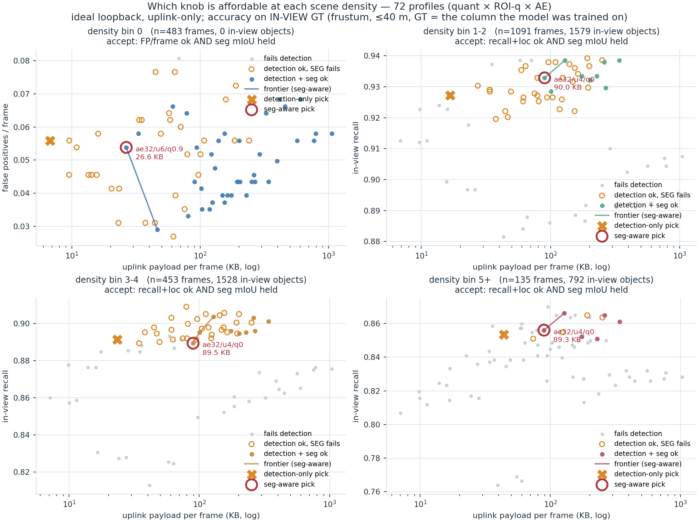
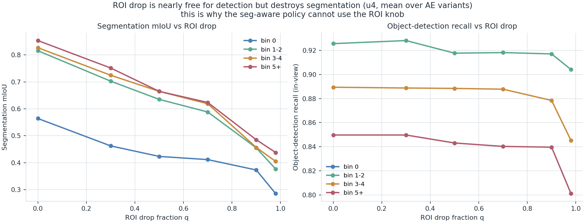
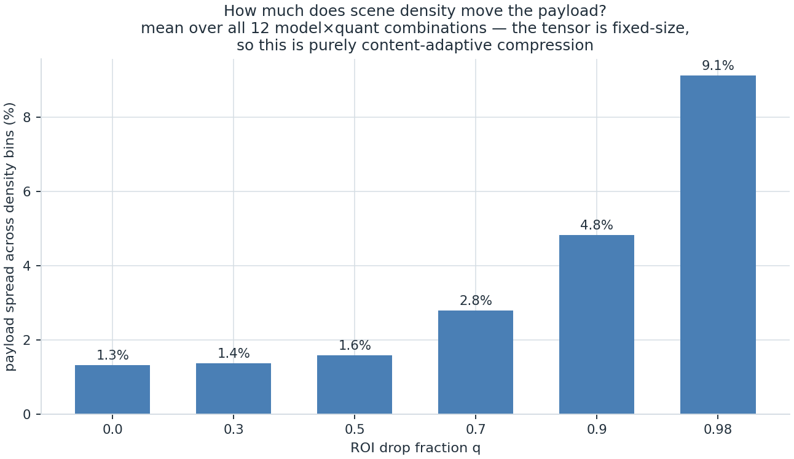

# Density-adaptive knob selection — RESULTS

**Date:** 2026-07-31 (seg-inclusive re-run) · **Plan:** [`../DENSITY_ADAPTIVE_KNOB_PLAN.md`](../DENSITY_ADAPTIVE_KNOB_PLAN.md) ·
**Run log:** [`RUN_LOG.md`](RUN_LOG.md) · **Gates:** 9/9 PASS ([`raw/gate_report.txt`](raw/gate_report.txt))
**Scope label:** offline per-model eval on the corrected-drivable moving-ego capture; payload→latency is
**ideal loopback, uplink-only**. OAI radio is a separate study.

**Measured:** 4 AE {none, 32, 64, 128} × 3 quant {u8, u6, u4} × 6 ROI drop fractions
{0, 0.3, 0.5, 0.7, 0.9, 0.98} = **72 profiles × 2162 test frames = 155 664 profile-frames**, each with its
own payload bytes, in-view GT count, per-class tp/fp/fn/loc, **and a per-frame 3×3 segmentation confusion**
(background / vehicle / person), so **both** object detection **and** dense segmentation are scored per
density bin. ROI q ∈ {0.7, 0.9, 0.98} are **new** — the published knob matrix stopped at 0.5.

> **What changed vs the first run.** The first density run scored **detection only** (recall + loc). This
> re-run adds **segmentation** (mIoU + per-class IoU), because the shared cooperative map needs the dense
> semantic layer — drivable surface, lane geometry, the vehicle/person pixel masks *between* the object
> boxes — not just object dots. Adding seg **flips the headline conclusion** (§1). Everything the detection-
> only run reported is still true *for detection*; it was just answering the wrong question for a map that
> carries segmentation.

---

## 1. Answer

**Once segmentation is part of the deliverable, the density-adaptive-ROI story collapses. The best knob is
`ae32 / u4 / ROI 0` at ~90 KB, and it is essentially the SAME at every non-empty density.**

Joint accept rule: minimum payload subject to **(detection)** `recall ≥ bin-best − 0.02` **and**
`loc ≤ bin-best + 0.10 m`, **AND (segmentation)** `mIoU ≥ (that model's own ROI-0 mIoU in the same bin) − 0.02`.

| density (in-view objects) | n frames | **seg-aware best knob** | payload | uplink ms | in-view recall | loc MAE | **mIoU** | **veh IoU** |
|---|--:|---|--:|--:|--:|--:|--:|--:|
| **0** (empty) | 483 | `ae32 / u6 / q0.9` * | 26.6 KB | ~13 † | n/a (no objects) | n/a | 0.545 * | 0.563 * |
| **1–2** (sparse) | 1091 | `ae32 / u4 / ROI 0` | **90.0 KB** | **~39** ‡ | 0.933 | 0.75 m | 0.812 | 0.918 |
| **3–4** (busy) | 453 | `ae32 / u4 / ROI 0` | **89.5 KB** | ~39 ‡ | 0.889 | 0.92 m | 0.822 | 0.932 |
| **5+** (dense) | 135 | `ae32 / u4 / ROI 0` | **89.3 KB** | ~39 ‡ | 0.856 | 1.08 m | 0.848 | 0.896 |

`*` bin-0 seg is **degenerate** — with no in-view vehicles/pedestrians the vehicle/person IoUs are computed
on a handful of far pixels, so the mIoU there is dominated by unstable object classes, not by the drivable-
surface layer (background IoU stays ~0.99 at every q). Read the empty-bin pick as "some ROI drop is
tolerable when the scene is truly empty," not as a reliable 0.545 mIoU. See §5.
`‡` **measured**: `ae32/u4/ROI0` capture→result ≈ 24.7 ms front + 12.1 ms back + 2.0 ms transport
(`loopback_latency_zstd.json`, ideal 8 MB loopback). `†` bin-0 q0.9 latency now also **measured**
(high-ROI sweep, 2026-07-31): front ~25 ms, transport ~1.5 ms — the whole ROI range is measured (§6).

**The three non-empty bins pick the identical knob.** Density does not move the seg-aware choice: `ae32/u4/
ROI0` is the cheapest profile that holds segmentation at every density, and it *also* holds detection recall
(0.93/0.89/0.86, within tolerance of the bin-best) with *better* localisation than the aggressive-ROI
alternatives. **Scene density is therefore not a useful knob-selection variable when the map carries
segmentation** — the policy is flat at ~90 KB.

---

## 2. Why ROI drop is not a free knob — it is a detection-only compression that destroys segmentation

This is the mechanism, and it is the whole story. The ROI gate zeroes the `k = round(q·N)` lowest-
objectness feature cells (rank-based drop, matching training's `model._objectness_drop`). Those low-
objectness cells are exactly the **background between objects** — which detection does not need but the
dense segmentation head does. So raising q is nearly free for object recall and **catastrophic for seg**:

**T3b — mIoU / vehicle-IoU vs ROI drop q (u4, mean over the four AE variants):**

| ROI drop q | bin 0 | bin 1–2 | bin 3–4 | bin 5+ |
|--:|--:|--:|--:|--:|
| **0** | 0.564 / 0.595 | **0.816 / 0.922** | **0.827 / 0.934** | **0.853 / 0.902** |
| 0.3 | 0.462 / 0.294 | 0.703 / 0.602 | 0.725 / 0.656 | 0.752 / 0.640 |
| 0.5 | 0.423 / 0.189 | 0.635 / 0.442 | 0.665 / 0.523 | 0.665 / 0.421 |
| 0.7 | 0.412 / 0.159 | 0.588 / 0.354 | 0.619 / 0.420 | 0.624 / 0.347 |
| 0.9 | 0.373 / 0.137 | 0.455 / 0.174 | 0.457 / 0.232 | 0.485 / 0.212 |
| **0.98** | 0.285 / 0.053 | **0.377 / 0.112** | 0.405 / 0.129 | 0.438 / 0.125 |

Vehicle-segmentation IoU falls off a cliff — in the sparse bin, **0.922 → 0.112** as q goes 0 → 0.98, an
88 % loss — while in-view **detection recall over the same sweep barely moves** (0.94 → 0.90). That
divergence is the entire reason the two analyses disagree.

---

## 3. The density-adaptive-ROI policy was an artifact of ignoring segmentation

The first run's picks, re-scored on seg, show what the aggressive-ROI compression was actually costing:

| density | detection-only pick (first run) | payload | recall | **mIoU** | **veh IoU** | seg verdict |
|---|---|--:|--:|--:|--:|---|
| 1–2 | `ae32/u4/q0.9` | 16.7 KB | 0.927 | **0.398** | **0.189** | seg destroyed (−52 %/−80 %) |
| 3–4 | `ae64/u4/q0.9` | 23.4 KB | 0.891 | **0.465** | **0.237** | seg destroyed |
| 5+ | `ae64/u4/q0.7` | 43.7 KB | 0.854 | **0.653** | **0.395** | seg badly degraded |

The "6.4× payload span / 60 % uplink saving from density adaptation" that the detection-only run reported
was **bought entirely by throwing away segmentation.** At equal detection accuracy, keeping seg costs the
extra payload: 16.7 → 90 KB in the sparse bin. The saving was real for an **object-only** map and is
**not** real for a map that carries the semantic layer.

**How many profiles survive each objective (out of 72):**

| bin | pass detection | pass detection **+ seg** |
|---|--:|--:|
| 0 (empty) | 71 | 39 |
| 1–2 | 41 | **9** |
| 3–4 | 38 | **9** |
| 5+ | 11 | **6** |

The seg constraint removes ~80 % of the detection-affordable profiles in populated scenes, and every
survivor is **ROI 0** (plus AE + u4). This reproduces, from an independent code path, what the seg-aware
knob matrix already implied: its `accept` column marks essentially only ROI-0 rows.

---

## 4. Payload physics (unchanged and still important): density barely moves the bytes

The uplink tensor is fixed-size, and the ROI drop is rank-based, so **density moves the payload by ~1–2 %
at usable operating points** — it never was the lever:

| ROI drop q | payload spread across the 4 density bins |
|--:|--:|
| 0 | 1.3 % |
| 0.5 | 1.6 % |
| 0.9 | 4.8 % |
| 0.98 | 9.1 % (max 16.9 %) |

So the correct one-line physics for the agent is unchanged from the first run — only its *consequence*
changes:

> Density barely moves what a knob COSTS in bytes. In the detection-only framing it moved what a knob costs
> in *detection accuracy*; in the seg-inclusive framing the binding constraint is **segmentation**, and seg
> is destroyed by the ROI knob at **every** density. So the seg-aware knob is density-invariant.

---

## 5. Empty scenes: the one place ROI drop survives, and why it is degenerate

In the empty bin (0 in-view objects) the joint rule accepts `ae32/u6/q0.9` at 26.6 KB — i.e. some ROI drop
*is* tolerated. But this is a metric artefact, not a licence to compress hard when empty:

- With no in-view vehicles/pedestrians, the **vehicle and person IoUs are computed on a few far/edge
  pixels** and are noisy; the reported bin-0 mIoU (0.545 at q0.9) is dominated by those degenerate classes.
- The **background / drivable-surface IoU stays ≈ 0.99 across all q** — the part of segmentation that
  actually matters in an empty scene is essentially q-insensitive.
- The empty-bin pick is also the **most FP-sensitive** result: raising q roughly doubles spurious detections
  (best-achievable 0.027 FP/frame → 0.054–0.058, one phantom every ~37 → ~18 frames). If the map is
  FP-sensitive, prefer a lower q here too.

**Honest reading:** in a *truly empty* scene the drivable-surface layer tolerates aggressive ROI, so the
agent may compress hard — but the moment even one object is in view the seg constraint snaps back to ROI 0.
Given the observability caveat (§9), the safe default is to treat empty the same as sparse (ROI 0) unless
the map explicitly does not consume segmentation.

---

## 6. Latency status — now fully MEASURED across the whole ROI range

- **The seg-aware pick is ROI 0, latency MEASURED** in `loopback_latency_zstd.json`:
  `ae32/u4/ROI0` ≈ 24.7 ms front + 12.1 ms back + 2.0 ms transport ≈ **39 ms** capture→result, ideal 8 MB
  loopback. The §1 deliverable rests on a measured number.
- **The high-ROI regime (q 0.7/0.9/0.98) is now MEASURED too** (2026-07-31, 12-profile loopback sweep,
  `run_ideal_loopback_zstd_highroi.sh`, merged into `loopback_latency_zstd.json` → 48 profiles). The
  measurement **confirms the earlier extrapolation was accurate and conservative**: front compute is flat
  and backbone-dominated (**24.5–26 ms** for the AE profiles, rising only for the large-payload no-AE ones),
  transport is **1.3–4.1 ms** (tracking payload), and **delivery is 1.00** at every point. The fit is now
  `transport_ms = 1.260 + 0.00877 × payload_KB` on 48 measured profiles (R²=0.844) — negligibly different
  from the earlier 36-profile fit (`1.067 + 0.00912`), and **no policy pick changed** (detection-only or
  seg-aware): latency was never the deciding axis, payload/accuracy is. So the object-only comparison in §3
  is now on measured latency, not a derivation.
- **Over OAI**, the byte axis matters ~14× more than on loopback (≈0.13 ms/KB vs ≈0.009 ms/KB) plus a
  delivery-rate effect (75 % → 99 %); the seg-aware ~90 KB point sits well below the 142 KB that already
  achieved 99 % delivery (memory `oai_compression_ab`), so it should be comfortably inside the good regime.
  Belongs with the pending uplink-only-over-OAI run.

---

## 7. GT convention (guardrail 4) — resolved with a measurement, and detection + seg both reproduce the matrix

Same as the first run, now with a segmentation reproduction check added (gate **G7**). Gate G1 established:
`object_world_x/y` present on **27 239/27 239** scored GT rows; it is the exact column `train_fusion.py`
regresses (self-consistent — scoring against actor origin would *inject* an offset); and the residual is
**measured**: over 73 600 live GT rows with both columns, origin-vs-bbox-centre XY delta is
**mean 0.124 m, median 0.039 m, p95 0.511 m, max 0.995 m** (worst `vehicle.fuso.mitsubishi`, 0.51 m).

This driver **reproduces the published `PERMODEL_KNOB_MATRIX_ZSTD.md`** on all 36 overlapping profiles, now
on **both** detection and segmentation:

| noae__uint8__roi0.0 | this driver | published | Δ |
|---|--:|--:|--:|
| payload KB | 1050.26 | 1050.30 | −0.04 |
| obj recall | 0.879 | 0.879 | −0.000 |
| loc MAE m | 0.951 | 0.950 | +0.001 |
| **mIoU** | **0.840** | **0.840** | **−0.000** |
| **veh IoU** | **0.931** | **0.931** | **+0.000** |

The floor is anchored at the offline **0.95 m**; the seg head reproduces the matrix exactly, so the seg-
aware conclusion is not an artefact of a mis-wired head.

---

## 8. Reconciliation with the knob matrix, confounds, limits

- **Consistent with the matrix.** The seg-aware knob matrix's `accept` column already marked essentially
  only ROI-0 profiles as passing (its 2 % mIoU gate rejects ROI drop). This density study rediscovers that
  independently and adds the per-density breakdown. The one difference: the matrix uses a **global** clean
  reference (best ped-recall = ae128 clean), which rejects `ae32/u4/ROI0` on ped-recall and pushes its
  Pareto pick to `ae128/u4/ROI0` (129 KB); this study uses the plan-mandated **per-bin in-view** recall
  reference, under which `ae32/u4/ROI0` (90 KB) qualifies. If you apply the stricter global ped-recall gate,
  the seg-aware pick tightens to `ae128/u4/ROI0` at 129 KB — still ROI 0, still density-invariant.
- **u4 and the AE are still the right axes.** At ROI 0, u4 is seg-lossless (ae32/u4/ROI0 mIoU 0.822 =
  ae32 clean) and the AE *improves* accuracy while shrinking payload; no-AE is Pareto-dominated everywhere.
  Density adaptation, to the extent any exists, lives in the AE-bottleneck / quant axes — which move payload
  by ≤2 % with density, i.e. effectively not at all. **Bits and bottleneck, not ROI, and not density.**
- **Density correlates with proximity** (nearest object 20.0 m sparse → 12.2 m dense); not a speed confound
  (mean GT speed flat 1.6/1.8/1.3 m/s). Same location confound the road-state analysis carried.
- **Bin 5+ is thinnest** (135 frames / 792 objects, ±2.5 pts recall); directionally sound, do not over-fit.
- **In-domain only**: Town10, single ego, same distribution the M′ models were trained on; ideal loopback.

## 9. Agent state / policy note (supersedes the first run's note in `AGENT_CONSTRAINTS.md §8`)

> **If the shared map carries segmentation (drivable surface / lane / dense semantics), scene density is
> NOT a useful knob-selection state variable, and the ROI-drop knob must not be used for compression.** The
> ROI gate keeps only high-objectness cells, which is nearly free for object recall but destroys the dense
> seg between objects (vehicle IoU 0.92 → 0.11 as q 0 → 0.98, at every density). The seg-safe operating
> point is **ROI 0 + AE bottleneck + u4**, ≈ 90 KB (`ae32/u4/ROI0`; 129 KB `ae128/u4/ROI0` under the
> stricter global recall gate), and it is **density-invariant** — the same knob is optimal from 1 to 5+
> objects in view. Compression must come from the **AE bottleneck and quantisation bits**, not from ROI and
> not from density. Object speed remains the live state variable (latency/FPS budget); density can be
> dropped from the knob-selection state.
>
> **Object-only exception:** if a deployment consumes *only* object detections (no segmentation layer),
> then the earlier detection-only density-adaptive policy applies (ROI q 0.98→0.9→0.9→0.7, AE 32/32/64/64,
> u4; 6.8 → 43.7 KB, ~60 % drive-average saving) — but it must be labelled "object map only; segmentation
> is not preserved," and it carries the empty-bin FP caveat (§5).
>
> **Observability caveat** (either regime): the agent cannot see the current frame's density before it
> sends; it must use a lagged proxy (detection count from the last map update), worst exactly when density
> changes fastest (entering an intersection). With the seg-aware policy this is moot (the knob is flat), a
> further reason to prefer it when segmentation is on the map.

## 10. Not run, and why

- **High-ROI loopback latency measurement** (q 0.7/0.9/0.98, 12 profiles) — ✅ **DONE 2026-07-31**
  (`run_ideal_loopback_zstd_highroi.sh`, merged → 48 measured profiles). Confirmed the earlier
  extrapolation; no policy pick changed (§6). The whole ROI range is now measured.
- **Controlled fixed-ego density sweep** — skipped (all four natural bins populated; avoids the
  Experiment-3 artificial-scene F1≈0.35 trap). Would add no statistical power.
- **Uplink-only-over-OAI validation** — belongs with the pending OAI run.

---

**Full tables** (T1 bins/confounds, T2 payload×density all 72 profiles, T3 accepted sets per bin with seg,
T3b seg-vs-q collapse, T4 detection-only-vs-seg-aware lookup, T5 recall-vs-q per model):
[`raw/tables.md`](raw/tables.md). Both-policy lookup: [`raw/best_knob_lookup.csv`](raw/best_knob_lookup.csv).
Raw per-frame data (now with seg confusion): `raw/perframe_*.csv`. Detection-only backup:
`raw/detonly_backup/`.
