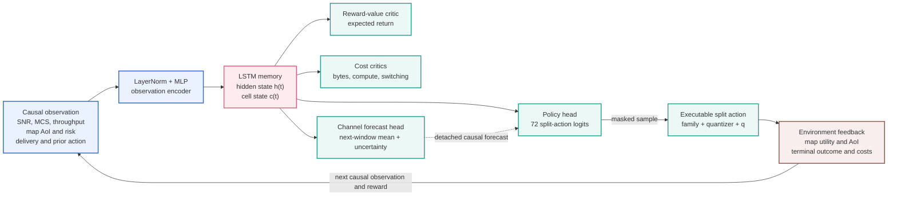

# Split-only recurrent PPO: preliminary architecture v1

Status: **DESIGN + NETWORK SKELETON ONLY — NO TRAINING CLAIM**

## Decision boundary

At every decision epoch the UE chooses one of the 72 measured split profiles:

$$
a_t \in \{0,\ldots,71\}.
$$

Each action fixes the feature family, quantizer and registered drop fraction
$q$. `LOCAL` and `SKIP` are deliberately excluded until their transitions are
measured. Poor but executable split actions remain learnable outcomes; the
action mask is reserved for actions that cannot physically execute.

## Why recurrence is needed

The current SNR is insufficient by itself. OAI channels evolve over time, and
the UE does not directly observe the next channel state or the complete edge
state. The LSTM summarizes causal history:

$$
(h_t,c_t)=\operatorname{LSTM}(e(o_t),h_{t-1},c_{t-1}).
$$

An auxiliary head predicts the channel distribution over the service interval
of the action being selected. The **prediction itself** (mean and uncertainty)
is supplied to the current policy, while the true future SNR becomes a target
only after the transition. Thus the policy is proactive without leaking a
future measurement.

In plain language, the LSTM gives the agent a short-term memory. At decision
epoch $t$, it receives the encoded current observation and its two memory
vectors from epoch $t-1$:

- the **cell state** $c_{t-1}$ carries longer-lived context, such as whether
  the channel has been steadily degrading or recovering;
- the **hidden state** $h_{t-1}$ is the compact summary exposed to the policy,
  value and forecast heads; and
- learned input, forget and output gates decide what new evidence to store,
  what old evidence to retain and what part of the memory to expose.

This matters because two epochs can have the same instantaneous SNR but imply
different decisions. A falling SNR sequence may favor a smaller payload before
congestion develops, whereas the same SNR during recovery may support a less
aggressive action. Recent delivery, supersession and map-AoI history also help
the memory distinguish a brief radio dip from a persistent service backlog.

## Causal observation groups

The first simulator should expose normalized values and availability flags for:

- current and lagged PUSCH SNR, MCS and delivered throughput;
- recent complete-message delivery and terminal-outcome history;
- latest installed-frame lag, oldest-pending-frame lag, pending age/count and
  time since a useful installation;
- edge busy/pending state plus recent supersession and expiry outcomes;
- previous action, payload, installation AoI and action-switch indicator; and
- causal ego/object-risk summaries available before action selection.

Forbidden inputs are the authored network-profile name, future SNR, CARLA
ground truth, and the current frame's eventual tail result.

The exact asynchronous attribution and missing-feedback behavior is frozen in
[AGENT_TIMELINE_AND_DELAYED_FEEDBACK_V1.md](AGENT_TIMELINE_AND_DELAYED_FEEDBACK_V1.md).
In particular, absence of feedback at the next frame means `PENDING`, not
`LOST`; later feedback closes the exact frame/action ticket.

## Network

`model.py` implements the initial network:

This is PPO with recurrent state, hard executability masking and an auxiliary
forecast objective. It is a composition of established techniques, not a new
algorithm called “Recurrent Hierarchical Masked PPO.”

### How the LSTM plugs into PPO

The LSTM is not a separate controller placed in front of PPO. It replaces the
memoryless feature layer inside the actor-critic network:

1. The UE forms only the information available before choosing $a_t$.
2. The encoder converts that observation to a compact feature vector.
3. The LSTM updates $(h_t,c_t)$ from that feature and the previous memory.
4. The policy head converts $h_t$ into probabilities over the 72 split actions.
5. The value and cost heads use the same $h_t$ to estimate future reward and
   resource consequences for PPO training.
6. The forecast head predicts channel mean and uncertainty over the period in
   which $a_t$ will travel. A stop-gradient copy of that prediction is appended
   to $h_t$ before the policy head, so it influences the current action but PPO
   cannot distort the forecast merely to make one action easier to choose.

During training, rollouts retain the observation, chosen action, reward,
terminal flag and incoming LSTM state. PPO optimizes short contiguous
sequences so gradients can teach the memory which past signals matter. The
memory resets at the start of a new episode or UE session; in a future
multi-UE deployment, each UE keeps its own state so histories cannot leak
between vehicles.

Formally,

$$
(\widehat\mu_{t,H},\widehat\sigma_{t,H})=g_\psi(h_t),
$$

$$
\pi_\theta(a_t\mid o_{\le t})=
\operatorname{softmax}\!\left(
W_\pi[\,h_t;\operatorname{sg}(\widehat\mu_{t,H},
\widehat\sigma_{t,H})\,]+b_\pi
\right),
$$

where $H$ is a preregistered service horizon and `sg` means stop-gradient.
The target may be next-window mean/minimum SNR rather than one noisy sample.
The first ablation compares no forecast, auxiliary-only forecasting and the
explicit detached forecast input. True future SNR is never available at action
selection.

## Early progress feedback versus final map outcome

Model-tail completion can shorten control uncertainty, but it is not the same
event as a successful spatial-map installation. Each exact frame/action ticket
therefore supports two messages:

1. `TAIL_COMPLETED` is a non-terminal progress ACK emitted after synchronized
   model-tail completion. It carries identity and timing and tells the next
   observation that transport and tail inference succeeded.
2. `MAP_OUTCOME` is the terminal record emitted after post-processing and map
   handling. It records `INSTALLED`, `SUPERSEDED`, `REJECTED` or another
   registered outcome and makes installed-map utility eligible for credit.

An early ACK cannot truthfully contain realized segmentation/localization
accuracy, p025 object records or installed-frame ID before those later stages
exist. In trace-driven training, quality may come from the frozen action table;
live deployment requires a qualified proxy or fixed offline quality prior.
Absence of either message at the next frame remains `PENDING`, not `LOST`.

The timing proposal must also distinguish an illustrative marginal sum from a
causal end-to-end sample. The slide estimate

$$
30_{\rm sensor}+25_{\rm UE}+65_{\rm UL}+21_{\rm tail}=141\ \mathrm{ms}
$$

omits the action-dependent reconstruction required before the 21 ms FCOS tail
and excludes the compact ACK return. The causal replay, on one 40-action common
support with at least 100 samples per stage/profile, places sensor-compute start
to model-tail completion at P50 = 141.7, 148.9, 159.4 and 146.9 ms for
Favorable, Mid, Adverse and Fade respectively. These remain counterfactual
edge-ready times, not received-ACK times.

At 10, 9 and 8 FPS, the next decision is nominally ready after roughly 130,
141 and 155 ms respectively when sensor compute is about 30 ms. Nine FPS has
no general P50 margin. Eight FPS has modest P50 headroom in Favorable, Mid and
Fade, but remains about 4 ms short in Adverse before even adding the feedback
return; every profile's P95 is above 200 ms. Use an 8/9/10-FPS sensitivity
experiment to quantify probability, not as a guarantee, and retain the
pending-ticket ledger at every rate.

### Expected policy runtime and training time

The recurrent controller is small relative to the perception pipeline. The
current observation-encoder/LSTM/four-head prototype has approximately 163k
parameters (162,973 exactly). On this host, 3,000 single-thread, batch-one CPU
forward passes through the complete actor-critic measured about 0.140 ms at
P50, 0.147 ms at P95 and 0.154 ms at P99 after warm-up. LSTM inference is
therefore not expected to be a service bottleneck next
to tens of milliseconds of sensing, radio and perception work. These are
microbenchmark values, not a live OAI deployment claim; the final integration
must time observation assembly and policy inference together.

Training time is dominated by trace-environment rollout and experimental
replication rather than the LSTM itself. A first trace-driven run should take
tens of minutes to a few hours per random seed; a defensible three-seed set
with the no-forecast, auxiliary-only and explicit-forecast ablations is more
realistically a 6--24 hour workload. Report convergence in environment steps
and wall time rather than promising a fixed duration before the environment is
implemented.

## Reward and intentional supersession

The equation below is the richer object-level utility candidate. The revised
first-training discussion draft is
[REWARD_FORMULATION_V2.md](REWARD_FORMULATION_V2.md); it keeps segmentation,
localization and latency separately weighted and uses frame ID for exact
causal attribution and frame-lag state rather than as an unbounded scalar
reward input. The asynchronous timing contract remains in
[AGENT_TIMELINE_AND_DELAYED_FEEDBACK_V1.md](AGENT_TIMELINE_AND_DELAYED_FEEDBACK_V1.md).

The reward should use the change in installed-map utility:

$$
r_t=(U_{t+1}-U_t)
 -\lambda_B\frac{B_t}{B_{\max}}
 -\lambda_C\frac{C_t}{C_{\max}}
 -\lambda_S\mathbf{1}[a_t\ne a_{t-1}].
$$

For tracked object $i$, a useful starting map utility is

$$
U_t=
\frac{\sum_i w_i Q_{i,t}\exp(-A_{i,t}/\tau_i)}
     {\sum_i w_i+\varepsilon}.
$$

Here $Q_{i,t}$ means installed-map quality for object $i$; it is deliberately
capitalized so it cannot be confused with the action's dropped-feature
fraction $q$.

### Reward-symbol dictionary

| Symbol | Meaning |
|---|---|
| $t$ | Current decision epoch. |
| $a_t$ | Selected split action: one of the 72 registered family/quantizer/$q$ profiles. |
| $r_t$ | Immediate transition reward. |
| $U_t$ | Utility of the spatial map before the transition. |
| $U_{t+1}-U_t$ | Measured improvement or degradation in installed-map utility. An update that is not installed creates no fictitious quality credit. |
| $i$ | One tracked object in the map. |
| $w_i$ | Application importance of object $i$, such as a larger weight for a vulnerable road user on the ego path. |
| $Q_{i,t}$ | Normalized installed quality/utility contribution for object $i$; this is not compression $q$. |
| $A_{i,t}$ | Object-level Age of Information: current time minus capture time of the newest installed observation for object $i$. |
| $\tau_i$ | Freshness tolerance. The freshness factor is $e^{-1}\approx0.368$ when $A_{i,t}=\tau_i$. |
| $\varepsilon$ | Small positive denominator guard when there are no weighted map objects. |
| $B_t$ | Feature bytes actually charged to the selected action. |
| $B_{\max}$ | Fixed payload normalizer—the largest registered median action payload, not instantaneous network capacity. |
| $C_t$ | Compute actually consumed, including spent work on an intentionally superseded frame. |
| $C_{\max}$ | Fixed compute-cost normalizer. |
| $\lambda_B$ | Communication-cost weight. |
| $\lambda_C$ | Compute-cost weight. |
| $\lambda_S$ | Action-switching penalty weight. |
| $\mathbf{1}[a_t\ne a_{t-1}]$ | Indicator equal to 1 when the action changes and 0 otherwise. |

PPO optimizes the discounted return

$$
G_t=\sum_{k=0}^{\infty}\gamma^k r_{t+k},
$$

where $\gamma\in[0,1)$ controls how strongly later consequences influence the
current decision.

A `SUPERSEDED_PENDING` frame receives no new-map utility because it was never
installed, but it is still charged for bytes and compute already consumed. It
must not be mislabeled as radio loss or structural failure. This lets the
policy learn that a large action can be wasteful when newer information is
likely to overtake it, without punishing the network for an intentional
latest-only scheduling decision.

## How the measurements enter the simulator

- The 288 cells provide action/profile-conditioned payload, delivery and
  original-runtime freshness evidence.
- The final v3 live comparison supplies prospective edge-service distributions
  for actions 30, 50 and 71. It must not be converted into one constant
  subtraction from all historical AoI values.
- The simulator must replay the two-stage latest-only scheduler so faster edge
  service changes supersession, completion and installation nonlinearly.
- Missing v3 actions require a conservative calibrated service model with an
  uncertainty flag, followed by fixed-action reproduction tests before PPO.
- Action 15's earlier v3 non-finite verdict was traced to missing cross-stream
  CUDA tensor-lifetime ownership, not non-finite model output. The repaired v3
  validator passed live and action 15 remains executable; the superseded false
  verdict must not become an action mask.

## Next implementation gate

Before PPO training, implement a causal trace-driven environment and require it
to reproduce held fixed-action statistics for payload, complete reassembly,
supersession, edge completion, installation probability and map AoI. Training
starts only after those checks pass. The first ablation compares the same PPO
network with and without the auxiliary next-SNR forecast loss.
