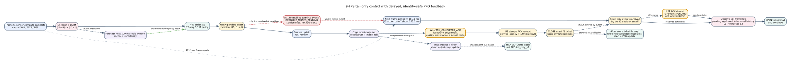

# Split-only PPO timeline and delayed-feedback contract v1

Status: **DESIGN CONTRACT — NO TRAINING OR DEPLOYMENT CLAIM**

The newer three-component reward discussion is in
[REWARD_FORMULATION_V2.md](REWARD_FORMULATION_V2.md). This document remains
authoritative for delayed, missing and out-of-order feedback behavior.

## The ambiguity we must avoid

If the UE chooses action $a_1$ for frame $f_1$ and no feedback has arrived when
frame $f_2$ becomes ready, the system does **not** know that $f_1$ was lost.
It knows only that the outcome is still pending. The policy may choose $a_2$
without waiting, but it must not fabricate a failure reward for $a_1$.

This means action selection is frame-driven while reward attribution is
event-driven and can arrive late or out of order.

## Frame-by-frame timeline



The same flow is retained below as Mermaid source so it can be edited directly
in Markdown.

```mermaid
sequenceDiagram
    autonumber
    participant S as Camera + radar
    participant UE as UE front + PPO-LSTM
    participant R as OAI uplink
    participant E as Edge latest-only worker
    participant M as Spatial map
    participant P as Pending-transition ledger

    S->>UE: frame f1 ready; causal SNR/MCS/BSR
    UE->>UE: encoder + LSTM(h0,c0)
    UE->>UE: policy samples action a1
    UE->>P: OPEN(session, UE, f1, a1, logprob, value, h0, c0)
    UE->>R: feature(f1, a1, capture time, deadline)
    R-->>E: complete reassembly or explicit failure

    S->>UE: frame f2 ready before feedback for f1
    Note over UE,P: f1 remains PENDING; it is not called lost
    UE->>UE: observe pending age/count + latest-installed frame lag
    UE->>UE: LSTM(h1,c1), SNR forecast for next epoch
    UE->>P: OPEN(session, UE, f2, a2, logprob, value, h1, c1)
    UE->>R: feature(f2, a2, capture time, deadline)

    E->>E: finish current frame; select newest pending frame
    E-->>M: direct object-map update
    M-->>E: INSTALL(f1, quality, install time)
    E-->>UE: compact terminal feedback for f1
    UE->>P: CLOSE f1 by exact session/UE/frame/action identity
    P-->>UE: reward r1 becomes eligible for PPO rollout

    alt f2 replaces an older pending frame
        E-->>UE: SUPERSEDED_PENDING(old frame, replacement frame)
        UE->>P: close old ticket as intentional supersession
    else feature never reassembles
        E-->>UE: REASSEMBLY_FAILED(f2) or cumulative status later
        UE->>P: close f2 as transport failure
    end
```

The auxiliary SNR forecast produced at epoch $t$ is trained against the SNR
observed at $t+1$. It helps the LSTM encode a rising, falling or recovering
channel trend; it does not use future SNR to choose the current action.

## Pending-transition ledger

Each action creates exactly one ticket keyed by

$$
k=(\text{session\_id},\text{ue\_id},\text{frame\_id},\text{action\_id}).
$$

The immutable ticket retains:

- capture/action timestamps, payload and action identity;
- PPO log-probability, value estimate, and incoming LSTM state;
- bytes and compute already consumed; and
- the registered deadline and reconciliation horizon.

A ticket may close only with one terminal outcome:

- `MAP_INSTALLED`;
- `SUPERSEDED_PENDING`;
- `REASSEMBLY_FAILED`;
- `STALE_BEFORE_EDGE_OR_MAP`;
- `ACTION_EXECUTION_FAILED`; or
- `FEEDBACK_HORIZON_EXPIRED_AFTER_RECONCILIATION`.

`PENDING` is a state, not a terminal outcome. A missing UDP feedback packet is
also not proof of frame loss. Later cumulative feedback must carry a terminal
watermark and recent per-frame outcomes, or the UE must query a durable edge
ledger before an unresolved ticket may expire.

Feedback identity is validated before credit assignment. Duplicate identical
feedback is idempotent; conflicting feedback for the same key is an integrity
failure. Out-of-order feedback closes the matching ticket, never merely the
most recent action.

## What frame ID means to the policy

Raw frame ID is not fed to the neural network as an ever-growing number and is
not itself a reward. It provides attribution and two causal state features:

$$
\Delta f_t=f_t-f_{\mathrm{latest\ installed}},
\qquad
\Delta f^{\mathrm{pending}}_t=f_t-f_{\mathrm{oldest\ pending}}.
$$

At a nominal 10 FPS, $Δf_t=3$ means the installed map is roughly three frame
periods behind, before considering irregular frame timing. The observation
also includes the exact elapsed milliseconds since the latest install so the
agent does not assume the frame rate is perfectly constant.

## Initial compact reward

For the ticket belonging to frame $j$:

$$
r_j=
\mathbf{1}_{\mathrm{installed}}
\alpha Q_j\exp\!\left(-\frac{L_j}{\tau}\right)
-\beta_D\mathbf{1}_{\mathrm{transport\ failure}}
-\beta_B\frac{B_j}{B_{\max}}
-\beta_C\frac{C_j}{C_{\max}}
-\beta_S\mathbf{1}[a_j\ne a_{j-1}].
$$

| Term | Meaning |
|---|---|
| $Q_j$ | Quality of the installed object-map update, using training-time CARLA ground truth or a separately qualified live proxy. |
| $L_j$ | Action-start to direct map-install latency. It ends at physical map installation, not at the later UE feedback. |
| $\exp(-L_j/\tau)$ | Smooth freshness discount: quality credit shrinks as the installed result gets older. |
| $\Delta f_t$ | Frame lag returned/derived from feedback and used in the next observation; it is not double-counted as another arbitrary penalty. |
| $\mathbf{1}_{\mathrm{transport\ failure}}$ | One only for a proven incomplete/failed feature delivery, not for intentional supersession. |
| $B_j/B_{\max}$ | Normalized communication cost. |
| $C_j/C_{\max}$ | Normalized compute already spent, including work spent before a supersession. |

This version therefore represents map freshness through the installed frame
identity in the state and the measured install latency in the reward. It does
not add a second standalone map-AoI penalty at this stage. Object-level map
utility remains a later refinement if the application requires different
freshness tolerances for pedestrians and vehicles.

`SUPERSEDED_PENDING` gets no fictitious quality credit and no transport-loss
penalty. It still pays bytes and compute already consumed. The explicit
replacement frame ID tells the agent why the old work vanished.

## Recurrent PPO bookkeeping

PPO rollouts may contain open tickets, but generalized-advantage estimation
and parameter updates must use only a contiguous prefix whose outcomes are
terminally reconciled. Each stored step retains its incoming LSTM state so
the old-policy log probability can be reproduced exactly. Episode shutdown
drains or explicitly terminalizes every ticket; unresolved tickets cannot be
silently dropped from training.

This preserves on-policy credit assignment even when feedback for $f_1$
arrives after actions for $f_2$ and $f_3$ have already been selected.
