# Phase-2 state diagram — presentation version

Compact presentation copy of [`state_diagram.md`](state_diagram.md). This keeps the same causal contract but removes most implementation detail so it can be explained live.

```mermaid
---
config:
  layout: dagre
  theme: redux
---
flowchart LR
  %% Presentation version: same causal structure as state_diagram.md,
  %% but reduced to the concepts needed for a live explanation.

  subgraph OBS["PRE-ACTION OBSERVATION  s_pre(t)"]
    direction TB
    net["Network memory<br/>capacity estimate, MCS/BLER/BSR,<br/>previous delivery + latency"]
    map["Recipient map memory<br/>tracks, AoI, covariance,<br/>install provenance"]
    trk["Source-local prior tracks<br/>completed detections only<br/>no same-frame result"]
    ego["Ego / recipient kinematics<br/>timestamped states"]
    comp["Local scheduler state<br/>compute headroom,<br/>in-flight work"]
  end

  OBS --> CHECK{{"CAUSAL CHECK<br/>only information available<br/>before this decision is allowed"}}

  CHECK --> DECIDE{{"PLACEMENT DECISION<br/>choose where/when to run perception"}}

  subgraph ACT["ACTION CANDIDATES"]
    direction TB
    split["SPLIT_FEATURE<br/>front on car, tail at edge"]
    local["LOCAL_INFER<br/>full model on car"]
    skip["SKIP_INFERENCE<br/>no new perception result"]
  end

  DECIDE --> ACT

  ACT --> ADMIT{{"HARD ADMISSION<br/>SPLIT: uplink budget<br/>LOCAL: compute budget<br/>all: deadline + uncertainty contract"}}

  ADMIT --> INF["ACTION-CONDITIONED INFERENCE<br/>capture → model path → detections<br/>+ covariance + timestamps"]

  INF --> PUB{{"PUBLICATION DECISION<br/>publish all, hazard subset,<br/>or skip publication"}}

  PUB --> WIRE["TRANSPORT<br/>local path or OAI RFsim<br/>bytes, queueing, reassembly"]

  WIRE --> MAP["RECIPIENT MAP UPDATE<br/>associate, install, propagate uncertainty"]

  MAP --> WARN["WARNING / SHARED MAP OUTPUT<br/>AoI, uncertainty, TTC,<br/>closest approach, evidence provenance"]

  WARN --> FB["NEXT-STEP FEEDBACK<br/>delivered frame, latency, AoI,<br/>BSR/backlog, updated tracks"]
  FB -. "available only at t+1" .-> OBS

  subgraph EVAL["EVALUATION PLANE — NOT POLICY STATE"]
    direction TB
    gt["CARLA truth<br/>actor IDs + future trajectory"]
    shadow["Shadow unchosen actions<br/>offline / evaluation only"]
    metrics["Metrics<br/>warning lead, missed/false warning,<br/>latency, AoI, bytes, tracking"]
    gate["TWO-TRAJECTORY PILOT GATE<br/>positive occlusion + matched benign negative<br/>human review before full collection"]
    gt --> metrics
    shadow --> metrics
    WARN --> metrics
    metrics --> gate
  end

  LEAK{{"FORBIDDEN LEAKAGE<br/>same-frame result, future truth,<br/>or shadow output cannot affect<br/>the decision that produced it"}}
  INF -. forbidden .-> LEAK
  gt -. forbidden .-> LEAK
  shadow -. forbidden .-> LEAK

  classDef obs fill:#dbeafe,stroke:#2a78d6,color:#0b0b0b;
  classDef act fill:#ffe3d3,stroke:#eb6834,color:#0b0b0b;
  classDef dec fill:#ece9fb,stroke:#4a3aa7,color:#0b0b0b;
  classDef env fill:#d7f2e6,stroke:#1baf7a,color:#0b0b0b;
  classDef eval fill:#eeeeee,stroke:#888888,color:#222222;
  classDef warn fill:#fff3cd,stroke:#eda100,color:#0b0b0b;
  classDef bad fill:#fde2e1,stroke:#e34948,color:#0b0b0b;

  class net,map,trk,ego,comp,FB obs;
  class split,local,skip act;
  class CHECK,DECIDE,ADMIT,PUB dec;
  class INF,WIRE,MAP env;
  class WARN,metrics,gate warn;
  class gt,shadow eval;
  class LEAK bad;
```

