# Why split inference? — results, in plain language

**Date:** 2026-07-27. Figures in `plots/` (`.pdf` for slides, `.png` for preview).

> **One-sentence takeaway.** Running the *whole* perception model on the vehicle is the simplest option and is
> cheapest on the network, but it demands the most on-board computing power; **split inference** moves the heavy part
> of the model to a nearby edge server so a compute-limited vehicle can keep up in real time — at the cost of sending
> more data and waiting a little longer. It becomes clearly necessary as perception models get heavier.

---

## What we are comparing

A self-driving car has to detect other cars/pedestrians many times per second and share what it sees. There are three
ways to organize the computing:

- **A — Full-local:** the car runs the *entire* model itself, then shares its final detections.
- **B — Full-offload:** the car sends its *raw camera image* to the edge server, which runs everything.
- **C — Split (our approach):** the car runs the *first half* of the model, sends the half-processed result
  ("features") to the edge, which runs the *second half*.

The question the paper must answer: **why choose C?**

---

## Glossary (every term used below)

| Term / abbreviation | Plain meaning |
|---|---|
| **Model** | The neural network that turns camera + radar into detections. |
| **Backbone (a.k.a. "front")** | The first half of the model — extracts general features. In split, this runs **on the car**. |
| **Heads (a.k.a. "back")** | The second half — turns features into actual detections. In split, this runs **on the edge**. |
| **Feature** | The half-processed numbers the backbone produces (not a viewable picture). This is what split sends over the air. |
| **Detection** | A final result: "vehicle at position (x, y)". Small in size. |
| **Edge server** | A powerful computer near the road (e.g. at a 5G base station) that vehicles can offload work to. |
| **FPS — Frames Per Second** | How many camera frames the system processes each second. Higher = smoother/safer. **10 FPS** is a common real-time floor; **30 FPS** is desirable for fast driving. |
| **Real-time deadline** | The FPS the system must hit to be safe. If it can't, it's too slow to deploy. |
| **FLOPs / MACs / GMACs** | A hardware-independent count of the **arithmetic** a model does per frame. 1 GMAC = 1 billion multiply-adds. More FLOPs = needs more computing power. |
| **CPU core** | One processing unit. A weak/cheap vehicle computer has few, weak cores; we vary the core budget to emulate weaker hardware. |
| **Latency (ms — milliseconds)** | Time from capturing a frame to having a usable result. Lower is better. 1000 ms = 1 second. |
| **E2E — End-to-End latency** | Total latency across every step (car → network → edge → back). |
| **RTT — Round-Trip Time** | Time for data to reach the edge and the answer to come back. |
| **Uplink** | The wireless upload from car to edge. Limited — a 5G car uplink is roughly **~11 Mbps** in our tests. |
| **Mbps — Megabits per second** | Data rate. Higher payloads need more Mbps; if you exceed the link, frames get dropped/delayed. |
| **KB — Kilobyte** | Data size per frame. |
| **Delivery** | Fraction of frames that actually arrive at the edge (100% = none lost). |
| **Power (W — Watts) / Energy (J — Joules)** | Electrical power draw / energy per frame. Matters for battery + heat. |
| **SWaP-C** | **S**ize, **W**eight, **P**ower **and C**ost — the tight budget of hardware you can put on a vehicle. |
| **Quantization / AE (Auto-Encoder) / ROI drop** | Three ways to **compress** the features before sending: use fewer bits, learn a compact code, or drop unimportant regions. |
| **Cooperative perception** | Two or more vehicles combining what they see, to cover each other's blind spots. |
| **SSIM / PSNR** | Image-similarity scores. **SSIM** runs 0→1 (1 = identical); used here to measure how well an *attacker* could rebuild the original camera image from the transmitted data (higher = worse for privacy). |
| **Occlusion / FOV (Field Of View)** | Something blocking the view / the area a camera can see. |

---

## The story, figure by figure

### 1. The core result: under a tight compute budget, only Split keeps up
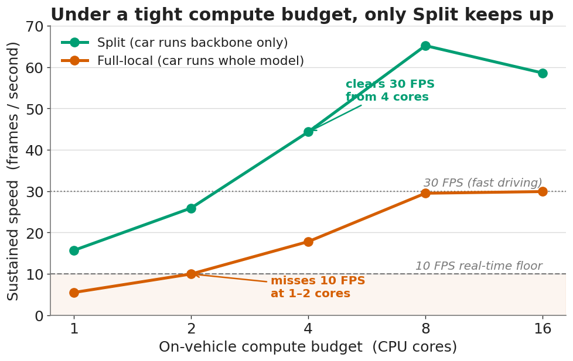

As we shrink the on-vehicle computing budget (fewer CPU cores), **Full-local falls below the 10 FPS real-time floor
(1–2 cores) while Split stays above it.** Split is **2–2.9× faster**, and the gap *widens* as the budget shrinks.
For the tougher 30 FPS target, Full-local never gets there on any budget we tested; Split clears it from 4 cores.

| CPU cores | Full-local FPS | Split FPS | Meets 10 FPS? |
|--:|--:|--:|:--|
| 1 | 5.5 | 15.7 | Full **no**, Split yes |
| 2 | 10.0 | 25.9 | Full **borderline-no**, Split yes |
| 4 | 17.8 | 44.3 | both (Split also clears 30) |
| 8 | 29.5 | 65.2 | both |
| 16 | 29.9 | 58.6 | Full never reaches 30; Split does |

*Honest note: total computing is not reduced — it is **relocated** to the edge. The point is the **vehicle's** budget.*

### 1b. What if the car has a GPU (not just CPU)?
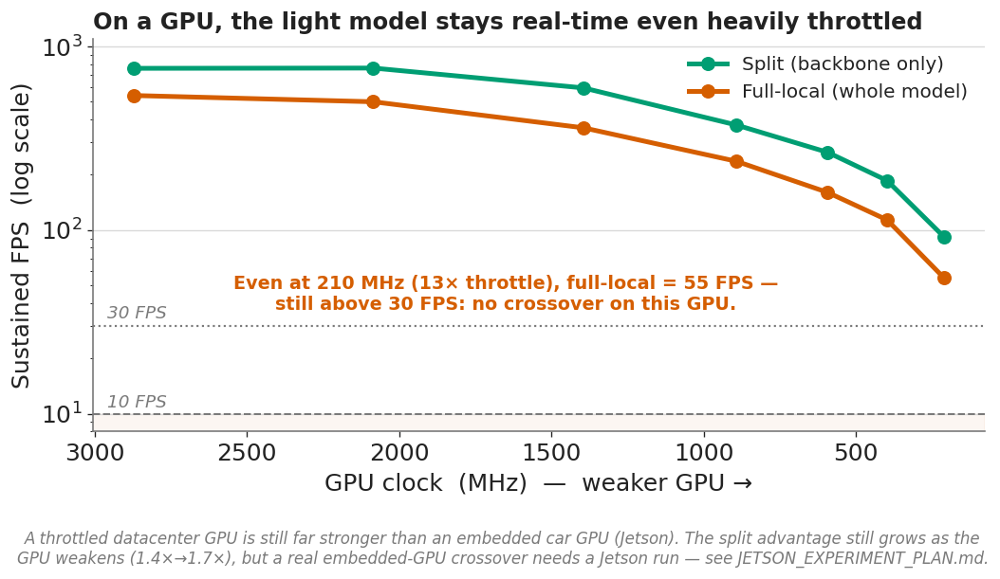

On a GPU our model is so light it stays real-time even heavily throttled: dropping a datacenter GPU **13×** (to
210 MHz) still gives **55 FPS** full-local — **no crossover appears on a GPU.** The split *advantage* still grows as
the GPU weakens (1.4×→1.7×, the same trend as on CPU), but a throttled datacenter GPU is still far stronger than a
real car GPU. **Honest reading:** for a GPU-equipped vehicle running *this lightweight* model, split is not required
on compute grounds; its compute case is for **CPU-only / weak-accelerator vehicles** (the crossover above) and
**heavier models** (§6). The definitive embedded-GPU test needs a real Jetson (`JETSON_EXPERIMENT_PLAN.md`).

### 2. Why Split helps: it offloads the heavy 76%
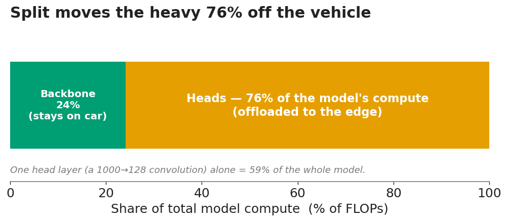

Surprisingly, the *heads* (second half) are the expensive part — **76% of the model's arithmetic** — because of one
large layer (59% of the whole model). Split runs only the light 24% backbone on the car and sends the heavy 76% to
the edge. That is exactly why the car in Fig. 1 keeps up on few cores.

### 2b. Power & energy: split also cuts on-vehicle energy
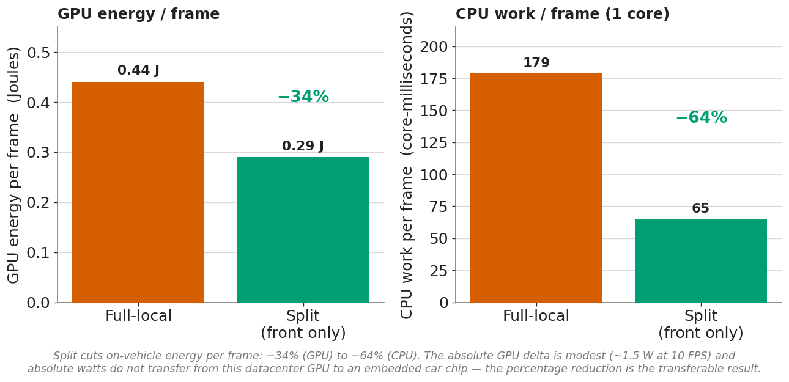

Because the car runs only the light backbone, it also spends **−34% GPU energy** and **−64% CPU work** per frame.
Be honest about the scale: the absolute GPU difference is small (~1.5 W at 10 FPS), and absolute watts measured on a
datacenter GPU don't transfer to an embedded car chip — so we report the **percentage** reduction (which does
transfer), not the watts. A real absolute-watt number needs the Jetson measurement (`JETSON_EXPERIMENT_PLAN.md`).

Compute **time** per frame tells the same story split by device:

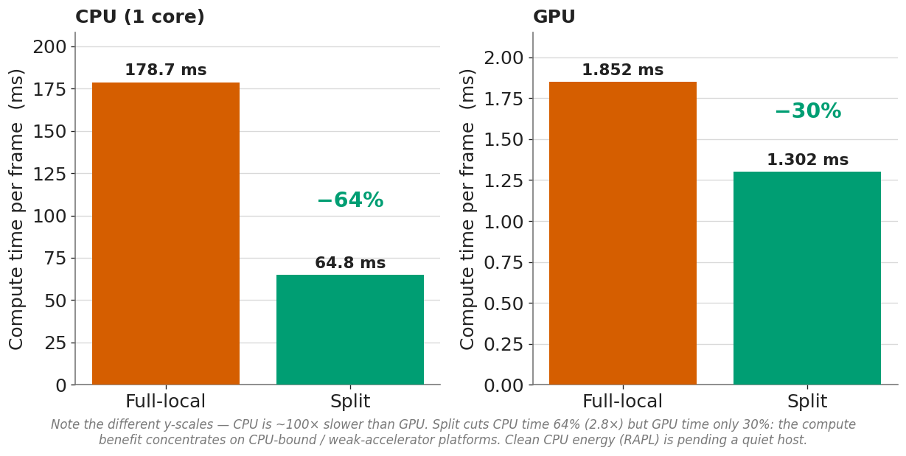

Split cuts **CPU time −64%** but **GPU time only −30%** — so the compute/energy benefit concentrates on **CPU-bound /
weak-accelerator** platforms, not GPU-equipped ones (consistent with §1b). *Clean CPU energy in Joules (RAPL) is
pending a quiet host* — the script `e2b_cpu_energy.py` is ready; on this pass the machine was running CARLA+OAI, which
contaminated the reading (idle read 88 W), so we don't report a contaminated absolute.

### 2c. Scalability, platform spectrum, and model ownership (supervisor's angles, 2026-07-XX)

**Scalability — how many concurrent real-time streams fit the device.** Real platforms run *many* perception streams
(multi-camera, multi-task, multiple co-located agents). At a fixed CPU budget, split fits far more:

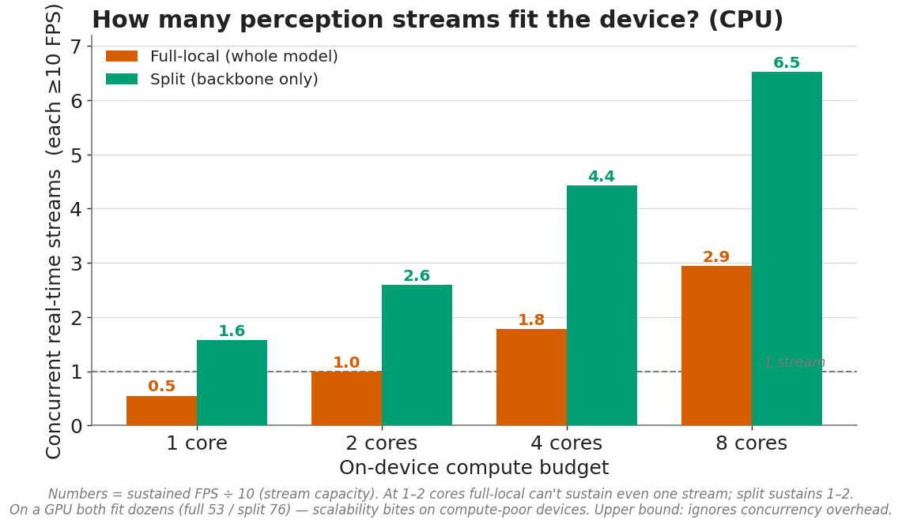

At **1–2 cores full-local can't sustain even one 10-FPS stream; split sustains 1–2**, and at 8 cores split fits ~6 vs
full-local's ~3. (On a GPU both fit dozens — 53 vs 76 — so this bites specifically on compute-poor devices.)

**Runtime on a battery.** Same perception for less compute energy → split runs longer on a fixed energy budget:

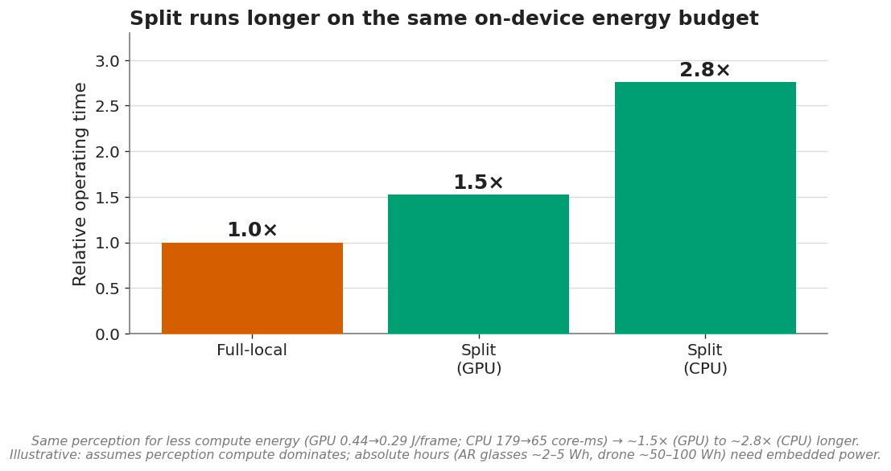

~1.5× (GPU) to ~2.8× (CPU) longer — illustrative (absolute hours need embedded power).

**This is not only for cars.** The target is the **SWaP-C spectrum** — AR glasses (~1–5 W total, no room for a
discrete GPU), drones, and small robots genuinely *cannot* carry heavy on-board compute. That is where full-local
fails and split is not a luxury but an enabler. (For compute-rich AD cars, the case is the multi-stream/heavier-model
regime above, not a single light model.)

**Model ownership (operator angle).** A network operator / model owner may not want to ship its full proprietary model
to every device. Split lets it deploy only the commodity **backbone** on the device and keep the heads/fusion on its
edge — useful for **IP protection and centralized model updates**. (This is a deployment/business benefit, not a hard
security guarantee — a backbone + edge query access can still be probed — so we state it modestly, unlike the refuted
privacy claim.)

### 3. The honest cost of Split: bandwidth, and radio latency
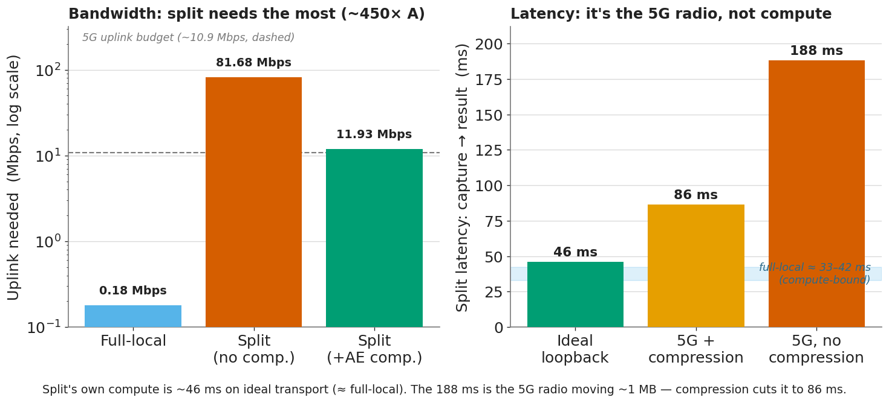

Split is the **worst** architecture on the network for bandwidth: Full-local uploads tiny detections (**0.18 Mbps**);
Split uploads big features (**82 Mbps uncompressed — ~450× more**).

But the latency is **the radio, not the compute.** On ideal transport (loopback, radio removed) the whole split
pipeline takes only **~46 ms — essentially the same as full-local (~33–42 ms).** The large **188 ms** is the **5G
radio moving the ~1 MB payload**; shrinking the payload with compression brings it back down:

| Split, capture → result | Payload/frame | Uplink | Latency | Delivery over 5G |
|---|--:|--:|--:|--:|
| Ideal transport (loopback) | 1045 KB | — | **46 ms** | 100% |
| Over 5G, no compression | 1045 KB | 82 Mbps | 188 ms | 84% |
| **Over 5G, + AE compression** | **129 KB** | 12 Mbps | **86 ms** | **99.8%** |

So **feature compression is mandatory, not optional**: uncompressed, split can't even sustain 10 FPS over the 5G link;
with compression it becomes viable — and **no accuracy is lost** (the compression is information-preserving).

### 4. Split does NOT buy privacy
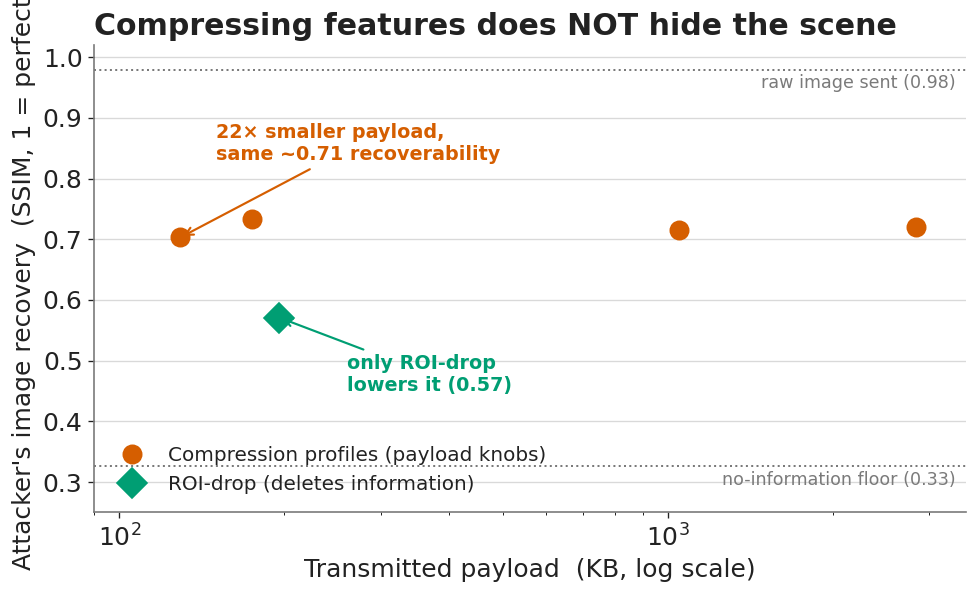

We hoped sending features (not pictures) would protect privacy. It does not: a trained attacker rebuilds recognizable
scene content (buildings, lanes, signs) from the features at **SSIM ≈ 0.70–0.73**, far above the 0.33 "no-information"
floor. And **compressing the payload 22× barely changes this** — payload size and privacy are almost unrelated. The
only knob that helps is **ROI drop** (0.57), because it *deletes* information rather than re-encoding it. We report
this honestly rather than claim a privacy benefit.

### 5. The whole picture: no architecture wins everything
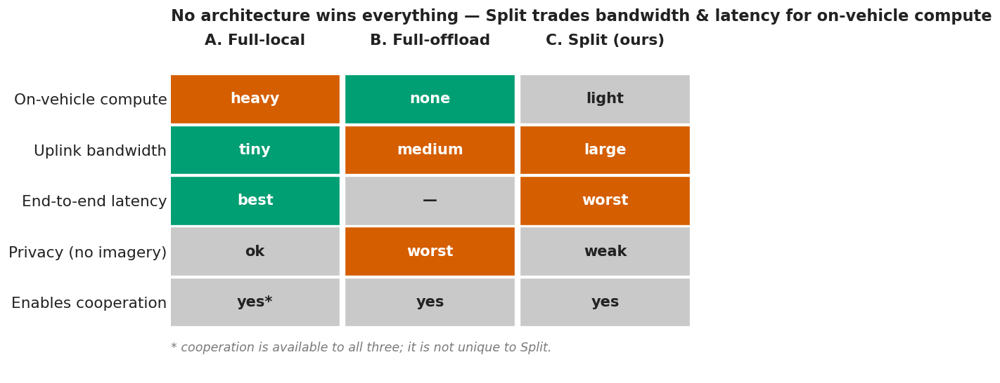

Split trades **more bandwidth and more latency** for **less on-vehicle compute**. Cooperative perception (covering
blind spots with a second vehicle) is a real win — but it is available to *all three* architectures, so it is a reason
to **cooperate**, not specifically a reason to **split**.

### 6. The forward-looking argument: heavier models make Split necessary
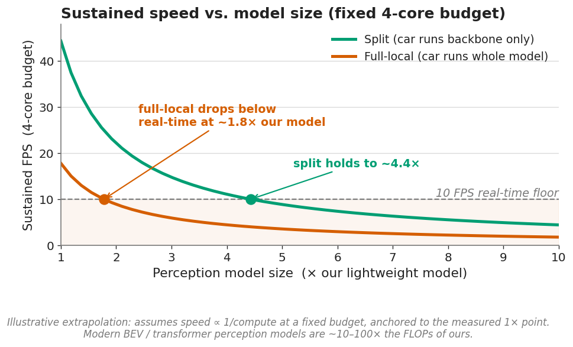

Our model is deliberately lightweight, so Full-local *can* run it on decent hardware. But the vehicle's cost grows
with model size, while Split's cost grows far slower (it only runs the small backbone). Extrapolating our measured
point: a model **~1.8×** heavier already pushes Full-local below real-time at a fixed 4-core budget, while Split holds
to **~4.4×**. Modern BEV/transformer perception models are **10–100×** heavier than ours — squarely in the regime where
Split is the only option that meets real-time on a SWaP-C vehicle. *(This panel is a labeled extrapolation, not a new
measurement.)*

---

## The honest bottom line

**Split inference is not universally better — and the paper should not claim it is.** Against each alternative it
wins one axis and loses others:

- **vs Full-local:** Split ~halves on-vehicle compute and is the difference between missing and meeting real-time on a
  constrained vehicle — but it costs ~450× more uplink. (Its *inherent* latency ~46 ms ≈ full-local; the extra latency
  is only the 5G radio moving the payload — 188 ms uncompressed, 86 ms compressed — not the split itself.) It gives no
  privacy advantage.
- **vs Full-offload:** Split keeps semantic features on the wire instead of raw video, so no vehicle's raw camera feed
  is centralized — but the privacy edge is weaker than assumed.
- **Cooperation** (blind-spot coverage: 74% → 87%) is a genuine perception win, but it motivates *sharing with an
  edge/peer*, not *splitting the model specifically*.

**The defensible motivation, in one line:** *on compute-constrained (SWaP-C) vehicles — and increasingly as perception
models grow heavier — running the full model locally misses real-time deadlines that split inference meets by
offloading the model's heavy 76%; the cost is a large feature uplink that our compression + network-aware controller
makes deployable over 5G.*
